layout:true
<div class="footer"><span>Drew Schmidt 2022</span></div>

```{r setup, include=FALSE}
options(htmltools.dir.version = FALSE)
```

---
# Announcements
* No class THIS THURSDAY on 9/1 🏈
* UTKDSE slack org
    * Everyone should have an invitation
    * Use channel `#dse511-fall2022` for public chat
* Homework 1 graded

---
# Homework 1 Comments
* ***Very*** diverse student backgrounds
* Lots of interest in git and the shell!
* Most know some R and Python (or equivalent) already
* Almost everyone going native (not a VM)
* This semester: git, bash, ...
* Next semester: HPC, the cloud, performance optimization, ...

---
# Today's Lecture
* VM Basics
* Setting Up a VM
* Installing Linux Software
* Wrapup

---
class: clear, inverse, middle, center
# VM Basics

---
# What Is a VM?
A VM is an entire OS living inside your OS.
.center[
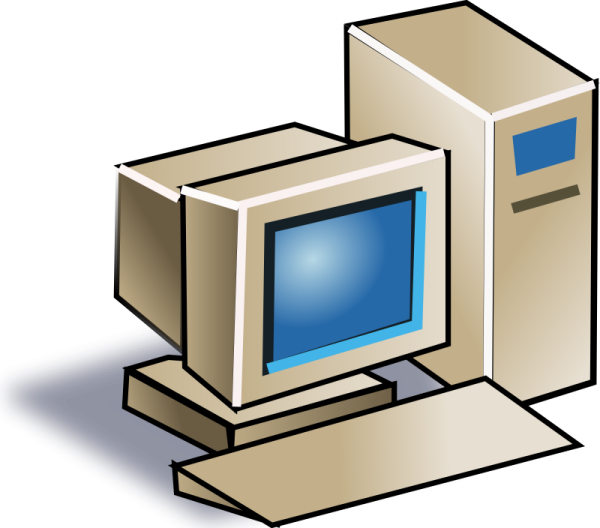

]

---
# What Is a VM?
* Virtualization tool
* An OS inside your OS
* Now broadly lumped under "containerization" umbrella

---
# History of Containerization
* 1980's: chroot
* 1990's: VM's
* 2000's: BSD Jails
* 2013: Docker
* 2016: Singularity
* 2016--Present: Kubernetes, OpenVZ, snap, flatpak, OpenShift, AND MANY MORE

---
# What Is a VM?
.pull-left[.small[
> A Virtual Machine (VM) is a compute resource that uses **software** instead of a
  **physical computer** to run programs and deploy apps. One or more virtual
  "guest" machines run on a physical "host" machine. Each virtual machine runs
  its own operating system and functions separately from the other VMs,
  even when they are all running on the same host.
]].pull-right[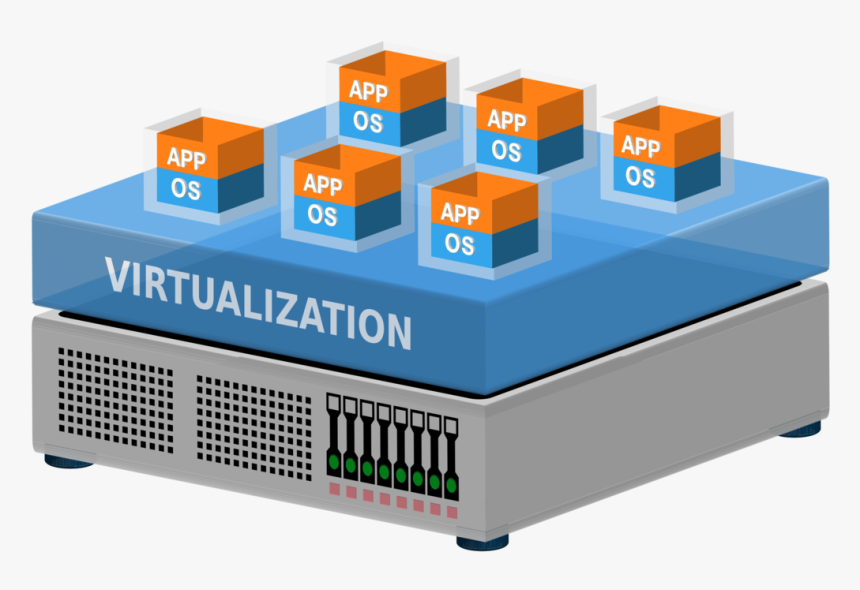]

.tiny[From https://www.vmware.com/topics/glossary/content/virtual-machine.html]

---
# Why Though?
.pull-left[
## Benefits
* Isolation
* Reproducibility
* Distribution
]
.pull-right[
## Common Uses
* Web services
* Dev environment
* CI builds
* Batch runs
]

---
# "Portability"
.center[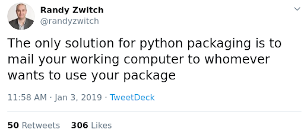]

---
# How A Program Runs in a VM
* Full OS installs on your hdd
* Has to boot!
* Shallow integration with host OS

.center[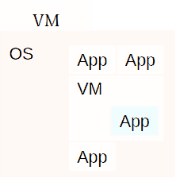]

---
# VM Uses
* ***The cloud***
* Running non-native arch binaries
* Distributing software (less common these days)

---
# Hypervisors
* Runs the VM
* Native vs hosted...
* Common hypervisors
    * QEMU
    * VirtualBox
    * VMWare
    * Parallels (Mac)
    * KVM


---
class: clear, inverse, middle, center
# Setting Up a VM

---
# Installing a VM
* VM thinks it's a computer
* We have to install the OS
* This is a bit time consuming
* For most modern applications, Linux containers are a better solution
* We'll use VirtualBox for demonstration

---
# Virtual Box Demo
.center[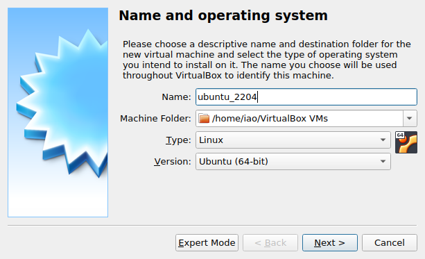]

---
# Virtual Box Demo
.center[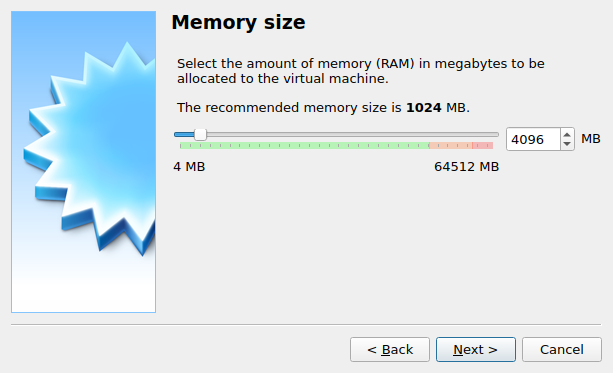]

---
# Virtual Box Demo
.center[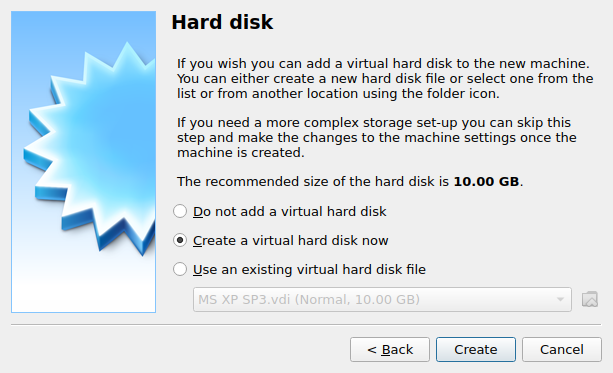]

---
# Virtual Box Demo
.center[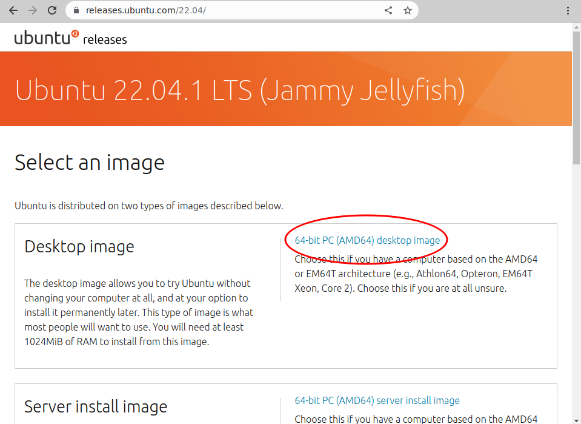]

---
# Virtual Box Demo
.center[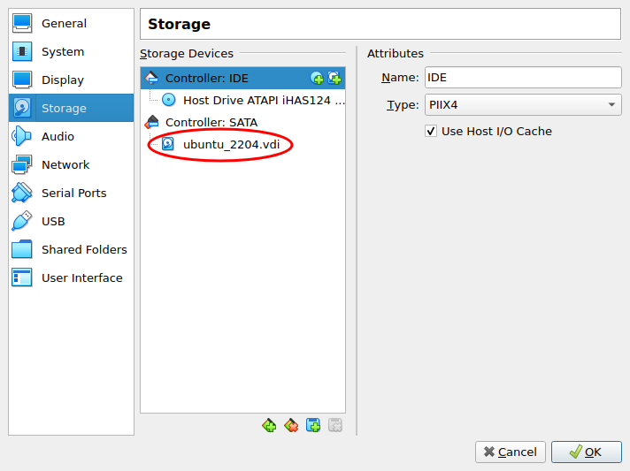]

---
# Virtual Box Demo
.center[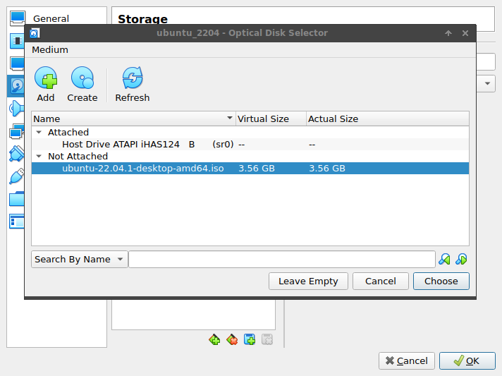]

---
# Virtual Box Demo
.center[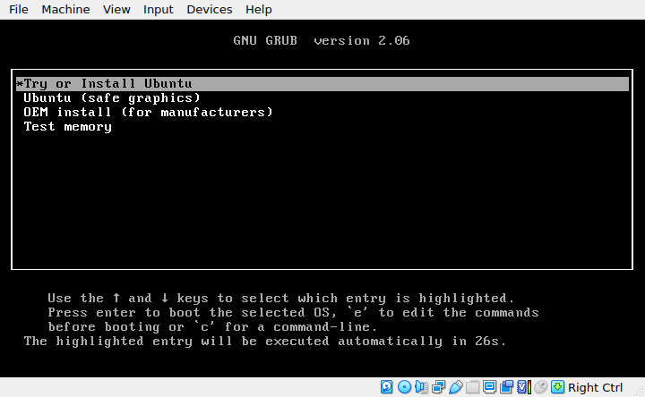]

---
# Virtual Box Demo
.center[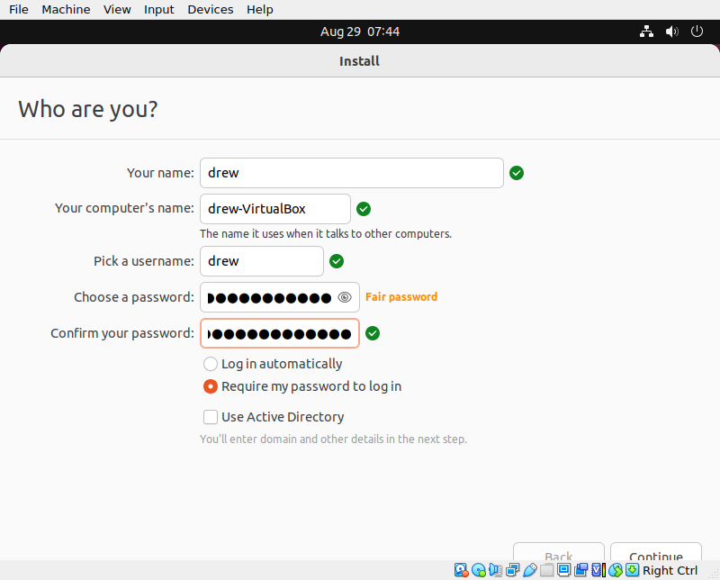]

---
# Virtual Box Demo
.center[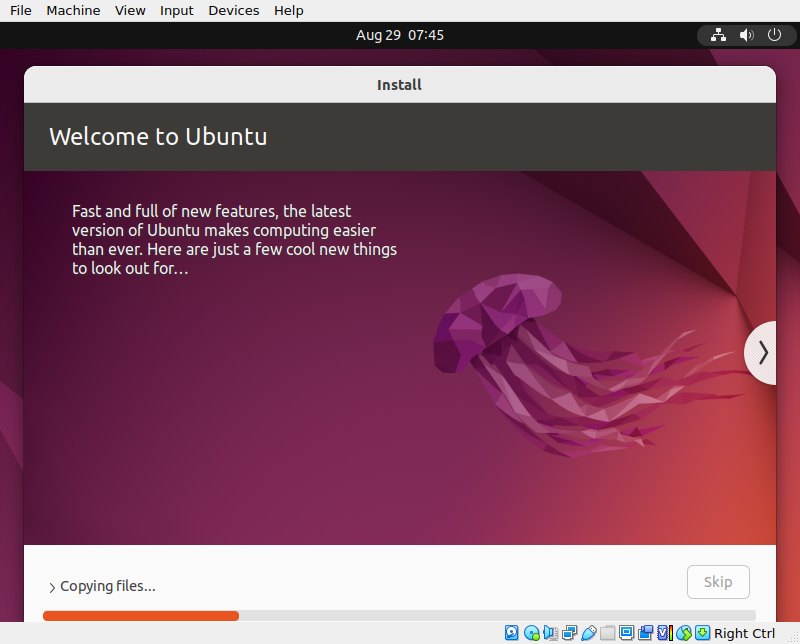]

---
class: clear, inverse, middle, center
# Installing Linux Software

---
# Installing Software
.pull-left[
* So you set up your VM
* Now what?
].pull-right[]

---
# Installing Software
* On Windows: click click click click ...
* On Mac: click click click click ...
* On Linux: use the package manager

---
# Installing Linux Software
* Various package managers exist
* Each "distro" has one
* We'll be using Ubuntu
    * It's basically the standard
    * If you have strong opinions: use whatever you want I don't care

---
# Updating Your System
.pull-left[
```bash
sudo apt update && sudo apt upgrade -y
```
].pull-right[
.center[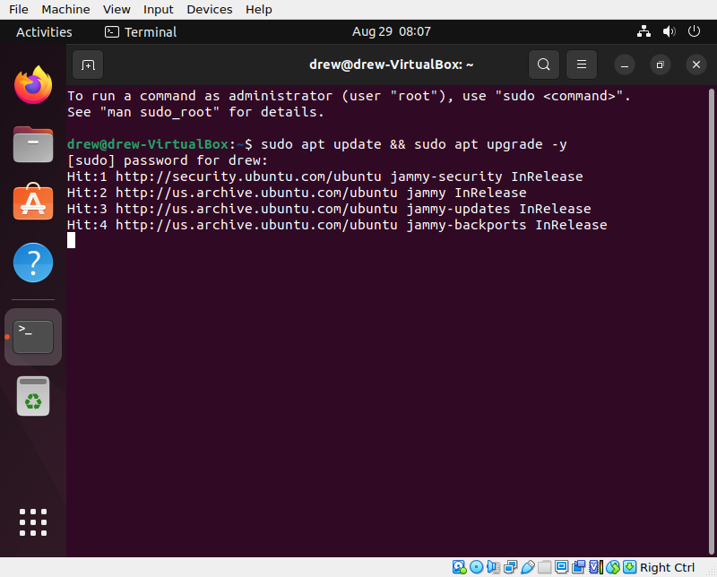]
]

---
# Installing Python
.pull-left[
```bash
sudo apt install -y \
  python3 python-is-python3
```
].pull-right[
.center[]
]

---
# Installing R
.pull-left[
```bash
sudo apt install -y r-base
```
].pull-right[
.center[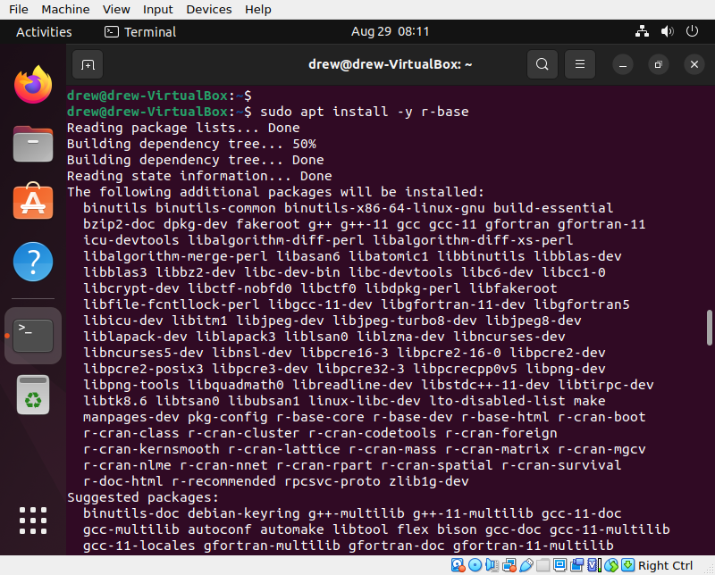]
]

---
# Installing R
.pull-left[
```bash
R --version
```
].pull-right[
.center[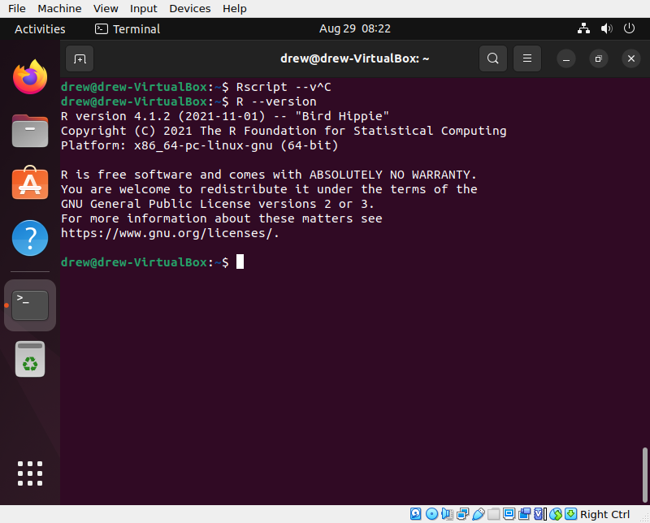]
]

---
# Uh-Oh!
We ran out of storage space!

---
# Resizing Your VM
.pull-left[
## Hypervisor
.center[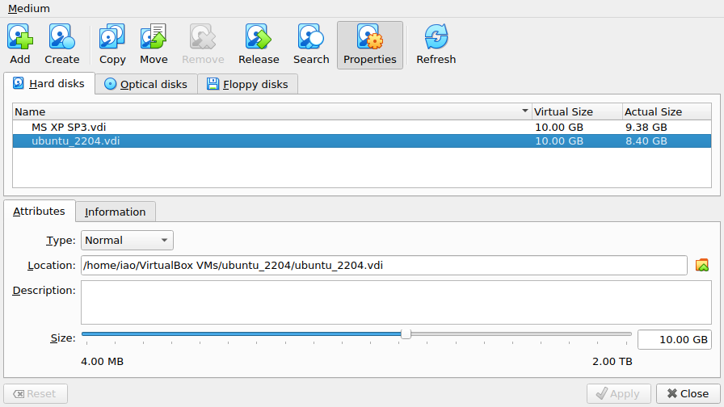]
].pull-right[
## VM
.center[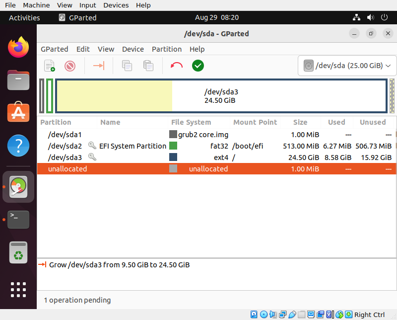]
]

---
# Resizing Your VM
.center[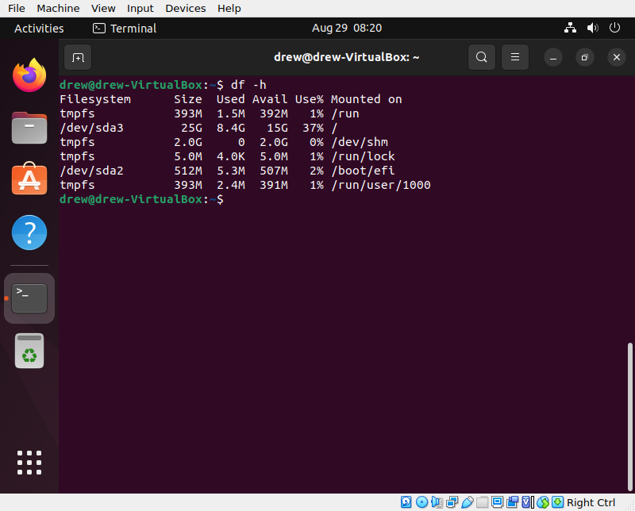]

---
# Installing git
.pull-left[
```bash
sudo apt install -y git
```
].pull-right[
.center[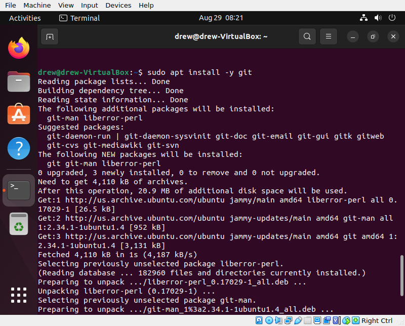]
]

---
# Installing pip
.pull-left[
```bash
sudo apt install -y python3-pip
```
].pull-right[
.center[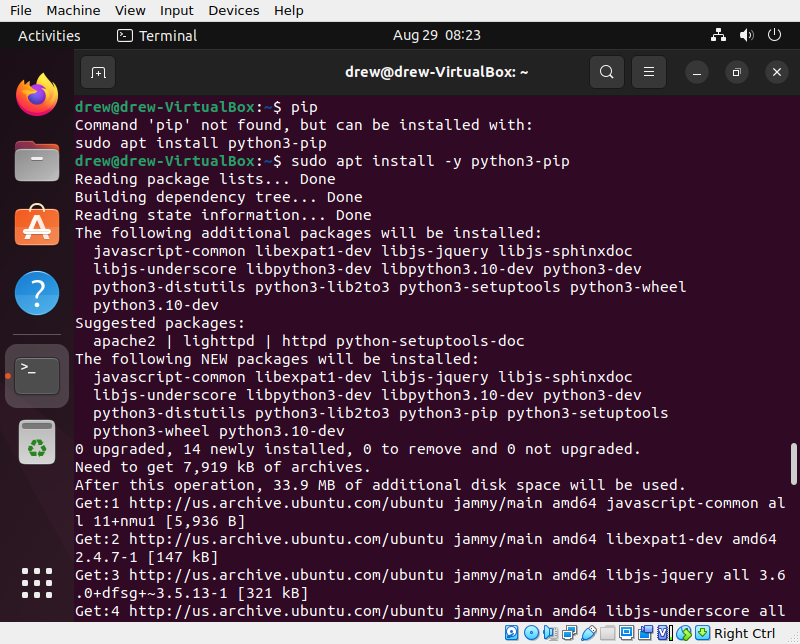]
]

---
# Installing tensorflow
.pull-left[
```bash
pip install tensorflow
```
].pull-right[
.center[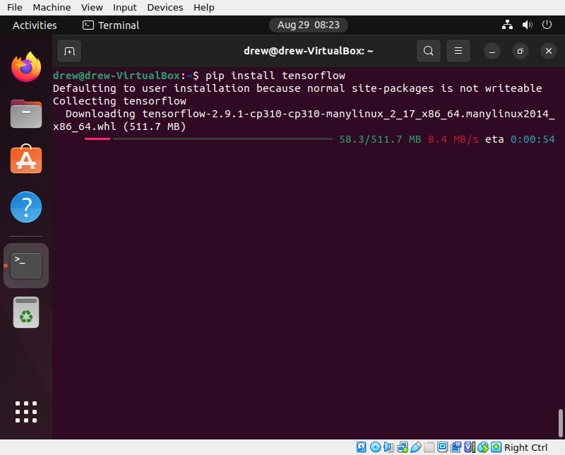]
]

---
# What About Windows/Mac?
* WSL uses Ubuntu
    * Step 1: Install WSL
    * Step 2: `sudo apt install ...`
* There are "similar" things for Mac (homebrew, ports)

---
# How "Ubuntu" Is This?
.pull-left[
* Short answer: kinda
* `apt`: Debian, Ubuntu, ...
* `yum`: Fedora, CentOS, RedHat, ...
* Others exist; largely irrelevant
].pull-right[]

---
class: clear, inverse, middle, center
# Wrapup

---
# Wrapup
* A VM is a virtualized OS + apps
* Advantages of a VM
    * Isolation
    * Reproducibility
    * Distribution
* Install Linux software via the software repo

---
# Ungraded (aka optional) Homework
* VM
    * Install an Ubuntu 22.04 VM with VirtualBox
    * Install the VirtualBox guest additions
    * I/O
        * Mount a folder from your host OS in your VM
        * Put a text file in the folder (from host OS)
        * From terminal: `cat` the file
    * Set up sshd in your VM and ssh to it (Windows users will need Putty or WSL for ssh)
* Native
    * On Windows (WSL): install git, R, and Python using `apt`
    * On Mac: experiment with homebrew

---
class: clear, inverse, middle, center
# Questions?
