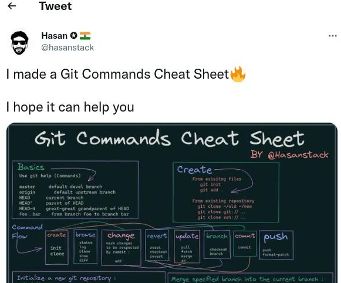

```{r setup, include=FALSE}
options(htmltools.dir.version = FALSE)
```

# Announcements
* Nothing unresolved from last time
* Questions?

---
# Today's Lecture
* Refresher: What Is git?
* Basic git
* Settings
* Branching and Merging
* Wrapup


---
class: clear, inverse, middle, center
# Refresher: What Is git?

---
# What Is git?
.pull-left[
* Version control software
* Command line tool
* Originally created by Linus Torvalds
].pull-right[]

---
# Some Early Advice
* git is **verbose** -- READ WHAT IT SAYS
* There are usually multiple ways to do anything
* git does what you tell it to do
    * This includes stupid things
* It's hard to *truly* wreck a git repo
    * But it's easy to wreck it beyond *your* ability to fix

---
# The $5^{\ast}$ Most Important Commands
* `git init` -- Initialize a new repository
* `git status` -- Summarize the current local state
* `git add` -- Stage a file for tracking
* `git commit` -- Commit staged changes
* `git push/pull` -- Synchronize with remote

---
# My Most Used Commands
```bash
history \
  | awk '{CMD[$2]++;count++;}END { for (a in CMD)print CMD[a] " " CMD[a]/count*100 "% " a;}' \
  | grep -v "./" \
  | column -c3 -s " " -t \
  | sort -nr \
  | nl \
  | head -n10
```
```
     1	419  41.9%  git
     2	145  14.5%  cd
     3	121  12.1%  ls
     4	50   5%     R
     5	39   3.9%   aws
     6	38   3.8%   grep
     7	24   2.4%   cat
     8	20   2%     vim
     9	14   1.4%   less
    10	14   1.4%   echo

```


---
class: clear, inverse, middle, center
# Basic git

---
# Setup
* Everyone said in homework 1 that you installed git
* Please feel free to follow along!
* Typing it out will help you learn it

1. Open terminal
2. Set up some kind of temporary repo, e.g.:
    ```bash
    mkdir /tmp/demo
    cd /tmp/demo
    ```

---
# Status
```bash
git status
```
```
fatal: not a git repository (or any of the parent directories): .git
```

---
# Init
```bash
git init
```
```
Initialized empty Git repository in /tmp/demo/.git/
```

---
# Add
```bash
touch x.txt
git status
```
```
On branch master

No commits yet

Untracked files:
  (use "git add <file>..." to include in what will be committed)
	x.txt

nothing added to commit but untracked files present (use "git add" to track)
```

---
# Add
```bash
git add x.txt
git status
```
```
On branch master

No commits yet

Changes to be committed:
  (use "git rm --cached <file>..." to unstage)
	new file:   x.txt
```

---
# Commit
```bash
git commit -m "adding x.txt"
```
```
[master (root-commit) 94c2c21] adding x.txt
 1 file changed, 0 insertions(+), 0 deletions(-)
 create mode 100644 x.txt
```
```bash
git status
```
```
On branch master
nothing to commit, working tree clean
```

---
# What About Push and Pull?
* These are all about interacting with remotes
* Pretty much what they sound like
* push
    * Send local state to the remote repo
    * Example: `git push origin master`
* pull
    * Retrieve remote state for the local repo
    * Example: `git pull origin master`
* Neither of these example commands will work right now


---
class: clear, inverse, middle, center
# Settings

---
# Configuration
* Git can be customized in many ways
* Can be controlled via `git config`
    * For list of options, just type `git config -h`
    * Web documentation: https://git-scm.com/docs/git-config
* Can also directly edit `~/.gitconfig`

---
# Let's Learn Some Shell!
* Technically not really, but anyway...
* Let's parse  `~/.gitconfig`
    * `~` - home directory; (see also `echo $HOME`)
    * Directories are separated by `/`
    * Files with a leading `.` are hidden from file viewers
    * So `~/.gitconfig` is a "hidden" file (dotfile) in your home directory

---
# Config options
.pull-left[
```bash
cat ~/.gitconfig
```
].pull-right[
```
[user]
  name = Drew Schmidt
  email = wrathematics@gmail.com
[color]
  ui = auto
[core]
  editor = vim
  excludesfile = ~/.gitignore_global
[color "status"]
  branch = blue
[alias]
  cm = commit -m
  st = status
[push]
  default = current
```
]

---
# Ignoring Files
* git is good for *source* files
    * Typical code file (Python/R script, ...)
    * Rmarkdown/LaTeX file
    * ...
* Generated files probably shouldn't go into git
    * Binary executable
    * pdf
    * ...
* How do we block unwanted files from git?

---
# Using gitignore
* Create a file (or files) called `.gitignore`
    * Can live anywhere in the repo
    * Can have multiple files
    * Placement has meaning; should probably just use the root
* List the kinds of files you don't ever want to see
    * Can be an explicit file name
    * Also can use basic pattern matching

---
# Ignoring Files
.pull-left[
`~/.gitignore_global`
].pull-right[
```
 # R
 .Rout
 .RData
 *.Rhistory

 # tex
 *.aux
 *.bbl
 *.blg
 *.out
 *.backup
 *.toc

 # Editor files
 *~
 *.swp

 # ...
```
]

---
# Adding Anyway
You can always *force* add

```bash
touch x.pdf
git status
```
```
On branch master

Untracked files:
  (use "git add <file>..." to include in what will be committed)
	x.pdf

nothing added to commit but untracked files present (use "git add" to track)
```

---
# Adding Anyway

```bash
echo "*.pdf" >> .gitignore
git status
```
```
On branch master

Untracked files:
  (use "git add <file>..." to include in what will be committed)
	.gitignore

nothing added to commit but untracked files present (use "git add" to track)
```

---
# Adding Anyway

```bash
git add -f x.pdf
git status
```
```
On branch master

Changes to be committed:
  (use "git rm --cached <file>..." to unstage)
	new file:   x.pdf

Untracked files:
  (use "git add <file>..." to include in what will be committed)
	.gitignore
```


---
class: clear, inverse, middle, center
# Branching and Merging

---
# Branches
.pull-left[
* Isolates the "primary" codebase
* Uses
    * Bug fixes
    * New features
    * Weird expieriments
    * ...
* "Primary" branch name is a convention
    * Typically `master` (the default)
    * GitHub *really* wants you to use `main`
    * I don't care what you use
].pull-right[
```bash
git status
```
```
On branch master
nothing to commit, working tree clean
```
]

---
# Branching Basics
* List branches with `git branch`
* Create a new branch with `git checkout -b new-branch-name`
    * Careful which branch you start from!
    * Usually want to start from `master`
    * Rebase as necessary
* Swap branches with `git checkout` (no flags)
    * `git checkout my-branch`
    * `git checkout master`
* Delete a branch with `git branch -D`

---
# Branching Example
```bash
git checkout -b my-feature-branch
```
```
Switched to a new branch 'my-feature-branch'
```
```bash
touch new_feature.txt
git status
```
```
On branch my-feature-branch
Untracked files:
  (use "git add <file>..." to include in what will be committed)
	new_feature.txt

nothing added to commit but untracked files present (use "git add" to track)
```

---
# Branching Example
```bash
git add new_feature.txt 
git commit -m "added cool new feature"
```
```
[my-feature-branch b76a2cb] added cool new feature
 1 file changed, 0 insertions(+), 0 deletions(-)
 create mode 100644 new_feature.txt
```
```bash
git log
```
```
commit b76a2cba88bb731d7a5b47e34dfb15dd01580f3f (HEAD -> my-feature-branch)
Author: Drew Schmidt <wrathematics@gmail.com>
Date:   Sun Sep 4 09:37:17 2022 -0400

    added cool new feature

commit 94c2c21ab933ecc3f877795530959921294e4979 (master)
Author: Drew Schmidt <wrathematics@gmail.com>
Date:   Sun Sep 4 09:23:22 2022 -0400

    adding x.txt
```

---
# Branching Example
```bash
git checkout master
```
```
Switched to branch 'master'
```
```bash
git log
```
```
commit 94c2c21ab933ecc3f877795530959921294e4979 (HEAD -> master)
Author: Drew Schmidt <wrathematics@gmail.com>
Date:   Sun Sep 4 09:23:22 2022 -0400

    adding x.txt
```

---
# Branching Example
```bash
git checkout my-feature-branch
```
```
Switched to branch 'my-feature-branch'
```
```bash
git checkout master
```
```
Switched to branch 'master'
```

---
# Branching Example
```bash
git merge my-feature-branch
```
```
Updating 94c2c21..b76a2cb
Fast-forward
 new_feature.txt | 0
 1 file changed, 0 insertions(+), 0 deletions(-)
 create mode 100644 new_feature.txt
```
```bash
git log
```
```
commit b76a2cba88bb731d7a5b47e34dfb15dd01580f3f (HEAD -> master, my-feature-branch)
Author: Drew Schmidt <wrathematics@gmail.com>
Date:   Sun Sep 4 09:37:17 2022 -0400

    added cool new feature

commit 94c2c21ab933ecc3f877795530959921294e4979
Author: Drew Schmidt <wrathematics@gmail.com>
Date:   Sun Sep 4 09:23:22 2022 -0400

    adding x.txt
```

---
# Branching Example
```bash
git checkout my-feature-branch
```
```
Switched to branch 'my-feature-branch'
```
```bash
git branch
```
```
   master
 * my-feature-branch
```
```bash
git branch -D my-feature-branch 
```
```
error: Cannot delete branch 'my-feature-branch' checked out at '/tmp/demo'
```

---
# Branching Example
```bash
git checkout master
```
```
Switched to branch 'master'
```
```bash
git branch -D my-feature-branch 
```
```
Deleted branch my-feature-branch (was b76a2cb).
```
```bash
git branch
```
```
 * master
```
```bash
git rev-list --count master
```
```
2
```


---
class: clear, inverse, middle, center
# Wrapup

---
# So Far
.pull-left[
## What have we covered?
* Basic git commands
* Working with a git repo on your computer
].pull-right[
## What Have We NOT Covered?
* Working with remotes (e.g. GitHub) (9/13)
* Collaborating with others (9/15)
* What to do when things go wrong (9/20)
* Homework (~9/22)
]

---
# git "Cheat Sheets"
* Many of these things exist
* This one is alright .small[https://twitter.com/hasanstack/status/1562735785736081408]
.center[]

---
# Wrapup
* A handful of git commands cover most of your workflow
* Easy to get started today!
* Use branches for development isolation

---
class: clear, inverse, middle, center
# Questions?
