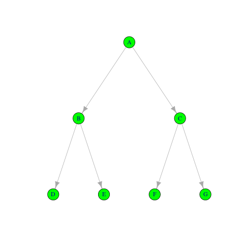

```{r setup, include=FALSE}
options(htmltools.dir.version = FALSE)
```


# Announcements
* Nothing unresolved from last time
* Homework is almost live!
* Questions?

---
# Content
* The Course So Far
* History of R and Python
* Programming and Data Science


---
class: clear, inverse, middle, center
# The Course So Far

---
# Where We've Been
## Module 1: Introduction
* Lecture 1 - Course Introduction
* Lecture 2 - Introduction to VMs
* Lecture 3 - CANCELED 🏈

---
# Where We've Been
## Module 2: Version Control
* Lecture 4 - Introduction to Version Control
* Lecture 5 - Basic git
* Lecture 6 - Working with Remotes
* Lecture 7 - Collaborating on GitHub
* Lecture 8 - When Things Go Wrong

---
# Where We're Headed
## Module 3: Basic Programming with R and Python
* Lecture 9 - Introduction to R and Python
* Lecture 10 - Basic Programming
* Lecture 11 - Data Structures (Part 1)
* Lecture 12 - Data Structures (Part 2)
* Lecture 13 - Application? (or possibly Data Structures Part 3)


---
class: clear, inverse, middle, center
# History of R and Python

---
# What is R?
.pull-left[
* *Lingua franca* for statistical computing
    * Good for data/stats
    * Can do general programming tasks (poorly)
* Part programming language, part data analysis package
* Dialect of S (May 5, 1976, Bell Labs)
* Notable names: Ross Ihaka, Robert Gentleman, **John Chambers**
* Free software (GPL >= 2)
].pull-right[]

---
# Python
.pull-left[
* General purpose programming language
    * Good for general purpose tasks
    * Can do data/stats tasks (poorly)
* Created late 80's / early 90's 
* Notable names: Guido Van Rossum
* Reference to Monty Python's Flying Circus
* Python Software Foundation License
].pull-right[]

---
# R vs Python
* Both are important to data science
    * Python: ML, *especially* neural networks
    * R: everything else
* Both have lots of career paths
* Learn **at least one of the two** a a high level

---
# Calling Python from R
```r
library(reticulate)
np = import('numpy')
np$random$seed(1234L)
np$random$rand()
```
```
[1] 0.1915195
```
```r
np$zeros(c(3L, 2L))
```
```
     [,1] [,2]
[1,]    0    0
[2,]    0    0
[3,]    0    0
```

---
# Calling R from Python
```python
import rpy2.robjects as robjects
r = robjects.r

set_seed = r('set.seed')
set_seed(1234)
rnorm = r('rnorm')
rnorm(3)
```
```
[-1.207066, 0.277429, 1.084441]
```
```python
from rpy2.robjects import pandas2ri
iris = pandas2ri.rpy2py(r('iris')
iris.head()
```
```
    Sepal.Length  Sepal.Width  Petal.Length  Petal.Width  Species
1           5.1          3.5           1.4          0.2        1
2           4.9          3.0           1.4          0.2        1
3           4.7          3.2           1.3          0.2        1
4           4.6          3.1           1.5          0.2        1
5           5.0          3.6           1.4          0.2        1
```


---
class: clear, inverse, middle, center
# Programming and Data Science

---
# Programming and Data Science
* We'll quickly lay out some basics
    * for loop
    * branching
    * etc
* We quickly want to get to "algorithms and data structures"

---
# Why Do We Need This?
* Most of your problems *are not new problems*
* There are often **known** good and bad solutions
* You will ***never*** be in a weaker position for knowing these things

---
# My Request to You
.pull-left[
Ask yourself: how does this work? How would I implement it?
].pull-right[]

---
# Thought Experiment
.pull-left[
* I have two files
* How do I tell if they're "the same"?
].pull-right[]

---
# Important Data Structures
.pull-left[
* Arrays
* Lists
* Stacks and Queues
* Hash Tables
* Graphs and Trees
].pull-right[]

---
# What We Will and Won't Do
.pull-left[
## What's the goal?
* Understand tradeoffs of solutions
* Learn "just enough" about how computers really work
* Learn some basic complexity ("Big O")
].pull-left[
## What's not the goal?
* Turn you into a computer scientist
* Make you into hardware experts
* Spend all day thinking about sorting algorithms
* Give you tons of algorithm puzzles
]

---
class: clear, inverse, middle, center
# Questions?
