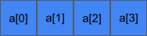
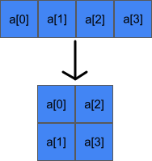
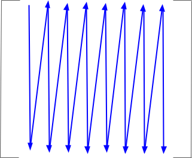
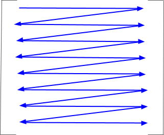

```{r setup, include=FALSE}
options(htmltools.dir.version = FALSE)
```

# Announcements
* Nothing unresolved from last time
* Homework is live!
* Questions?

---
# Content
* Data Structures and Algorithms
* Arrays


---
# Abstract Data Types


---
# Specification vs Implementation
* Example: a dictionary
    * Abstract data type
    * Can be implemented via hash table


---
class: clear, inverse, middle, center
# Arrays

---
# What Is An Array?


---
# C Arrays
.center[]

---
# C Arrays
.center[]

---
# Major Ordering

.pull-left[
## Column Major

].pull-right[
## Row Major

]


---
class: clear, inverse, middle, center
# Wrapup

---
# Wrapup
* 

---
class: clear, inverse, middle, center
# Questions?
