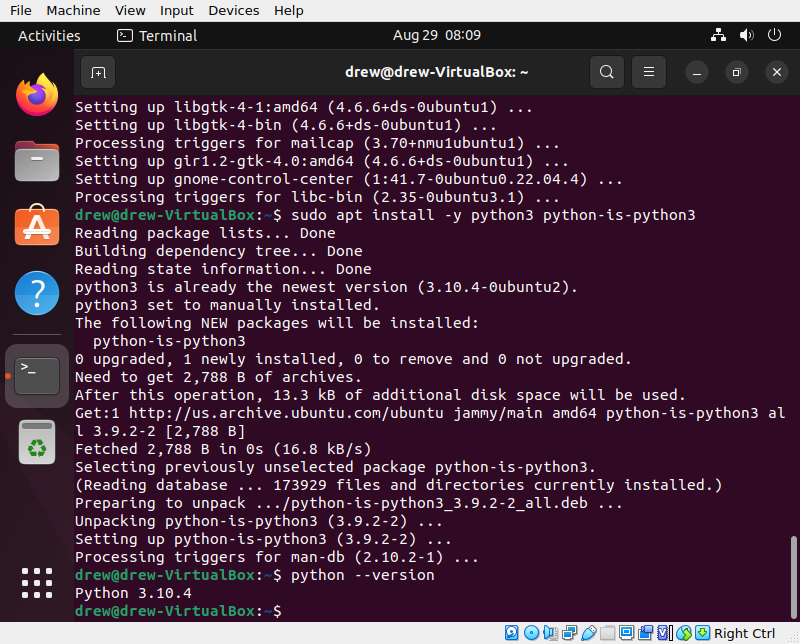

```{r setup, include=FALSE}
options(htmltools.dir.version = FALSE)
```

# Announcements
* Homework is graded
* New homework coming soon!
    * Some programming problems
    * A few data structures questions
    * Some gimme Big O questions
* Questions?

---
# Content
* The Course So Far
* Introduction to the Shell
* Getting Started with the *NIX Userland
* Installing and Managing Software


---
class: clear, inverse, middle, center
# The Course So Far

---
# Where We've Been
## Module 1: Introduction
* Lecture 1 - Course Introduction
* Lecture 2 - Introduction to VMs
* Lecture 3 - CANCELED 🏈

---
# Where We've Been
## Module 2: Version Control
* Lecture 4 - Introduction to Version Control
* Lecture 5 - Basic git
* Lecture 6 - Working with Remotes
* Lecture 7 - Collaborating on GitHub
* Lecture 8 - When Things Go Wrong

---
# Where We've Been
## Module 3: Basic Programming with R and Python
* Lecture 9 - Introduction to R and Python
* Lecture 10 - Basic Programming
* Lecture 11 - Data Structures (Part 1)
* Lecture 12 - Data Structures (Part 2)
* Lecture 13 - Data Structures (Part 3)

---
# Where We're Headed
## Module 4: Introduction to the Shell
* Lecture 14: CANCELED
* Lecture 15: Introduction to the Shell
* Lecture 16: Basic Shell
* Lecture 17: Some Helpful Utilities
* Lecture 18: Interacting with the Internet
* Lecture 19: grep
* Lecture 20: sed
* Lecture 21: awk and make
* Lecture 22: Scripting/Programming (Parts 1-2)


---
class: clear, inverse, middle, center
# Introduction to the Shell

---
# The Shell
* An interface to the *NIX system
* An interactive REPL for your computer
* A very efficient way to extract information
* Extremely useful for data science!

---
# Strictly Speaking
.pull-left[
* This is about more than "the shell"
* More broadly: the *NIX userland (which includes shell)
* Everyone just calls it "the shell" (or "bash")
].pull-right[]

---
# Different Shells
* `sh` (often `dash`)
* `bash` $\leftarrow$
* `csh`
* `ksh`

---
# Why Does This Even Matter
* There are "bash-isms" that aren't "portable"
* This is especially true in scripting/programming
* I assume you don't really care about this
* We'll be using bash


---
class: clear, inverse, middle, center
# Getting Started with the *NIX Userland

---
# What is *NIX?
.pull-left[
* UNIX (1970's, Bell Labs)
* Many dead UNIX clones
* 1990's: Linux **KERNEL** created
* GNU (from FSF) userland + Linux kernel = "Linux"
* Obnoxious people say "GNU/Linux" or "GNU+Linux"
* Mac: technically UNIX (and NOT Linux)
* WSL: Ubuntu Linux
].pull-right[]

---
# BASH Prompt
Like an R/Python session:
.pull-left[
```bash
$ whoami
```
```
mschmid3
```
```bash
$ echo $USER
```
```
mschmid3
```
].pull-right[
```bash
$ echo "hello world"
```
```
hello world
```
]

---
# Everything Is A File
* See slide title
* Everything? Yes!
    * Binary executables
    * Directories
    * Device drivers
    * HDD mounts

---
# Getting Help
* `man`
* Short for "manual"
* Examples
    * `man cd`
    * `man ls`

---
# Flags and Options
* Not consistent across programs
* But as a general rule:
    * Flags: dash followed by a single character
    * Options: dash-dash or dash-dash-equals followed by a string
    * Each controls program behavior
* Examples
    * `ls -a`
    * `ls --all`
    * `ls --color=always`
* Flags can usually be combined
    * `ls -a -l`
    * `ls -al`
* Often for simplicity, people will call all of these "flags"


---
class: clear, inverse, middle, center
# Installing and Managing Software

---
# Installing Software
* Software repo
    * Pros: easy
    * Cons: requires root (admin), you can't specify the version (much)
* Building from source
    * Pros: doesn't need root, can specify version
    * Cons: hard ("depdency hell")

---
# Installing From the Repo: The General Procedure
1. `sudo apt update`
2. `sudo apt install whatever-ubuntu-calls-the-thing-you-want`

---
# How "Ubuntu" Is This?
.pull-left[
* Short answer: kinda
* `apt`: Debian, Ubuntu, ...
* `yum`: Fedora, CentOS, RedHat, ...
* Others exist; largely irrelevant
].pull-right[]

---
# What About Windows/Mac?
* WSL uses Ubuntu
    * Step 1: Install WSL
    * Step 2: `sudo apt install ...`
* There are "similar" things for Mac (homebrew, ports)

---
# Installing Python
.pull-left[
```bash
sudo apt install -y \
  python3 python-is-python3
```
].pull-right[
.center[]
]

---
# Installing from Source: The General Procedure
1. Download `some_program.tar.gz`
2. Extract `tar -zxf some_program.tar.gz`
3. Move to new directory `cd some_program`
4. Build (check the README!)
    * If autotools: `./configure && make && sudo make install`
    * If cmake: `mkdir build && cd build && cmake .. && make`

---
# Installing from Source: R
```bash
export MAKE="/usr/bin/make -j 16"

wget https://stat.ethz.ch/R/daily/R-devel.tar.gz
tar -zxf $pkg
cd R-devel
./configure \
  --with-x=no \
  --enable-R-shlib=yes \
  --enable-memory-profiling=no \
  --prefix=`pwd` \
  && make \
  && make install
```

---
# Other Installation Options
* Python packages
    * pip (binary or source)
    * conda (can manage libraries...)
* cget
* ...


---
class: clear, inverse, middle, center
# Wrapup

---
# Resources
* `man`
* Data Science at the Command Line
    * Read free online (legally) https://datascienceatthecommandline.com/2e/
    * Physical copies can be purchased
* `[bash]` tag on stack overflow

---
# Ungraded Homework
* What do the flags/options do in the Flags and Options slide?
* Try building R from source!

---
# Wrapup
* The shell is extremely useful for data science workflows.
* Getting good at "the shell" is a super power.
* We're only just getting started!

---
class: clear, inverse, middle, center
# Questions?
