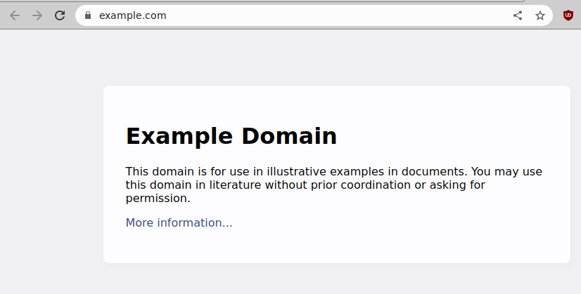

```{r setup, include=FALSE}
options(htmltools.dir.version = FALSE)
```

# Announcements
* New homework
* Questions?

---
# What We've Already Seen
* `sudo apt update && sudo apt install -y some-package`
* `git clone https://github.com/some-user/some-package`
* `pip install some-package`
* `Rscript -e "install.packages('some_package')"`

---
# Some Pre-Requisites
* We'll show some examples with `wget` and `curl`
* In Ubuntu we would run:
    ```bash
    sudo apt install -y wget curl libcurl4-openssl-dev
    ```

---
# Content
* curl
* wget

---
# Other Protocols
* rsync
* ssh/sftp
* ftp


---
class: clear, inverse, middle, center
# curl

---
# curl
* cURL - "client URL"
* Command line tool for interacting with "the web"
* Can "send" (`POST`) and "receive" (`GET`) (and more...)
* Quite powerful, but often not your "go-to" tool

---
# curl
```bash
curl https://www.uuidgenerator.net/api/version4
```
```
9997bb47-4ab2-4cc8-a805-2f6aec33947c
```

---
# curl
```bash
curl -v https://www.uuidgenerator.net/api/version4
```
```
*   Trying 173.255.230.79:443...
* Connected to www.uuidgenerator.net (173.255.230.79) port 443 (#0)
* ALPN, offering h2
* ALPN, offering http/1.1
*  CAfile: /etc/ssl/certs/ca-certificates.crt
*  CApath: /etc/ssl/certs
* TLSv1.0 (OUT), TLS header, Certificate Status (22):
* TLSv1.3 (OUT), TLS handshake, Client hello (1):
* TLSv1.2 (IN), TLS header, Certificate Status (22):
* TLSv1.3 (IN), TLS handshake, Server hello (2):
* TLSv1.2 (IN), TLS header, Finished (20):
* TLSv1.2 (IN), TLS header, Supplemental data (23):
* TLSv1.3 (IN), TLS handshake, Encrypted Extensions (8):
# ...
```

---
# curl
```bash
curl -o /tmp/key https://www.uuidgenerator.net/api/version4
```
```
 % Total    % Received % Xferd  Average Speed   Time    Time     Time  Current
                                 Dload  Upload   Total   Spent    Left  Speed
100    36    0    36    0     0    113      0 --:--:-- --:--:-- --:--:--   112
```
```bash
cat /tmp/key
```
```
8d434045-91e2-4586-9f41-fdde24b7cdd6
```


---
# curl
```bash
curl -s -o /tmp/key https://www.uuidgenerator.net/api/version4
cat /tmp/key
```
```
cc157e22-355b-4f69-89df-08762debf810
```

---
# Web Verbs
* HTTP methods for API calls
* Common ones:
  * `GET` - retrieve information
  * `POST` - send information
  * `PUT` - "upload"
  * `DELETE` - remove something
* Different resources may require different "headers" (metadata)

---
# curl and Web Verbs
* `curl --request GET ...`
* `curl --request POST ...`
* etc

---
# Verbs? Pipes?
* Can use `curl` to do a variety of tasks, not just `GET`s
* Piping to other programs also possible
* There are some challenges here
* Not really worth getting into
    * You wouldn't just use CLI/curl on something complicated
    * Instead use curl bindings in ruby/R/Python/...

---
# Language Interfaces
* R
    * curl package (direct)
    * httr package (indirect)
* Python
    * pycurl package (direct)
    * requests package (indirect)

---
# curl
.pull-left[
## R
```r
install.packages("httr")
```
].pull-right[
## Python
```bash
pip install requests
```
]

---
# curl
.pull-left[
## R
```r
url = "https://www.uuidgenerator.net/api/version4"
resp = httr::GET(url)
resp
```
```
Response [https://www.uuidgenerator.net/api/version4]
  Date: 2022-10-27 18:40
  Status: 200
  Content-Type: text/plain; charset=utf-8
  Size: 36 B
```
```r
httr::content(x)
```
```
[1] "1511291d-48ca-4450-88de-90091891c12d"
```
].pull-right[
## Python
```python
import requests
url = "https://www.uuidgenerator.net/api/version4"
resp = requests.get(url)
resp
```
```
<Response [200]>
```
```python
resp.content
```
```
b'50daced5-9bd4-47c9-91e9-c184d52747b1'
```
]


---
class: clear, inverse, middle, center
# wget

---
# wget
* Downloader for the shell
* "world wide web" + "get"
* Surprisingly powerful tool!

---
# Notable Uses
* Downloads files
    * Go to website
    * Copy url
    * `wget {url}`
* Can mirror websites
* Used in 2010 by Chelsea Manning to get logs later sent to WikiLeaks

---
# Example
.center[]

---
# wget
```bash
wget http://example.com
```
```
--2022-10-27 15:26:09--  http://example.com/
Resolving example.com (example.com)... 93.184.216.34, 2606:2800:220:1:248:1893:25c8:1946
Connecting to example.com (example.com)|93.184.216.34|:80... connected.
HTTP request sent, awaiting response... 200 OK
Length: 1256 (1.2K) [text/html]
Saving to: ‘index.html’

index.html          100%[===================>]   1.23K  --.-KB/s    in 0s      

2022-10-27 15:26:09 (25.9 MB/s) - ‘index.html’ saved [1256/1256]
```

---
# wget
```bash
ls
```
```
index.html
```
```bash
head index.html 
```
```
<!doctype html>
<html>
<head>
    <title>Example Domain</title>

    <meta charset="utf-8" />
    <meta http-equiv="Content-type" content="text/html; charset=utf-8" />
    <meta name="viewport" content="width=device-width, initial-scale=1" />
    <style type="text/css">
    body {
```

---
# wget
```bash
wget -m http://example.com
```
```
Resolving example.com (example.com)... 93.184.216.34, 2606:2800:220:1:248:1893:25c8:1946
Connecting to example.com (example.com)|93.184.216.34|:80... connected.
HTTP request sent, awaiting response... 200 OK
Length: 1256 (1.2K) [text/html]
Saving to: ‘example.com/index.html’

example.com/index.h 100%[===================>]   1.23K  --.-KB/s    in 0s      

2022-10-27 15:27:59 (156 MB/s) - ‘example.com/index.html’ saved [1256/1256]

FINISHED --2022-10-27 15:27:59--
Total wall clock time: 0.06s
Downloaded: 1 files, 1.2K in 0s (156 MB/s)
```

---
# wget
```bash
ls
```
```
example.com
```
```bash
ls example.com/
```
```
index.html
```
```bash
head example.com/index.html 
```
```
<!doctype html>
<html>
<head>
    <title>Example Domain</title>

    <meta charset="utf-8" />
    <meta http-equiv="Content-type" content="text/html; charset=utf-8" />
    <meta name="viewport" content="width=device-width, initial-scale=1" />
    <style type="text/css">
    body {
```

---
# Not Just for html
* Can download specified files
* Lists of files
* Can interact with ftp
* Can resume broken downloads
* ...

---
# Example: The Airlines Dataset
.center[]
.tiny[https://dataverse.harvard.edu/dataset.xhtml?persistentId=doi:10.7910/DVN/HG7NV7]

---
# Example: The Airlines Dataset
```bash
mkdir /tmp/airlines && cd /tmp/airlines
wget -O out.html \
    https://dataverse.harvard.edu/dataset.xhtml?persistentId=doi:10.7910/DVN/HG7NV7
```
```bash
ls
```
```
out.html
```
```bash
head -n 3 out.html 
```
```
<?xml version='1.0' encoding='UTF-8' ?>
<!DOCTYPE html>
<html xmlns="http://www.w3.org/1999/xhtml" lang="en" xml:lang="en"><head id="j_idt19"><!-- Global site tag (gtag.js) - Google Analytics -->
```

---
# Example: The Airlines Dataset
```r
library(magrittr)

html_file = "/tmp/airlines/out.html"
html = readLines(html_file)
json = html[grep("script type", html)[1]] %>%
  sub('<script type=\"application/ld+json\">', "", ., fixed = TRUE) %>%
  jsonlite::fromJSON()

json$distribution$contentUrl %>% head(3)
```
```
[1] "https://dataverse.harvard.edu/api/access/datafile/1375005"
[2] "https://dataverse.harvard.edu/api/access/datafile/1375004"
[3] "https://dataverse.harvard.edu/api/access/datafile/1375003"
```

---
# Example: The Airlines Dataset
```r
setwd("/tmp/airlines")
for (url in json$distribution$contentUrl) {
  cmd = glue::glue("wget --quiet {url}")
  system(cmd)
}
list.files(getwd())
```
```
 [1] "1374917"  "1374918"  "1374922"  "1374923"  "1374925"  "1374926" 
 [7] "1374927"  "1374928"  "1374929"  "1374930"  "1374931"  "1374932" 
[13] "1374933"  "1374993"  "1374994"  "1374995"  "1374996"  "1374997" 
[19] "1374998"  "1374999"  "1375000"  "1375001"  "1375002"  "1375003" 
[25] "1375004"  "1375005"  "out.html"
```

---
# Example: The Airlines Dataset
```bash
rm out.html
ls
```
```
1374917  1374923  1374927  1374930  1374933  1374995  1374998  1375001  1375004
1374918  1374925  1374928  1374931  1374993  1374996  1374999  1375002  1375005
1374922  1374926  1374929  1374932  1374994  1374997  1375000  1375003
```
```bash
file 1374917
```
```
1374917: bzip2 compressed data, block size = 900k
```

---
# Example: The Airlines Dataset
```bash
for f in `ls`; do mv $f $f.bz2; done
ls
```
```
1374917.bz2  1374926.bz2  1374931.bz2  1374995.bz2  1375000.bz2  1375005.bz2
1374918.bz2  1374927.bz2  1374932.bz2  1374996.bz2  1375001.bz2
1374922.bz2  1374928.bz2  1374933.bz2  1374997.bz2  1375002.bz2
1374923.bz2  1374929.bz2  1374993.bz2  1374998.bz2  1375003.bz2
1374925.bz2  1374930.bz2  1374994.bz2  1374999.bz2  1375004.bz2
```

---
# Example: The Airlines Dataset
```bash
bzip2 -d 1375004.bz2
ls
```
```
1374917.bz2  1374926.bz2  1374931.bz2  1374995.bz2  1375000.bz2  1375005.bz2
1374918.bz2  1374927.bz2  1374932.bz2  1374996.bz2  1375001.bz2
1374922.bz2  1374928.bz2  1374933.bz2  1374997.bz2  1375002.bz2
1374923.bz2  1374929.bz2  1374993.bz2  1374998.bz2  1375003.bz2
1374925.bz2  1374930.bz2  1374994.bz2  1374999.bz2  1375004
```
```bash
head -n2 1375004
```
```
Year,Month,DayofMonth,DayOfWeek,DepTime,CRSDepTime,ArrTime,CRSArrTime,UniqueCarrier,FlightNum,TailNum,ActualElapsedTime,CRSElapsedTime,AirTime,ArrDelay,DepDelay,Origin,Dest,Distance,TaxiIn,TaxiOut,Cancelled,CancellationCode,Diverted,CarrierDelay,WeatherDelay,NASDelay,SecurityDelay,LateAircraftDelay
1988,1,9,6,1348,1331,1458,1435,PI,942,NA,70,64,NA,23,17,SYR,BWI,273,NA,NA,0,NA,0,NA,NA,NA,NA,NA
```


---
class: clear, inverse, middle, center
# Wrapup

---
# Wrapup
* `curl` is a very powerful command line tool.
* But you're probably better off using library interfaces.
* `wget` is definitely worth using (directly) though!

---
class: clear, inverse, middle, center
# Questions?
