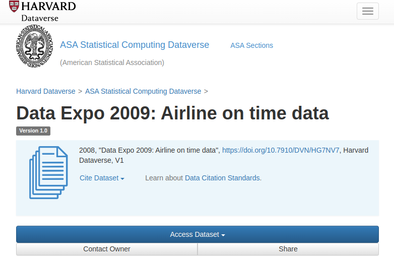
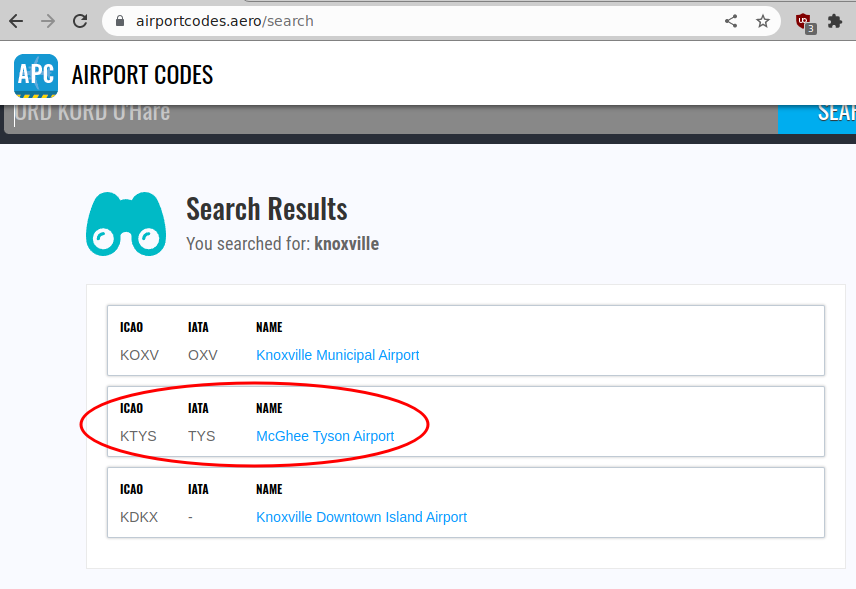

layout:true
<div class="footer"><span>Drew Schmidt 2022</span></div>

```{r setup, include=FALSE}
options(htmltools.dir.version = FALSE)
```

---
# Announcements
* New homework
    * Due Monday Nov 7
    * Problem 1: read the instructions carefully!
    * Problem 5: Freebie - the answer is NOT $O(n)$
* Questions?

---
# Content
* Background
* Basic grep
* Examples


---
class: clear, inverse, middle, center
# Background

---
# grep
* CLI tool
* What does it do?
    * Searches for patterns in text
    * Can be files, outputs from commands, ...
* Very powerful!

---
# The Name
* Comes from `ed`
* Also explains some patterns in `vim`
* `g/re/p` - **g**lobally search for **re**gular expression and **p**rint matches

---
# Common Uses for grep
* Software engineering
    * Find file containing function definition
    * Finding data source
    * Making sure some value is actually where you think it is
* Data science
    * Quick summaries (how many observations are from such-and-such class)
    * Software engineering!

---
# Regular Expressions
* String-based pattern matching.
* Often looks like your cat just stomped on your keyboard.
* Concise (not necessarily readable!) descriptions of a set of strings.
* Find/Replace cranked up to 11.
* Regular Expression Language - Quick Reference https://learn.microsoft.com/en-us/dotnet/standard/base-types/regular-expression-language-quick-reference

---
# Regular Expressions: Some Important Examples
* `^A` - is `A` at the beginning of the string?
* `A$` - is `A` at the end of the string?
* `^A$` - is the string *exactly* `A`?
* `(^A|A$)` - is `A` at the beginning or at the end of the string?

---
# A Very Powerful Tool
.pull-left[
`grep` your way to success!
].pull-right[]


---
class: clear, inverse, middle, center
# Basic grep

---
# Basic grep
* `grep <flags> pattern file(s)`
* `grep -R` - recursive
* `grep -F` - "fixed" strings
* `grep -i` - ignore (upper/lower) case in text
* `grep -v` - invert match

---
# Basic grep
```{bash}
echo "hello world" > /tmp/example.txt
cat /tmp/example.txt
```
```{bash}
grep hello /tmp/example.txt
```
```{bash}
grep ello /tmp/example.txt
```

---
# Basic grep
```{bash, error = TRUE}
grep goodbye /tmp/example.txt
```
```{bash, error = TRUE}
grep Hello /tmp/example.txt
```
```{bash}
grep -i Hello /tmp/example.txt
```
```{bash, error = TRUE}
grep -v Hello /tmp/example.txt
```


---
class: clear, inverse, middle, center
# Examples

---
# Contrived Example
* We're going to randomly generate a bunch of files
* Structure
  * Root path (arbitrary)
  * Two directories (single capital letter)
  * Some number of files (single lower case letter)
  * File is text of random "words"

---
# Setup
```r
num_rand_files = function(range = 5:15) sample(range, size = 1)
gen_dirs = function(sample_space, root_paths) {
  lapply(1:length(root_paths), function(i) {
    n_dirs = num_rand_files()
    root_path = root_paths[i]
    dirs = sample(sample_space, size = n_dirs)
    full_paths = file.path(root_path, dirs)
    sapply(full_paths, dir.create, recursive = TRUE)
    return(full_paths)
  })
}
```

---
# Setup
```r
gen_word = function(..., length = 1:10) paste0(sample(LETTERS, sample(length, 1), replace = TRUE), collapse = "")
gen_files = function(sample_space, root_paths) {
  lapply(1:length(root_paths), function(i) {
    n_files = num_rand_files()
    root_path = root_paths[i]
    for (j in 1:n_files) {
      n_words = num_rand_files(range = 1:1000)
      body = paste(sapply(1:n_words, gen_word), collapse = " ")
      file = file.path(root_path, sample(sample_space, size=1))
      cat(glue::glue("Writing to {file}"), "\n")
      writeLines(body, con = file)
    }
  })
}
```

---
# Setup
```r
library(magrittr)
set.seed(1234)
root = "~/tmp/example"
unlink(root, recursive = TRUE)
dirs = gen_dirs(LETTERS, root = root) %>% unlist()
subdirs = gen_dirs(LETTERS, root = dirs)
ret = parallel::mclapply(unlist(subdirs), gen_files, sample_space = letters)
```

---
# What Was Generated?
```{bash}
find /tmp/example -name "[a-z]" | wc -l
```
```{bash}
du -h /tmp/example/ | tail -n 1
```
```{bash}
find . -type f -exec wc -w {} + | tail -n 1
```

---
# Finding Files
```{bash}
find /tmp/example -name x | grep B
```
```{bash}
find /tmp/example -name x | grep ^/tmp/example/B
```

---
# Finding Text In Files
```{bash}
grep -R ABC /tmp/example | wc -l
```
```{bash}
grep -R " ABC " /tmp/example | wc -l
```
```{bash}
grep -R -l " ABC " /tmp/example | sort
```

---
# Finding Text In Files
```{bash}
grep -R AB /tmp/example | wc -l
```
```{bash}
grep -R "^AB" /tmp/example | wc -l
```
```{bash}
grep -R -l "^AB" /tmp/example
```
```{bash}
grep -o '^.\{3\}' /tmp/example/D/H/w
```


---
# Example: The Airlines Dataset
.center[]
.tiny[https://dataverse.harvard.edu/dataset.xhtml?persistentId=doi:10.7910/DVN/HG7NV7]

---
# Example: The Airlines Dataset
```{bash}
ls ~/sw/data/airlines/csv
```

---
# Example: The Airlines Dataset
Ungraded (for now?) homework: download and update the file names for "the airlines dataset".
* 22 csv files
* Years: 1987-2008
* File name: `${YEAR}.csv`
* Do it programmatically!

---
# Example: The Airlines Dataset
```{bash}
du -h ~/sw/data/airlines/csv/1987.csv
```
```{bash}
wc -l ~/sw/data/airlines/csv/1987.csv
```

---
# Example: The Airlines Dataset
```{bash}
head -n 3 ~/sw/data/airlines/csv/1987.csv
```

---
# Example: The Airlines Dataset
.center[]

---
# Example: The Airlines Dataset
```{bash}
grep TYS ~/sw/data/airlines/csv/1987.csv | head -n 3
```
```{bash}
head -n 3 ~/sw/data/airlines/csv/1987.csv | tr ',' ' '
```
```{bash}
grep TYS ~/sw/data/airlines/csv/1987.csv | wc -l
```

---
# Example: The Airlines Dataset
```bash
time grep TYS 1987.csv | wc -l 
```
```
4795

real	0m0.066s
user	0m0.051s
sys	0m0.018s
```
```r
system.time(nrow(read.csv("1987.csv")))
```
```
   user  system elapsed 
  7.034   0.370   7.405 
```
```r
system.time(nrow(data.table::fread("1987.csv")))
```
```
   user  system elapsed 
  0.886   0.075   0.235 
```

---
# Strictly Speaking...
```bash
echo -e "a\nb\nc\nd\ne" > /tmp/test.txt
```
.pull-left[
## R
```{r}
con <- file("/tmp/test.txt", "r")
readLines(con = con, n = 1)
readLines(con = con, n = 1)
close(con)
```
].pull-right[
## Python
```python
con = open("/tmp/test.txt", "r")
con.readline()
```
```
'a\n'
```
```python
con.readline()
```
```
'b\n'
```
```python
con.close()
```
]

---
# Example: The Airlines Dataset
```bash
grep ,TYS, ~/sw/data/airlines/csv | wc -l
```
```
grep: 2001.csv: binary file matches
grep: 2002.csv: binary file matches
394298
```
```bash
ls ~/sw/data/airlines/csv | wc -w
```
```
22
```
```bash
echo "scale=4; 394298/22" | bc
```
```
17922.6363
```

---
# Example: The Airlines Dataset
```{bash}
head -n 3 ~/sw/data/airlines/csv/1987.csv
```
```bash
grep [0-9],TYS, * | wc -l
```
```
grep: 2001.csv: binary file matches
grep: 2002.csv: binary file matches
193641
```
```bash
echo "scale=4; 193641/22" | bc
```
```
8801.8636
```


---
class: clear, inverse, middle, center
# Wrapup

---
# Wrapup
* `grep` your way to success!
* More on regular expressions next time with `sed`

---
class: clear, inverse, middle, center
# Questions?
