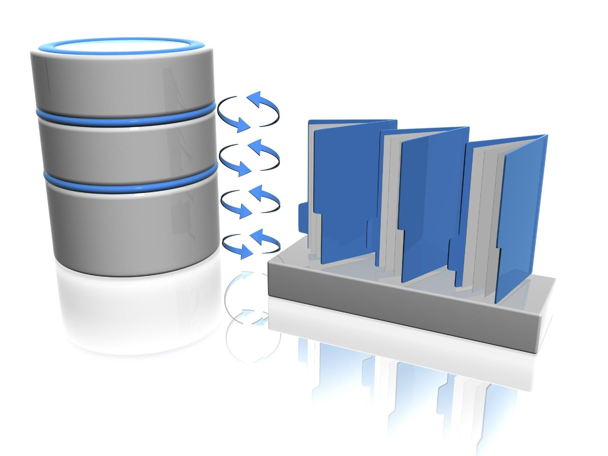

layout:true
<div class="footer"><span>Drew Schmidt 2022</span></div>

```{r setup, include=FALSE}
options(htmltools.dir.version = FALSE)
```

---
# Announcements
* Schedule:
    * Nov 17 and 22 - databases
    * Nov 24 - No class for US Thanksgiving
    * Nov 29 and Dec 1 - more databases
    * Dec 6 - course wrapup
* New homework (last one)
    * Coming "soon"
    * Due Mon Dec 5? (fairly hard last date)
    * No homework on last modeule (databases)
* Questions?

---
# Where We've Been
## Module 1: Introduction
* Lecture 1 - Course Introduction
* Lecture 2 - Introduction to VMs
* Lecture 3 - CANCELED 🏈

---
# Where We've Been
## Module 2: Version Control
* Lecture 4 - Introduction to Version Control
* Lecture 5 - Basic git
* Lecture 6 - Working with Remotes
* Lecture 7 - Collaborating on GitHub
* Lecture 8 - When Things Go Wrong

---
# Where We've Been
## Module 3: Basic Programming with R and Python
* Lecture 9 - Introduction to R and Python
* Lecture 10 - Basic Programming
* Lecture 11 - Data Structures (Part 1)
* Lecture 12 - Data Structures (Part 2)
* Lecture 13 - Data Structures (Part 3)

---
# Where We've Been
## Module 4: Introduction to the Shell
* Lecture 14: CANCELED
* Lecture 15: Introduction to the Shell
* Lecture 16: Basic Shell
* Lecture 17: Some Helpful Utilities
* Lecture 18: Interacting with the Internet
* Lecture 19: grep
* Lecture 20: sed
* Lecture 21: awk and make
* Lecture 22-23: Scripting/Programming (Parts 1-2)

---
# Where We're Headed
## Module 5: Databases
* Lecture 24: Introduction to Databases
* Lecture 25-26: Relational Databases
* Lecture 27: Non-relational Databases
* Lecture 28: Course Wrapup


---
# What Is a Database?
.pull-left[
* "A database is an organized collection of structured information, or data, typically stored electronically in a computer system" - Oracle
* Usually referring to a DBMS + its stored data
* Data is usually "tabular", but can form complicated hierarchies
].pull-right[]

---
# Pros and Cons
.pull-left[
## Pros
* Data integrity
* Security
* Usually quite fast
* Server queryable from multiple "locations"
].pull-right[
## Cons
* Complexity!
    * How do you run the server?
    * How do you store data (this is the hard part)?
    * Have do you query it?
* Can be expensive $$$
* Difficult to share data with others
]

---
# Databases
.pull-left[
## Uses
* Web apps
* Buesiness processes
* ...
].pull-right[
## Absence
* Academia! (research)
* HPC
]

---
# Types of Databases
.pull-left[
## Relational (tables - SQL)
* MySQL
* PostgreSQL
* SQLite
* Oracle
].pull-right[
## Non-Relational ("NoSQL")
* MongoDB (document-oriented)
* Redis (key/value)
* Apache Cassandra (columnar)
]

---
# SQL
* Structured Query Language
* S-Q-L or "sequel"
* A DSL 
* Differences across implementations
* Simple queries are easy to understand: `SELECT x FROM y WHERE z`
* Kind of looks like dplyr (cough cough)
* Queries can be EXTREMELY complicated...

---
# SQLite
.pull-left[
* We'll be using this for examples/demos
* Not a daemon/service
* The "db" is a file!
* Strictly speaking: a library
* Accessible via R and Python
].pull-right[]


---
class: clear, inverse, middle, center
# Questions?
