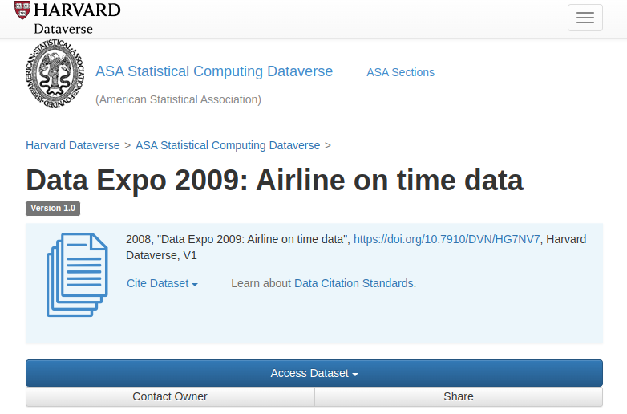
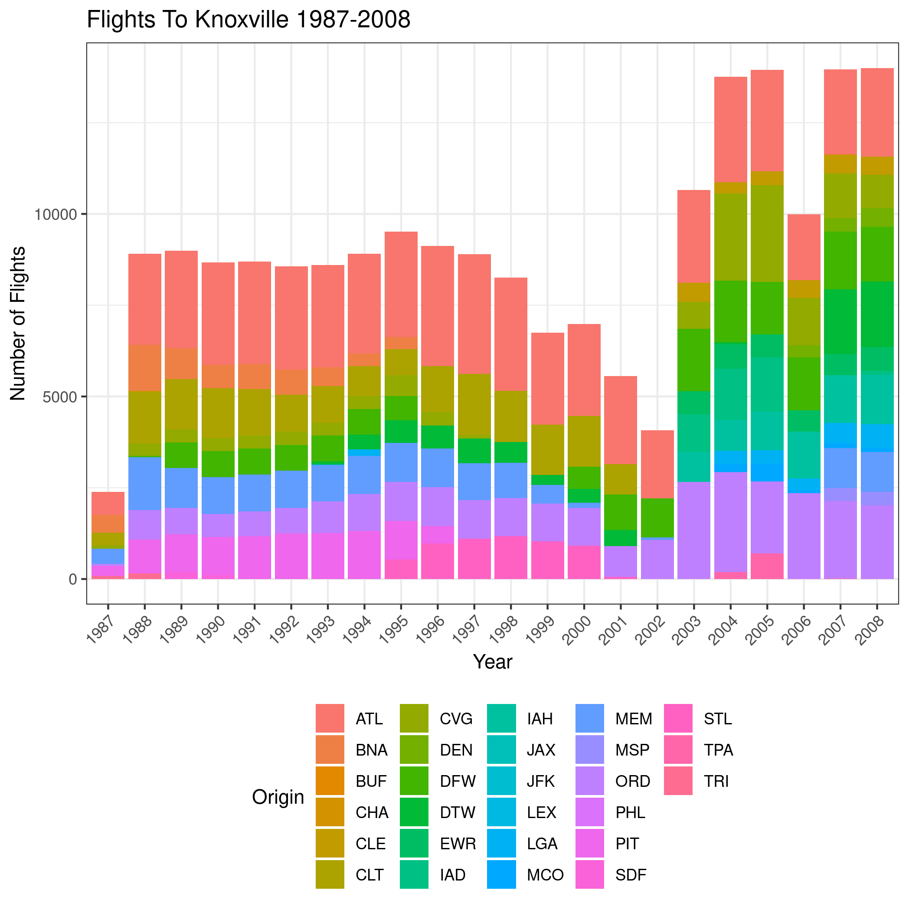
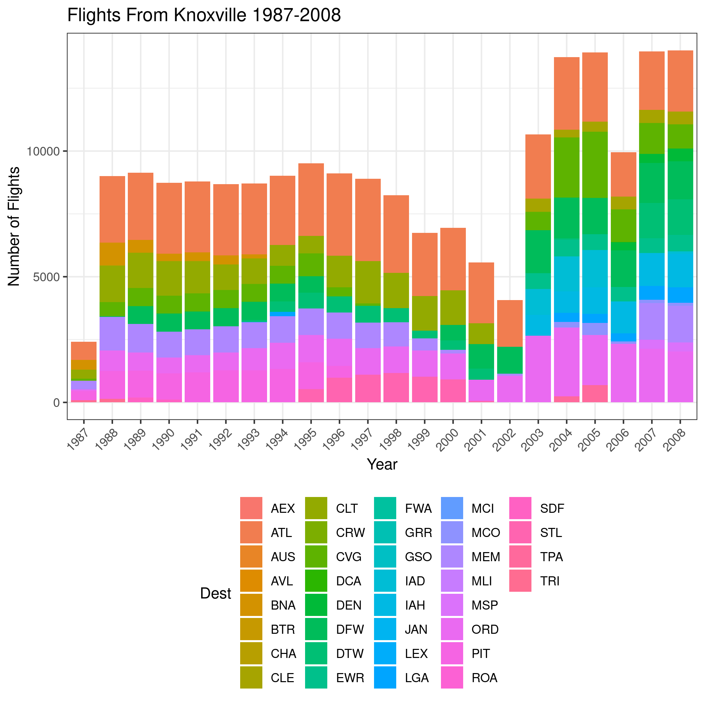
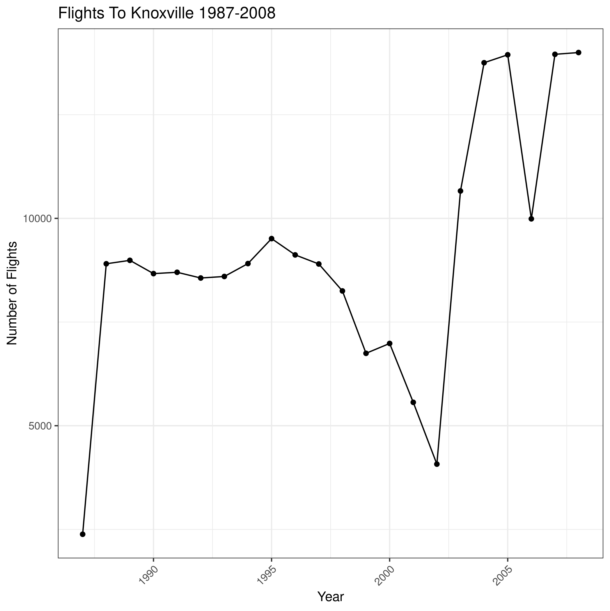
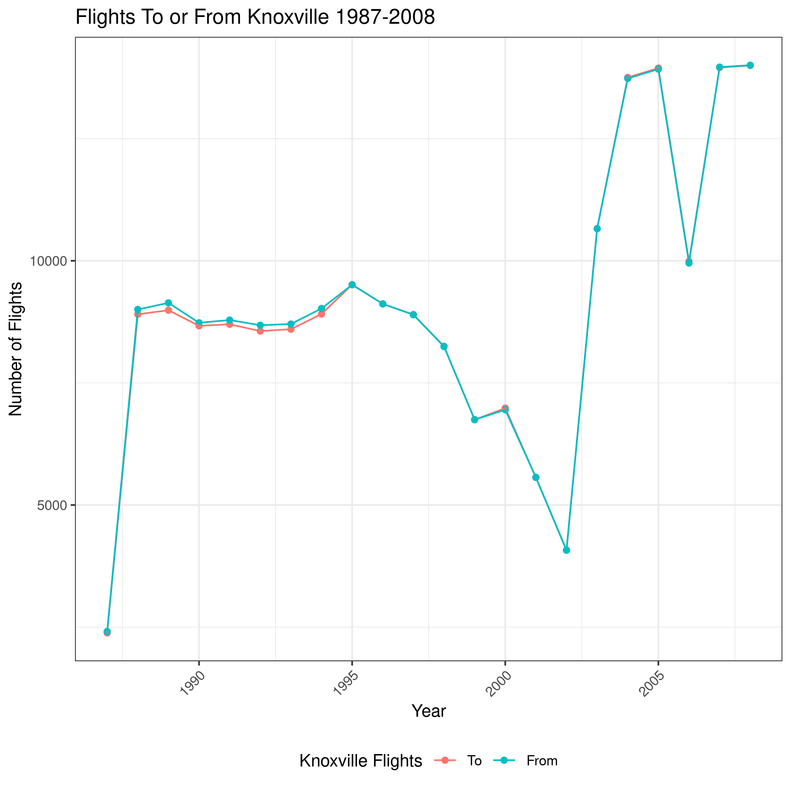

layout:true
<div class="footer"><span>Drew Schmidt 2022</span></div>

```{r setup, include=FALSE}
options(htmltools.dir.version = FALSE)
```


---
# Announcements
* Schedule:
    * Nov 29 and Dec 1 - more databases
    * Dec 6 - course wrapup
* New homework (last one)
    * Assigned now
    * Due Mon Dec 5
    * No homework on last modeule (databases)
* Questions?

---
# Content
* The Airlines Dataset


---
class: clear, inverse, middle, center
# The Airlines Dataset

---
# Example: The Airlines Dataset
.center[]
.tiny[https://dataverse.harvard.edu/dataset.xhtml?persistentId=doi:10.7910/DVN/HG7NV7]

---
# Airlines - Setup
```r
library(memuse)
library(glue)
library(magrittr)
library(DBI)
library(RSQLite)
library(data.table)

setwd("~/sw/data/airlines/csv")
files = dir()
files
```
```
 [1] "1987.csv" "1988.csv" "1989.csv" "1990.csv" "1991.csv" "1992.csv"
 [7] "1993.csv" "1994.csv" "1995.csv" "1996.csv" "1997.csv" "1998.csv"
[13] "1999.csv" "2000.csv" "2001.csv" "2002.csv" "2003.csv" "2004.csv"
[19] "2005.csv" "2006.csv" "2007.csv" "2008.csv"
```

---
# Airlines - Converting a CSV
```r
db_file = "/tmp/airlines.sqlite"
db = DBI::dbConnect(RSQLite::SQLite(), db_file)

file = files[1]
file
```
```
[1] "1987.csv"
```
```r
df = fread(file)

table_name = paste0("airlines_", tools::file_path_sans_ext(file))
table_name
```
```
[1] "airlines_1987"
```
```r
DBI::dbWriteTable(db, table_name, df)
```

---
# Airlines - Converting a CSV
```r
memuse::Sys.filesize(file)
```
```
121.272 MiB
```
```r
memuse::Sys.filesize(db_file)
```
```
81.746 MiB
```

---
# Airlines - Querying
```r
query = glue("SELECT * from {table_name} WHERE Origin='TYS' OR Dest='TYS';")
query
```
```
SELECT * from airlines_1987 WHERE Origin='TYS' OR Dest='TYS';
```
```r
res = DBI::dbGetQuery(db, query)
dim(res)
```
```
[1] 4795   29
```
```r
res %>% pull(Cancelled) %>% summary()
```
```
    Min.  1st Qu.   Median     Mean  3rd Qu.     Max. 
0.000000 0.000000 0.000000 0.007716 0.000000 1.000000 
```

---
# Airlines - Querying
```r
query = glue("SELECT DepTime from {table_name} WHERE Origin='TYS';")
query
```
```
SELECT DepTime from airlines_1987 WHERE Origin='TYS';
```
```r
res = DBI::dbGetQuery(db, query)
res$DepTime %>% mean()
```
```
[1] NA
```
```r
res$DepTime %>% mean(na.rm = TRUE)
```
```
[1] 1337.813
```

---
# Airlines - Converting All CSVs
```r
file.remove(db_file)
db = DBI::dbConnect(RSQLite::SQLite(), db_file)
for (file in files) {
  df = fread(file)
  table_name = paste0("airlines_", tools::file_path_sans_ext(file))
  DBI::dbWriteTable(db, table_name, df)
}
```

```r
memuse::Sys.filesize(db_file)
```
```
8.391 GiB
```
```r
sapply(files, memuse::Sys.filesize) %>% sapply(., as.numeric) %>% sum() %>% memuse::mu()
```
```
11.203 GiB
```

---
# Multiple Tables
.pull-left[
Can we `SELECT` from multiple tables?
].pull-right[]

---
# Unions
* SQL `UNION` statements combine multiple `SELECT` statements
* Some rules:
    * Same number of columns across tables
    * Columns have the same types
    * Columns have same order
* `UNION` removes duplicates
* `UNION ALL` does not check for duplicates (you get what you get)
    ```sql
    SELECT col1 col2 col3 FROM table1
    UNION ALL
    SELECT col1 col2 col3 FROM table2;
    ```

---
# Airlines - Querying
.pull-left[
```r
query = "
SELECT * FROM airlines_1987
UNION ALL
SELECT * FROM airlines_1988
"

res = DBI::dbGetQuery(db, query)
nrow(res)
```
```
[1] 6513922
```
```r
res %>% pull(Year) %>% min()
```
```
[1] 1987
```
```r
res %>% pull(Year) %>% max()
```
```
[1] 1988
```
].pull-right[
```r
str(res)
```
```
'data.frame':   6513922 obs. of  29 variables:
 $ Year             : int  1987 1987 1987 1987 1987 1987 1987 1987 1987 1987 ...
 $ Month            : int  10 10 10 10 10 10 10 10 10 10 ...
 $ DayofMonth       : int  14 15 17 18 19 21 22 23 24 25 ...
 $ DayOfWeek        : int  3 4 6 7 1 3 4 5 6 7 ...
 $ DepTime          : int  741 729 741 729 749 728 728 731 744 729 ...
 $ CRSDepTime       : int  730 730 730 730 730 730 730 730 730 730 ...
 $ ArrTime          : int  912 903 918 847 922 848 852 902 908 851 ...
 $ CRSArrTime       : int  849 849 849 849 849 849 849 849 849 849 ...
 $ UniqueCarrier    : chr  "PS" "PS" "PS" "PS" ...
 $ FlightNum        : int  1451 1451 1451 1451 1451 1451 1451 1451 1451 1451 ...
 $ TailNum          : int  NA NA NA NA NA NA NA NA NA NA ...
 $ ActualElapsedTime: int  91 94 97 78 93 80 84 91 84 82 ...
 $ CRSElapsedTime   : int  79 79 79 79 79 79 79 79 79 79 ...
 $ AirTime          : int  NA NA NA NA NA NA NA NA NA NA ...
 $ ArrDelay         : int  23 14 29 -2 33 -1 3 13 19 2 ...
 $ DepDelay         : int  11 -1 11 -1 19 -2 -2 1 14 -1 ...
 $ Origin           : chr  "SAN" "SAN" "SAN" "SAN" ...
 $ Dest             : chr  "SFO" "SFO" "SFO" "SFO" ...
 $ Distance         : int  447 447 447 447 447 447 447 447 447 447 ...
 $ TaxiIn           : int  NA NA NA NA NA NA NA NA NA NA ...
 $ TaxiOut          : int  NA NA NA NA NA NA NA NA NA NA ...
 $ Cancelled        : int  0 0 0 0 0 0 0 0 0 0 ...
 $ CancellationCode : int  NA NA NA NA NA NA NA NA NA NA ...
 $ Diverted         : int  0 0 0 0 0 0 0 0 0 0 ...
 $ CarrierDelay     : int  NA NA NA NA NA NA NA NA NA NA ...
 $ WeatherDelay     : int  NA NA NA NA NA NA NA NA NA NA ...
 $ NASDelay         : int  NA NA NA NA NA NA NA NA NA NA ...
 $ SecurityDelay    : int  NA NA NA NA NA NA NA NA NA NA ...
 $ LateAircraftDelay: int  NA NA NA NA NA NA NA NA NA NA ...
```
]

---
# Airlines - Querying
```r
query = "
SELECT Year, DepTime, Origin, Dest FROM airlines_1987
WHERE Origin='TYS' OR Dest='TYS'
UNION ALL
SELECT Year, DepTime, Origin, Dest FROM airlines_1988
WHERE Origin='TYS' OR Dest='TYS'
"

res = DBI::dbGetQuery(db, query)
res %>% pull(Origin) %>% table()
```
```
  ATL   BNA   CHA   CLT   CVG   DFW   MEM   ORD   PIT   TRI   TYS 
 3117  1747    21  1762   441    31  1876   863  1195   235 11415 
```
```r
res %>% pull(Dest) %>% table()
```
```
  ATL   BNA   CHA   CLT   CVG   DFW   MEM   ORD   PIT   TRI   TYS 
 3365  1293    29  1789   653    33  1679   874  1463   237 11288 
```

---
# Airlines - Querying
.pull-left[
```r
years = 1987:2008
query = paste0("
SELECT Year, Origin FROM airlines_", years, "
WHERE Dest='TYS'
", collapse = "UNION ALL"
)

tys_to_df = DBI::dbGetQuery(db, query)
```
].pull-right[
```r
years = 1987:2008
query = paste0("
SELECT Year, Dest FROM airlines_", years, "
WHERE Origin='TYS'
", collapse = "UNION ALL"
)

tys_from_df = DBI::dbGetQuery(db, query)
```
]

---
# Airlines - Plotting
.pull-left[
```r
library(ggplot2)
tbl = table(tys_to_df) %>% as.data.frame()
tbl$Year = factor(tbl$Year, levels = sort(unique(tbl$Year)))
ggplot(tbl, aes(Year, Freq, fill = Origin)) + 
  theme_bw() +
  geom_bar(stat = "identity") + 
  theme(legend.position = "bottom") + 
  ylab("Number of Flights") +
  theme(axis.text.x = element_text(angle = 45, vjust = 1, hjust = 1)) + 
  ggtitle(glue("Flights To Knoxville {min(years)}-{max(years)}"))
```
].pull-right[
```r
library(ggplot2)
tbl = table(tys_from_df) %>% as.data.frame()
tbl$Year = factor(tbl$Year, levels = sort(unique(tbl$Year)))
ggplot(tbl, aes(Year, Freq, fill = Dest)) + 
  theme_bw() +
  geom_bar(stat = "identity") + 
  theme(legend.position = "bottom") + 
  ylab("Number of Flights") +
  theme(axis.text.x = element_text(angle = 45, vjust = 1, hjust=1)) + 
  ggtitle(glue("Flights From Knoxville {min(years)}-{max(years)}"))
```
]

---
# Airlines - Plotting
.pull-left[]
.pull-right[]

---
# Airlines - Plotting
.pull-left[
```r
tys_to_df_tot = tys_from_df %>%
  group_by(Year) %>%
  summarise(Freq = n())

library(ggplot2)
ggplot(tys_to_df_tot, aes(Year, Freq)) + 
  theme_bw() +
  geom_point() + 
  geom_line() +
  theme(legend.position = "bottom") + 
  ylab("Number of Flights") +
  theme(axis.text.x = element_text(angle = 45, vjust = 1, hjust=1)) + 
  ggtitle(glue("Flights To Knoxville {min(years)}-{max(years)}"))
```
].pull-right[
```r
tys_from_df_tot = tys_from_df %>%
  group_by(Year) %>%
  summarise(Freq = n())

library(ggplot2)
ggplot(tys_from_df_tot, aes(Year, Freq)) + 
  theme_bw() +
  geom_point() + 
  geom_line() +
  theme(legend.position = "bottom") + 
  ylab("Number of Flights") +
  theme(axis.text.x = element_text(angle = 45, vjust = 1, hjust=1)) + 
  ggtitle(glue("Flights From Knoxville {min(years)}-{max(years)}"))
```
]

---
# Airlines - Plotting
.pull-left[]
.pull-right[]

---
# Airlines - Plotting
```r
df = cbind(
  Year=tys_to_df_tot$Year,
  Freq_to=tys_to_df_tot$Freq,
  Freq_from=tys_from_df_tot$Freq
) %>%
  as.data.frame() %>%
  reshape2::melt(id.vars="Year")

library(ggplot2)
ggplot(df, aes(Year, value, color=variable)) + 
  theme_bw() +
  geom_point() + 
  geom_line() +
  theme(legend.position = "bottom") + 
  ylab("Number of Flights") +
  scale_color_discrete(labels=c("To", "From")) +
  labs(color = "Knoxville Flights") +
  theme(axis.text.x = element_text(angle = 45, vjust = 1, hjust=1)) + 
  ggtitle(glue("Flights To or From Knoxville {min(years)}-{max(years)}"))
```

---
# Airlines - Plotting
.center[]

---
# Further Exploration
.pull-left[
* We're straying into data science territory
    * What questions would you ask?
    * Do you see the relationship between question-posing and data gathering?
* Getting back to the CS of DS:
    * Could we make it a single table?
    * What sorts of issues might we run into?
].pull-right[]

---
# Before We Wrap...
.pull-left[
* We've seen basic R and Python interfaces
* Any other interesting interfaces?
].pull-right[]

---
# dbplyr
.pull-left[
* Extension to dplyr
    * Originally there was plyr
    * Then came dplyr just for dataframes
* R only
* dplyr syntax, database backend
    * Query is built lazily
    * Great if you know dplyr
].pull-right[]

---
# dbplyr
```r
library(dplyr, warn.conflicts = FALSE)

db = DBI::dbConnect(RSQLite::SQLite(), db_file)
airlines = tbl(db, "airlines_1987")

summary = airlines %>% 
  group_by(Origin) %>% 
  summarise(AvgDepTime = mean(DepTime, na.rm = TRUE)) %>% 
  arrange(desc(AvgDepTime))
```

---
# dbplyr
.pull-left[
```r
summary %>% show_query()
```
```
<SQL>
SELECT `Origin`, AVG(`DepTime`) AS `AvgDepTime`
FROM `airlines_1987`
GROUP BY `Origin`
ORDER BY `AvgDepTime` DESC
```
].pull-right[
```r
summary %>% collect()
```
```
# A tibble: 237 x 2
   Origin AvgDepTime
   <chr>       <dbl>
 1 LIH         2047.
 2 OGG         1790.
 3 BET         1637.
 4 DRO         1633.
 5 SPN         1620.
 6 HNL         1578.
 7 JAC         1563.
 8 JFK         1547.
 9 STX         1527.
10 ATL         1509.
# … with 227 more rows
```
]


---
class: clear, inverse, middle, center
# Wrapup

---
# Ungraded Homework (Course Project)
Create a SQLite database using the airlines dataset
* Put the data into a single table
* Track your code in git
* It should be completely reproducible
* Can your software be extended to an arbitrary collection of CSV's?
* Can you chunk the CSV read/writer for CSV's larger than RAM?

---
# Wrapup
* Relational databases are very powerful tools for (essentially) storing dataframes.
* You can filter "in database" to save RAM.
* Useful collaboration tool
    * Across languages
    * Across systems (with a real DB)

---
class: clear, inverse, middle, center
# Questions?
