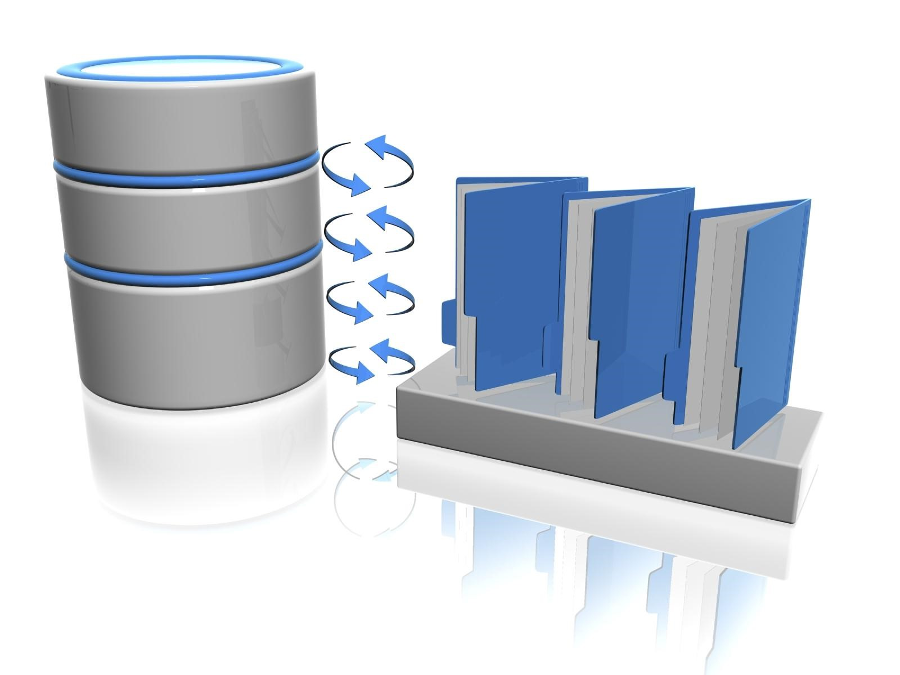
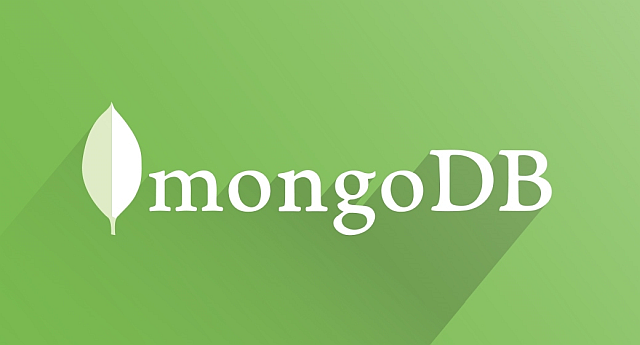

layout:true
<div class="footer"><span>Drew Schmidt 2022</span></div>

```{r setup, include=FALSE}
options(htmltools.dir.version = FALSE)
```

---
# Announcements
* Schedule:
    * Dec 1 - more databases
    * Dec 6 - course wrapup
* New homework (last one)
    * Assigned now
    * Due Mon Dec 5
    * No homework on last modeule (databases)
* Questions?


---
# What Is a Database?
.pull-left[
* "A database is an organized collection of structured information, or data, typically stored electronically in a computer system" - Oracle
* Usually referring to a DBMS + its stored data
* Data is usually "tabular", but can form complicated hierarchies
].pull-right[]

---
# Types of Databases
.pull-left[
## Relational (tables - SQL)
* MySQL
* PostgreSQL
* SQLite
* Oracle
].pull-right[
## Non-Relational ("NoSQL")
* MongoDB (document-oriented)
* Redis (key/value)
* Apache Cassandra (columnar)
]

---
# Relational Databases
* We've seen one example (SQLite)
* They're all very similar

.pull-left[
## Pros
  * Ubiquity
  * Data integrity
  * SQL is a quasi-standard
  * Your favorite language has an interface
].pull-right[
## Cons
* No table flexibility
    * Can't change columns
    * Can't change types
    * ...
* Scalability
    * Usually no parallelism
    * Table complexity
]

---
# A Question
.pull-left[
Observation: Relational DB's can maintain complex data relationships ("complexity")

Question: If we just want to "store dataframes", could we use something else?
* Yes
* But you lose SQL (or may as well)
* And you *must* run a server
].pull-right[]

---
# MongoDB
.pull-left[
* The poster-child of NoSQL
* A document DB
    * Data is json-like
    * Fields can change
    * Types can vary
    * Data can change over time!
* Items in the DB are just key/value stores
* "Scales" (in the web sense - more next semester)
* Well-supported language bindings
].pull-right[]

---
# A Note on Terminology
.pull-left[
"Shards"
].pull-right[]

---
class: clear, inverse, middle, center
# Questions?
