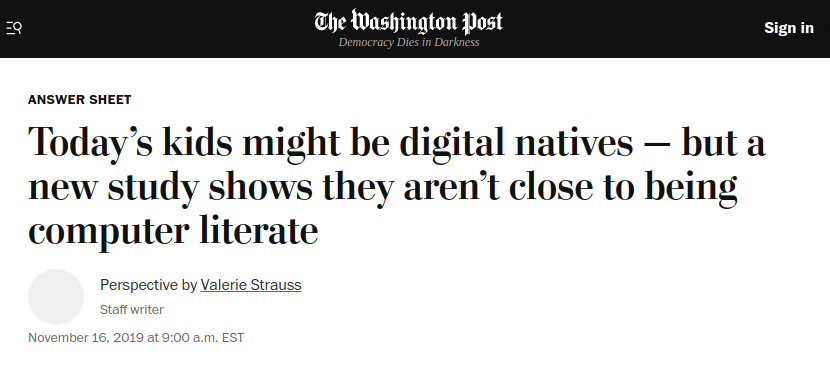
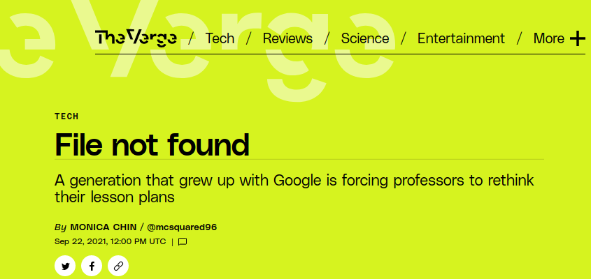

layout:true
<div class="footer"><span>Drew Schmidt 2022</span></div>

```{r setup, include=FALSE}
options(htmltools.dir.version = FALSE)
```

---
# Computer Literacy
.pull-left[
.tiny[
> Results were recently released from the International Computer and Information
> Literacy 2018 study, and they were sobering: Only 2 percent of students scored
> at the highest levels implied by digital native status, and only another 19
> percent of the 42,000 students assessed in 14 countries and educational
> systems could work independently with computers as information-gathering and
> management tools.
]].pull-right[]

.tiny[https://www.washingtonpost.com/education/2019/11/16/todays-kids-may-be-digital-natives-new-study-shows-they-arent-close-being-computer-literate/]

---
# Computer Literacy
.pull-left[
.tiny[
> Garland thought it would be an easy fix. She asked each student where they'd
> saved their project. Could they be on the desktop? Perhaps in the shared
> drive? But over and over, she was met with confusion. "What are you talking
> about?" multiple students inquired. Not only did they not know where their
> files were saved — they didn’t understand the question.

> Gradually, Garland came to the same realization that many of her fellow
> educators have reached in the past four years: the concept of file folders and
> directories, essential to previous generations' understanding of computers, is
> gibberish to many modern students.
]
].pull-right[]

.tiny[https://www.theverge.com/22684730/students-file-folder-directory-structure-education-gen-z]


---
class: clear, inverse, middle, center
# Wrapup

---
# Wrapup
* 

---
class: clear, inverse, middle, center
# Questions?
