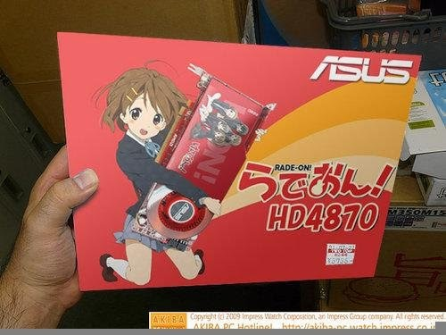
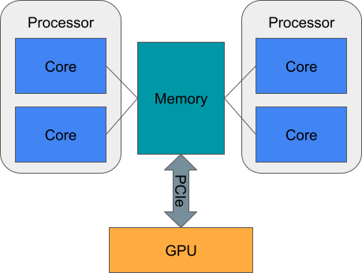
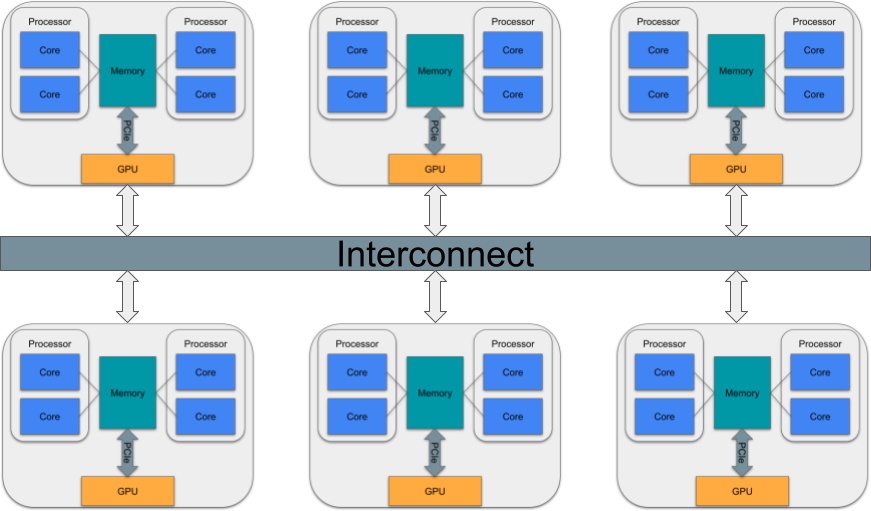
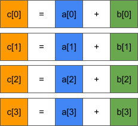
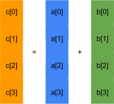
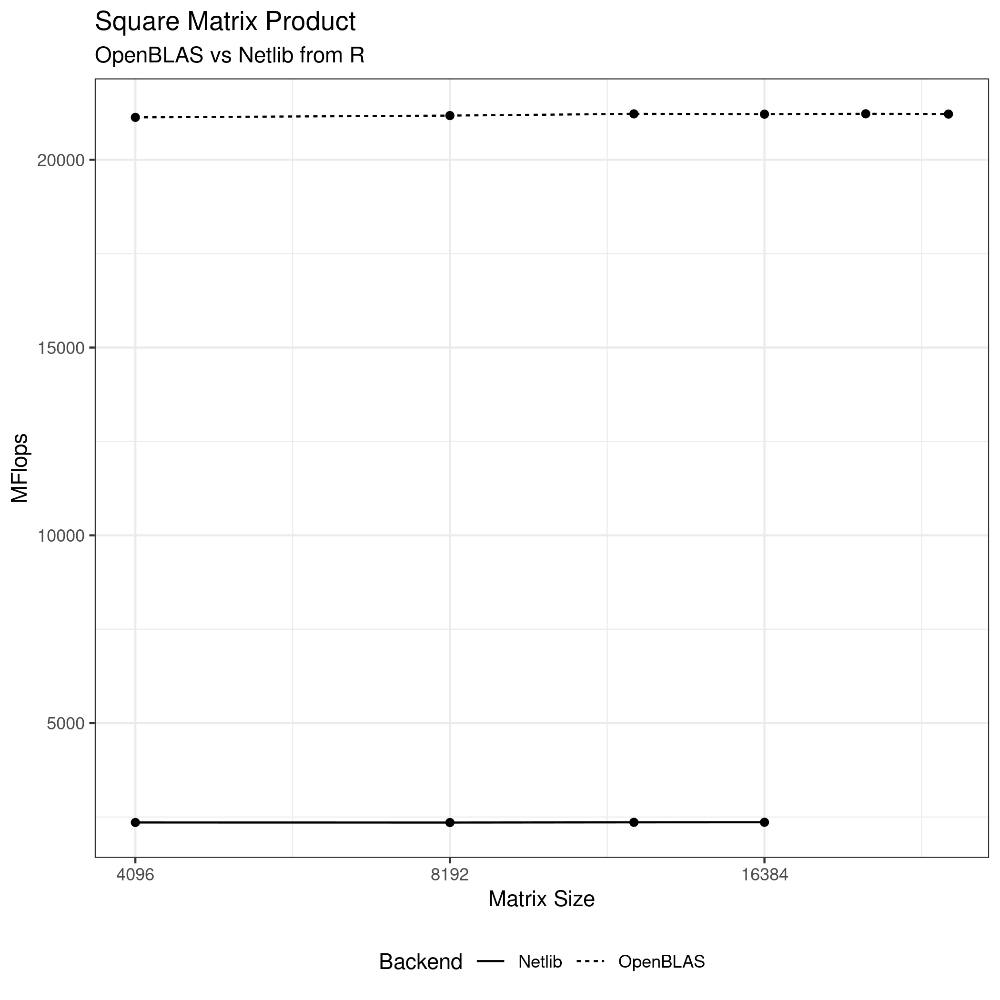
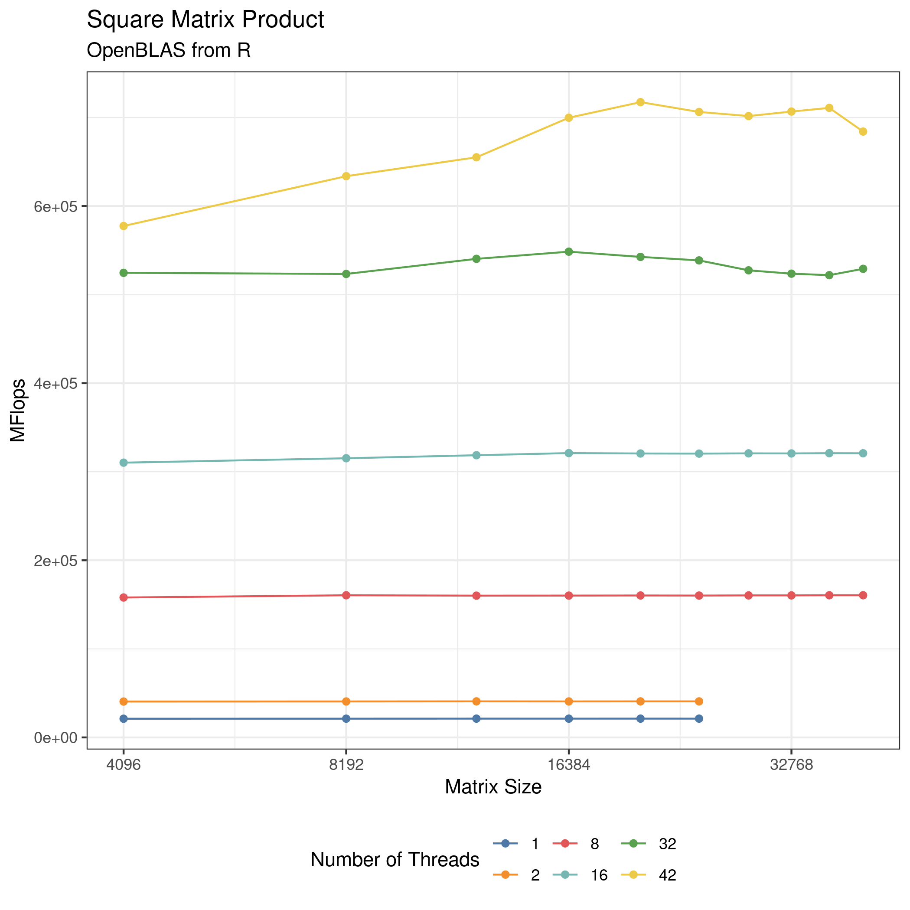

```{r setup, include=FALSE}
options(htmltools.dir.version = FALSE)
```


# From Last Time
* Homework is out --- due Saturday
* Slack channel
* ISAAC help
* Questions?

---
# Structure
* Part 1
  - GPGPU Basics
  - NVBLAS
* Part 2
  - Python (CuPy)
  - R (gpuR, fmlr)


---
class: clear, inverse, middle, center
# GPGPU

---
# GPGPU
.pull-left[
* General Purpose GPU
* Using Video Game Hardware to Multiply Matrices
* Major players
  - NVIDIA
  - AMD
  - Intel
]
.pull-right[]

---
# "Low-Level" GPGPU Technologies
.pull-left[
* ~~Shaders~~
* CUDA
* OpenCL
* OpenACC
* OpenMP
]
.pull-right[]

---
# "High-Level" GPGPU Technologies
.pull-left[
* NVBLAS
* Python
  - CuPy
* R
  - fmlr
  - gpuR
* Deep Learning frameworks
]
.pull-right[]

---
# Hardware
.center[]

---
# Hardware
.center[]

---
# Using a GPU
.pull-left[
* GPUs have their own (HB) memory
* Transferring data is very expensive
* Leave data on GPU as long as possible
]
.pull-right[]

---
# So How Does a GPU Work?
.center[]

---
# SIMD Parallelism
* GPUs use Single Instruction Multiple Data
* SIMD aka vectorization

>SIMD describes computers with multiple processing elements that perform the same operation on multiple data points simultaneously.

https://en.wikipedia.org/wiki/Single_instruction,_multiple_data

---
# SIMD Parallelism
.pull-left[
## Serial

]
.pull-right[
## SIMD

]

---
# SIMD Kernel
```c++
template <typename REAL>
__global__ void kernel_vec_vec_add(const int n, const REAL *a, const REAL *b, REAL *c)
{
  c[i] = a[i] + b[i];
}

template <typename T>
Vec vec_vec_add(const Vec a, const Vec b)
{
  static const int BLOCK_SIZE = 16;
  dim3 dim_block(BLOCK_SIZE);
  dim3 dim_grid((len + BLOCK_SIZE - 1) / BLOCK_SIZE);
  
  Vec c(a.size());
  kernel_vec_vec_add<<<dim_grid, dim_block>>>(a.size(), a.data(), b.data(), c.data());
  this->c->check();
}
```

---
# GPGPU Myth vs Reality
.pull-left[
## Myth
* Easy to use!
* Libraries work well!
* SO FAST 2000x OMG!!!
]
.pull-right[
## Reality
* ***IMPOSSIBLE TO USE***
* Libraries are buggy garbage
* Some operations are fast; many are ***SLOW***
]
.center[]

---
# CUDA OS Support
.pull-left[
* Linux - Full support; works best
* Windows - Mostly works; dll problem even worse than usual
* MacOS - Not supported; will not work
]
.pull-right[]


---
class: clear, inverse, middle, center
# NVBLAS

---
# BLAS and LAPACK on a GPU
* MAGMA https://icl.cs.utk.edu/magma/
* AMD ROCm https://rocmdocs.amd.com/en/latest/Installation_Guide/HIP.html
* NVIDIA
  - cuBLAS https://docs.nvidia.com/cuda/cublas/index.html
  - cuSOLVER https://docs.nvidia.com/cuda/cusolver/index.html
  - NVBLAS https://docs.nvidia.com/cuda/nvblas/index.html

---
# gemm
```
NAME
     dgemm - perform one of the matrix-matrix operations    C  :=
     alpha*op( A )*op( B ) + beta*C

SYNOPSIS
     SUBROUTINE DGEMM(TRANSA, TRANSB, M, N, K, ALPHA, A, LDA, B, LDB,
           BETA, C, LDC)

     CHARACTER * 1 TRANSA, TRANSB
     INTEGER M, N, K, LDA, LDB, LDC
     DOUBLE PRECISION ALPHA, BETA
     DOUBLE PRECISION A(LDA,*), B(LDB,*), C(LDC,*)

     SUBROUTINE DGEMM_64(TRANSA, TRANSB, M, N, K, ALPHA, A, LDA, B, LDB,
           BETA, C, LDC)

     CHARACTER * 1 TRANSA, TRANSB
     INTEGER*8 M, N, K, LDA, LDB, LDC
     DOUBLE PRECISION ALPHA, BETA
     DOUBLE PRECISION A(LDA,*), B(LDB,*), C(LDC,*)
```

---
# gemm
```c
dgemm_(
  const char *transa, const char *transb,
  int *m, int *n, int *k,
  const double *alpha,
  const double *a, int *lda,
  const double *b, int *ldb,
  const double *beta,
  double *c, int *ldc)
```

```c++
cublasStatus_t cublasDgemm(
  cublasHandle_t handle,
  cublasOperation_t transa, cublasOperation_t transb,
  int m, int n, int k,
  const double *alpha,
  const double *A, int lda,
  const double *B, int ldb,
  const double *beta,
  double *C, int ldc)
```

---
# Can We Offload Computations to GPU Automatically?
.center[]

---
# NVBLAS
* Uses `LD_PRELOAD` trick
* BLAS calls get hijacked
* Data transfer handled automatically
* Pros
  - easy to use
  - somewhat configurable
  - problems can exceed GPU memory
* Cons
  - Uses `LD_PRELOAD` trick
  - Some environments just not set up for it
  - ***DOES NOT WORK WELL FOR SMALL PROBLEMS***

---
# Supported Routines
| Routine |	Types |	Operation |
|---------|-------|-----------|
| gemm | S,D,C,Z | Multiplication of 2 matrices |
| syrk | S,D,C,Z | Symmetric rank-k update |
| herk | C,Z | Hermitian rank-k update |
| syr2k | S,D,C,Z | Symmetric rank-2k update |
| her2k | C,Z | Hermitian rank-2k update |
| trsm | S,D,C,Z | Triangular solve with multiple right-hand sides |
| trmm | S,D,C,Z | Triangular matrix-matrix multiplication |
| symm | S,D,C,Z | Symmetric matrix-matrix multiplication |
| hemm | C,Z | Hermitian matrix-matrix multiplication |


---
# Matrix Products Benchmark
.center[]

---
# Matrix Products Benchmark
.center[]

---
# Matrix Products Benchmark
.center[]

---
# Configuring NVBLAS
* Create `nvblas.conf` file
* Set `NVBLAS_CONFIG_FILE`
    ```
    export NVBLAS_CONFIG_FILE=${HOME}/nvblas.conf
    ```
* Set `LD_PRELOAD`
    ```
    CUDA_HOME=/sw/isaac/applications/cuda/11.4.2/rhel8_binary/
    LD_PRELOAD=${CUDA_HOME}/lib64/libnvblas.so
    ```
* READ THE DOCS https://docs.nvidia.com/cuda/nvblas/index.html

---
# Configuring NVBLAS
```
NVBLAS_LOGFILE nvblas.log
NVBLAS_TRACE_LOG_ENABLED

NVBLAS_CPU_BLAS_LIB /spack/spack-0.16.3/apps/linux-rhel8-cascadelake/gcc-10.2.0/openblas-0.3.12-c4x3eon3lkfddumq466n3n6b5gpqdbvh/lib/libopenblas.so

# NVBLAS_GPU_LIST 0
NVBLAS_GPU_LIST ALL

NVBLAS_TILE_DIM 2048
NVBLAS_AUTOPIN_MEM_ENABLED

# Disable routines
# NVBLAS_GPU_DISABLED_DSYRK 

# Set CPU/GPU compute ratio
# NVBLAS_CPU_RATIO_DGEMM 0.07
```


---
class: clear, inverse, middle, center
# NVBLAS on ISAAC

---
# It Doesn't Go Well
.center[]

---
# Test Scripts
.pull-left[
## test.r
```r
set.seed(1234)
n = 10000 # set to 10 for testing
x = matrix(runif(n*n), n, n)
y = matrix(runif(n*n), n, n)
system.time({x %*% y})[3]
```
]
.pull-right[
## test.py
```python
import numpy as np
import random
import time

np.random.seed(1234)
n = 10000 # set to 10 for testing
x = np.random.rand(n, n)
y = np.random.rand(n, n)
t0 = time.perf_counter()
z = np.dot(x, y)
t1 = time.perf_counter()
print(t1 - t0)
```
]

---
# R - OpenBLAS
```bash
singularity exec r.simg Rscript test.r
```
```
elapsed 
   1.26 
```

---
# R - NVBLAS
```bash
module load openblas
module load cuda
export CUDA_HOME=/sw/isaac/applications/cuda/11.4.2/rhel8_binary/

export NVBLAS_CONFIG_FILE=$HOME/nvblas.conf
LD_PRELOAD=${CUDA_HOME}/lib64/libnvblas.so singularity exec --bind /sw:/sw r.simg Rscript test.r
```
```
[NVBLAS] NVBLAS_CONFIG_FILE environment variable is set to '/nfs/home/mschmid3/nvblas.conf'

 *** caught segfault ***
address 0xc0, cause 'memory not mapped'

Traceback:
 1: system.time({    x %*% y})
An irrecoverable exception occurred. R is aborting now ...
```

---
# Python - MKL
```bash
python3 test.py
```
```
1.4268960766494274
```

---
# Python - NVBLAS???
```bash
LD_PRELOAD=${CUDA_HOME}/lib64/libnvblas.so python3 test.py
```
```
1.3604787662625313
```

---
# Python - NumPy config
```
Python 3.8.8 (default, Apr 13 2021, 19:58:26) 
[GCC 7.3.0] :: Anaconda, Inc. on linux
Type "help", "copyright", "credits" or "license" for more information.
>>> import numpy as np
>>> np.show_config()
blas_mkl_info:
    libraries = ['mkl_rt', 'pthread']
    library_dirs = ['/sw/isaac/applications/anaconda3/2021.05/rhel8_gcc10.2.0/anaconda3-2021.05/lib']
    define_macros = [('SCIPY_MKL_H', None), ('HAVE_CBLAS', None)]
    include_dirs = ['/sw/isaac/applications/anaconda3/2021.05/rhel8_gcc10.2.0/anaconda3-2021.05/include']
```

---
# Is It Using CBLAS?
```bash
nm /sw/isaac/applications/anaconda3/2021.05/rhel8_gcc10.2.0/anaconda3-2021.05/lib/libmkl_rt.so | grep cblas_dgemm_ 
```
```
00000000001a10c0 T cblas_dgemm_
00000000001a1210 T cblas_dgemm_batch
00000000001a1210 T cblas_dgemm_batch_
00000000001a1390 T cblas_dgemm_batch_strided
00000000001a1390 T cblas_dgemm_batch_strided_
00000000001a1520 T cblas_dgemm_compute
00000000001a1520 T cblas_dgemm_compute_
00000000001a1660 T cblas_dgemm_pack
00000000001a1660 T cblas_dgemm_pack_
00000000001a1780 T cblas_dgemm_pack_get_size
00000000001a1780 T cblas_dgemm_pack_get_size_
```

---
# NVBLAS DOESN'T WORK WITH CBLAS
.center[]

---
# Retry With OpenBLAS
```bash
module load openblas
pip install --force-reinstall numpy
```

```
>>> import numpy as np
>>> np.show_config()
openblas64__info:
    libraries = ['openblas64_', 'openblas64_']
    library_dirs = ['/usr/local/lib']
    language = c
    define_macros = [('HAVE_CBLAS', None), ('BLAS_SYMBOL_SUFFIX', '64_'), ('HAVE_BLAS_ILP64', None)]
    runtime_library_dirs = ['/usr/local/lib']
```

---
# Python - NVBLAS???
```bash
LD_PRELOAD=${CUDA_HOME}/lib64/libnvblas.so python3 test.py
```
```
1.5831096079200506
```

---
# Retry With Netlib BLAS
```bash
module unload openblas
module load netlib-lapack
export NETLIB_HOME=/spack/spack-0.16.3/apps/linux-rhel8-cascadelake/gcc-10.2.0/netlib-lapack-3.8.0-xh7uzdm4yijch4yghw3fo2tvv3wrq553/lib64
BLAS=$NETLIB_HOME/libblas.so LAPACK=$NETLIB_HOME/liblapack.so pip install --force-reinstall numpy

LD_PRELOAD=${CUDA_HOME}/lib64/libnvblas.so python3 test.py
```
```
1.6391727197915316
```


---
# Building R from Source
```bash
module unload PE-intel
module load gcc
wget https://tukaani.org/xz/xz-5.2.5.tar.gz
tar zxf xz-5.2.5.tar.gz
cd xz-5.2.5
./configure --prefix=`pwd`/build && make -j && make install
export LD_LIBRARY_PATH=${LD_LIBRARY_PATH}:${HOME}/R/xz-5.2.5/build/lib
export PATH=$PATH:${HOME}/R/xz-5.2.5/build/bin

module load bzip2
module load openblas
cd ${HOME}/R/
wget https://cran.r-project.org/src/base/R-4/R-4.1.2.tar.gz
tar zxf R-4.1.2.tar.gz
cd R-4.1.2
OBPATH=/spack/spack-0.16.3/apps/linux-rhel8-cascadelake/gcc-10.2.0/openblas-0.3.12-c4x3eon3lkfddumq466n3n6b5gpqdbvh/lib/libopenblas.so
LDFLAGS="-L${HOME}/R/xz-5.2.5/build/lib/ -llzma" CFLAGS="-I${HOME}/R/xz-5.2.5/build/include/" \
  ./configure --with-x=no --enable-R-shlib=yes \
  --with-blas=${OBPATH} --with-lapack=${OBPATH}
make -j16
```

---
# NVBLAS
```bash
LD_PRELOAD=${CUDA_HOME}/lib64/libnvblas.so ${HOME}/R/R-4.1.2/bin/Rscript test.r
```
```
[NVBLAS] No Gpu available
[NVBLAS] NVBLAS_CONFIG_FILE environment variable is set to '/nfs/home/mschmid3/nvblas.conf'
```
```bash
cat nvblas.log 
```
```
[NVBLAS] Problem parsing line 7
[NVBLAS] Config parsed
[NVBLAS] No device selected
[NVBLAS] dgemm[cpu]: ta=N, tb=N, m=10000, n=10000, k=10000
```

---
# Running a GPU Job?
```bash
#!/bin/bash
#SBATCH --account UTK0011
#SBATCH --job-name=nvblas_test
#SBATCH --nodes=1
#SBATCH --time=00:05:00
#SBATCH --partition=campus-gpu
#SBATCH --qos=campus

module load bzip2
module load openblas
module load cuda

CUDA_HOME=/sw/isaac/applications/cuda/11.4.2/rhel8_binary/
LD_PRELOAD=${CUDA_HOME}/lib64/libnvblas.so ${HOME}/R/R-4.1.2/bin/Rscript test.r
```
```
sbatch: error: Batch job submission failed: Invalid account or account/partition combination specified
```

---
# What To Do?
.center[]


---
class: clear, inverse, middle, center
# Questions?
