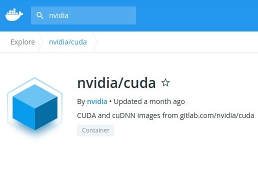

```{r setup, include=FALSE}
options(htmltools.dir.version = FALSE)
```

# From Last Time
* Homework is out --- due Saturday
* New homework "soon"
* Getting a GPU on ISAAC
  - Have not tested NVBLAS
  - Assume this works fine with R, not Python
  - More on ISAAC GPUs later
* Questions?

---
# GPU Interfaces
.pull-left[
## Implicit (NVBLAS)
* Pros
  - Easy to use
  - No code changes
  - Multi-GPU
* Cons
  - Not suitable for all problems
  - Weird segfaults?
]
.pull-right[
## Explicit (CuPy, fmlr)
* Pros
  - Data stays on GPU
  - Optimized for many operations
  - Small(er) problems can work
* Cons
  - Harder to use
  - Code changes
  - Multi-GPU isn't guaranteed
]


---
class: clear, inverse, middle, center
# CuPy

---
# CuPy
.pull-left[
* GPU accelerated NumPy and SciPy
* Uses NVIDIA CUDA
* Can be tricky to install...
* Know NumPy? Know CuPy.
* API reference https://docs.cupy.dev/en/stable/reference/index.html
]
.pull-right[]

---
# Installing
.pull-left[
## In the Cloud
* conda
* pip binaries
* Docker container
* ~~Build from source~~
]
.pull-right[
## On ISAAC
* ~~conda~~
* ~~pip binaries~~
* Singularity container
* Build from source
]

---
# Problem with Conda (binaries generally)
```bash
conda create --name mce cupy
# ...
conda activate mce
python
```
```python
import cupy as cp
```
```
ImportError: libcuda.so.1: cannot open shared object file: No such file or directory
```

---
# Installing
.pull-left[
## In Theory
```bash
pip install cupy
```
]
.pull-right[
## In Reality
```bash
module unload PE-Intel
module load cuda
module load gcc
export CUDA_HOME=/sw/isaac/applications/cuda/11.4.2/rhel8_binary/
CC=gcc NVCC=${CUDA_HOME}/bin/nvcc \
  CUDA_PATH="${CUDA_HOME}" \
  LDFLAGS=${CUDA_HOME}/lib64 \
  CFLAGS="-I${CUDA_HOME}/include" \
  pip install cupy-cuda114
```
]

---
# AND IT STILL DOESN'T WORK
.center[]

---
# Running CuPy on ISAAC
.pull-left[
* I give up
* Just use singularity
    ```bash
    singularity exec --nv cupy.simg python3
    ```
]
.pull-right[]
* Images
  - cuda https://hub.docker.com/r/nvidia/cuda/
  - CuPy https://hub.docker.com/r/cupy/cupy

---
# Building a CuPy Singularity Image
```bash
MY_CONTAINER="cupy/cupy"
mkdir -p /tmp/d2s
docker run \
  -v /var/run/docker.sock:/var/run/docker.sock \
  -v /tmp/d2s:/output \
  --privileged -t --rm \
  singularityware/docker2singularity ${MY_CONTAINER}
```

`/lustre/isaac/proj/UTK0188/cupy.simg`

---
# Running the Image
```bash
singularity exec --nv cupy.simg python3
```
```
INFO:    Could not find any nv files on this host!
```

---
# That's a Real Pickle
.center[]

---
# Getting a GPU on ISAAC
```bash
PROJECT="ACF-UTK0011"
RUNTIME="0:15:00"

srun --account=${PROJECT} --time=${RUNTIME} \
	--qos=campus-gpu --partition=campus-gpu \
	--pty bash -i
```
```
srun: job 21181 queued and waiting for resources
srun: job 21181 has been allocated resources
```
```bash
singularity exec --nv ~/cupy.simg python3
```
```
Python 3.8.10 (default, Jun  2 2021, 10:49:15) 
[GCC 9.4.0] on linux
Type "help", "copyright", "credits" or "license" for more information.
>>> import cupy as cp
>>> 
```


---
# CuPy Basics
```python
import numpy as np
import cupy as cp

m = 10000
n = 500
np.random.seed(1234)
x_cpu = np.random.rand(m, n)
cp.random.seed(1234)
x_gpu = cp.random.rand(m, n)
```

---
# CuPy Norm
```python
np.linalg.norm(x_cpu)
```
```
1290.7480024767005
```
```python
x_gpu = x_gpu.astype(np.float32)
cp.linalg.norm(x_gpu)
```
```
array(1291.5363, dtype=float32)
```

---
# CuPy SVD
.pull-left[
## CPU (float64)
```python
import time

t0 = time.perf_counter()
svd = np.linalg.svd(x_cpu)
t1 = time.perf_counter()
print(t1 - t0)
```
```
14.223893312038854
```
]
.pull-right[
## GPU (float32)
```python
import time

t0 = time.perf_counter()
svd = cp.linalg.svd(x_gpu)
t1 = time.perf_counter()
cp.cuda.stream.get_current_stream().synchronize()
print(t1 - t0)
```
```
4.236048500053585
```
```python
# run it again
```
```
0.22288543893955648
```
]


---
class: clear, inverse, middle, center
# fmlr

---
# fmlr
.pull-left[
* fused matrix library for R
* Novel matrix framework
* Includes a GPU backend (NVIDIA CUDA)
* Very different from base R
* Documentation https://fml-fam.github.io/fmlr/html/index.html
]
.pull-right[]

---
# Installation
```r
options(repos=structure(c(
  HPCRAN="https://hpcran.org/",
  CRAN="https://cran.rstudio.com/"
)))

install.packages("fmlr")
```

---
# Installation with GPU Support
```r
install.packages("fmlr", configure.args="--enable-gpu")
```

---
# fmlr on ISAAC?
```r
CUDA_HOME = "/sw/isaac/applications/cuda/11.4.2/rhel8_binary/"
cfargs = paste0("--enable-gpu --with-cuda=", CUDA_HOME)
install.packages("fmlr", configure.args=cfargs)
```
```
/usr/bin/ld: cannot find -lnvidia-ml
```

---
# fmlr on ISAAC
```bash
NVML_PATH="/sw/isaac/applications/cuda/11.4.2/rhel8_binary/targets/x86_64-linux/lib/stubs"
export LD_LIBRARY_PATH=${LD_LIBRARY_PATH}:${NVML_PATH}
LDFLAGS="-L${NVML_PATH}" R
```
```r
CUDA_HOME = "/sw/isaac/applications/cuda/11.4.2/rhel8_binary/"
cfargs = paste0("--enable-gpu --with-cuda=", CUDA_HOME)
install.packages("fmlr", configure.args=cfargs)
```
```
/usr/bin/ld: cannot find -lnvidia-ml
```

---
# Running fmlr on ISAAC
.pull-left[
* I give up
* Just use singularity
    ```bash
    singularity exec --nv r.simg R
    ```
]
.pull-right[]
* Images
  - cuda https://hub.docker.com/r/nvidia/cuda/


---
# fmlr Basics
.pull-left[
* Uses R6 "reference classes"
* Objects have to be declared (usually)
* Default type is `double`
]
.pull-right[
```r
x = cpumat(3, 2)
x$info()
```
```
# cpumat 3x2 type=d
```
```r
x$fill_linspace()
x
```
```
1.0000 4.0000 
2.0000 5.0000 
3.0000 6.0000 
```
]

---
# fmlr and GPUs

```r
c = card()
c
```
```
## GPU 0 (NVIDIA GeForce GTX 1070 Ti) 1011/8116 MB - CUDA 11.4 (math mode: default)
```
```r
x = gpumat(c, 3, 2)
x$fill_linspace()
x$info()
```
```
# gpumat 3x2 type=d 
```
```r
x
```
```
1.0000 4.0000 
2.0000 5.0000 
3.0000 6.0000 
```

---
# SVD
```r
v = gpuvec(c)
linalg_svd(x, v)
v
```
```
9.5080 0.7729 
```
```r
x
```
```
-3.7417 -8.5524 
0.4218 1.9640 
0.6327 0.8598 
```

---
# Covariance Matrices
.pull-left[
```r
x$fill_runif(1234)
x
```
```
0.5823 0.9964 
0.4636 0.1182 
0.6156 0.2672 
```
]
.pull-right[
```r
cp = linalg_crossprod(1.0, x)
cp$info()
```
```
# gpumat 2x2 type=d 
```
```r
cp
```
```
0.9330 0.7995 
0.7995 1.0781 
```
```r
cp = stats_cov(x)
cp
```
```
0.0064 0.0171 
0.0171 0.2208 
```
]

---
# What Happens to the Input Data?
```r
x
```
```
-0.2519 -0.7767 
0.7986 0.1702 
-0.5466 0.6065 
```

```r
dimops_colmeans(x)
```
```
0.0000 -0.0000 
```

---
# PCA

```r
x$fill_runif(1234)
rot = gpumat(c)
stats_pca(TRUE, FALSE, x, v, rot)
v
```
```
0.4714 0.0709 
```

```r
rot
```
```
-0.0790 0.9969 
-0.9969 -0.0790 
```

---
# SVD Timing
.pull-left[
## CuPy
```python
import cupy as cp

m = 10000
n = 500
cp.random.seed(1234)
x_gpu = cp.random.rand(m, n).astype(np.float32)

import time
t0 = time.perf_counter()
svd = cp.linalg.svd(x_gpu)
t1 = time.perf_counter()
cp.cuda.stream.get_current_stream().synchronize()
print(t1 - t0)
```
```
4.236048500053585
0.22288543893955648
```
]
.pull-right[
## fmlr
```r
suppressMessages(library(fmlr))
c = card()
m = 10000
n = 500
x = gpumat(c, m, n, type="float")
x$fill_runif(1234)

s = gpuvec(c, type="float")
u = gpumat(c, type="float")
vt = gpumat(c, type="float")
system.time({
  linalg_svd(x, s, u, vt)
  c$synch()
})
```
```
user  system elapsed 
0.158   0.027   0.185 
```
]

---
# Matrix/Vector Operations

.pull-left[
## Arithmetic
* Dot product
* Addition
* Multiplication
* Crossproducts $X^TX$ and $XX^T$

## Matrix Factorizations
* SVD
* Eigendecomposition
* QR/LQ
* Cholesky
* LU
]

.pull-right[
## Dimensional Operations
* Row/col-sums/means
* Arithmetic row/col-sweep
* Scale

## Matrix Methods
* Transpose
* Inversion
* System solving
* Determinant
* Trace
* Various norms
]

---
# Singular Value Decomposition

* Four main implementations
    - Divide-and-conquer (`gesdd()`)
    - QR/LQ-based SVD
    - Crossproduct SVD ( uses $X^TX$ or $XX^T$)
    - Randomized SVD (Halko et al, *Finding Structure with Randomness*)
* Compute values-only or values and left/right vectors

```r
fmlr::linalg_svd(x, s, u = NULL, vt = NULL)
fmlr::linalg_qrsvd(x, s, u = NULL, vt = NULL) 
fmlr::linalg_cpsvd(x, s, u = NULL, vt = NULL) 
fmlr::linalg_rsvd(seed, k, q, x, s, u = NULL, vt = NULL) 
```

---
# fmlr Core Features
.pull-left[
* Dense matrix and vector types
    * CPU
    * GPU (CUDA)
    * MPI (2-dimensional block cyclic)
* `float` and `double` fundamental types (some support for `__half` for GPU)
* All data held externally to R
* Single interface covers all types and backends - it Does The Right Thing (TM)
]
.pull-right[.center[]]

---
# craze
.pull-left[
* Syntax like base R
* fmlr object backend
* Same problems as base R
  - implicit copies
  - S4 overhead
  - ...
]
.pull-right[
```r
library(craze)

x = matrix(as.double(1:9), 3)
x_gpu = fmlmat(x, backend="gpu")
x_gpu
```
```
## # gpumat 3x3 type=d 
## 1.0000 4.0000 7.0000 
## 2.0000 5.0000 8.0000 
## 3.0000 6.0000 9.0000 
```
```r
x_gpu %*% x_gpu
```
```
## # gpumat 3x3 type=d 
## 30.0000 66.0000 102.0000 
## 36.0000 81.0000 126.0000 
## 42.0000 96.0000 150.0000 
```
]


---
class: clear, inverse, middle, center
# Questions?
