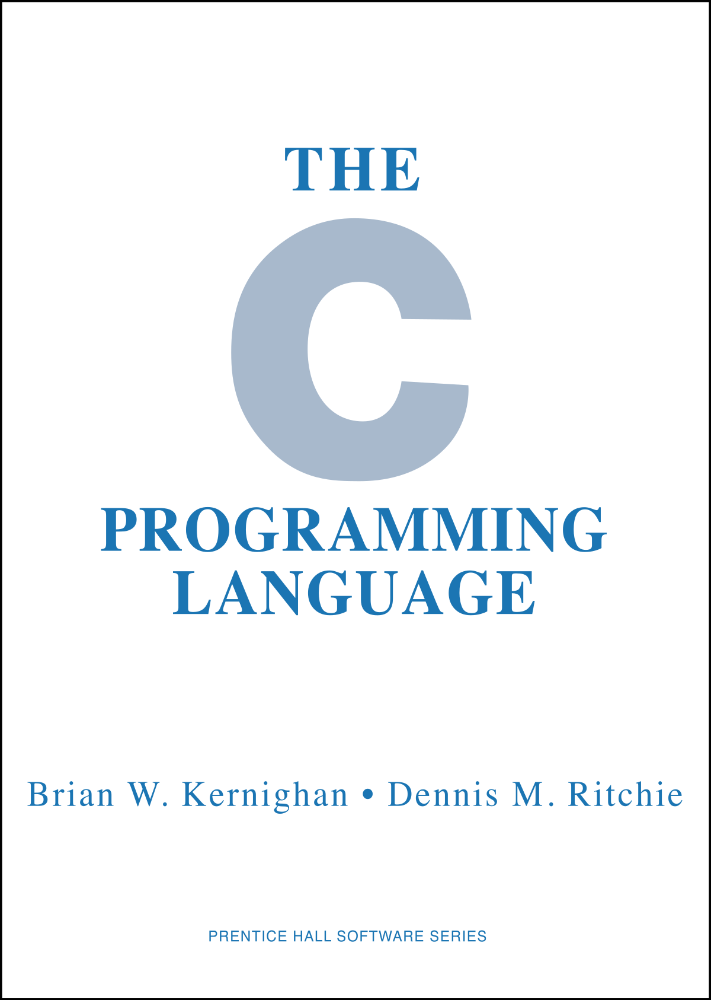

```{r setup, include=FALSE}
options(htmltools.dir.version = FALSE)
```

# From Last Time
* Next time: wrapup with I/O
* New homework "soon"
* Won't be due before March 26
* Questions?

---
# A Quick Comment
* I am not *ideological*
* But I am very *opinionated*
* I'm not always right
* You are free to disagree

---
# Compiled Code
* Very specialized set of skills
* Could *easily* spend *all semester* on just this
* This is a single lecture
* We will focus on just a few principles and examples
* This is probably the least useful topic for most of you
* *But it's important that you see it and understand it*

---
# Using Compiled Code in a HLL
.pull-left[
* Pros
  - fast
  - memory-efficient
  - best of both worlds
* Cons
  - hard to write
  - hard to debug
  - multiple skillsets
* Julia???
]
.pull-right[]

---
# Differences
.pull-left[
## HLL
* Memory managed *for* you
* Type (usually) implicit
* Interactive REPL
]
.pull-right[
## LLL
* Memory managed *by* you
* Type (usually) explicit
* Non-interactive
]

---
# Memory
.pull-left[
## Python
```python
import numpy as np
np.array(range(0, n))
```
]
.pull-right[
## C
```c
double *x = malloc(n * sizeof(*x));
for (int i=0; i<n; i++)
  x[i] = i;
// ...
free(x);
```
]

---
# Types
.pull-left[
## R
```{r, cache=TRUE}
x = 1
typeof(x)
y = 2
typeof(x)
z = 1:2
typeof(z)
```
]
.pull-right[
## C
```c
double x = 1;
double y = 2;
int z = {1, 2};
```
]

---
# Bringing Compiled Code to HLL
* C/C++/Fortran/etc. code must be:
  - compiled
  - linked
  - loaded
* Each HLL handles this differently
* So why is this hard?

---
# Machine Code
.pull-left[
```c
#include <stdio.h>

int main()
{
  printf("hi\n");
  return 0;
}
```

```
gcc -g -O2 hello.c -o hello
```
]
.pull-right[
```
(gdb) disass main
Dump of assembler code for function main:
  0x0000000000001060 <+0>:	endbr64 
  0x0000000000001064 <+4>:	sub    $0x8,%rsp
  0x0000000000001068 <+8>:	lea    0xf95(%rip),%rdi        # 0x2004
  0x000000000000106f <+15>:	callq  0x1050 <puts@plt>
  0x0000000000001074 <+20>:	xor    %eax,%eax
  0x0000000000001076 <+22>:	add    $0x8,%rsp
  0x000000000000107a <+26>:	retq  
End of assembler dump.
```
]

---
# Python Bytecode
```{python, cache=TRUE}
def hello():
  print('hi')

import dis
dis.dis(hello)
```

---
# R Bytecode

```{r, cache=TRUE}
hello = function() print("hi")
hello = compiler::cmpfun(hello)
compiler::disassemble(hello)
```


---
class: clear, inverse, middle, center
# Cython

---
# I'm not going to be polite about this...
.center[]

---
# How I Feel About Cython
* Only really useful for package developers
* Can't decide if it wants to be C or Python
* The Cython docs are *terrible*
* If you want a different take, see last year's Lecture 18

---
# Basic Structure
* `whatever.pyx` - Cython code
* `setup.py` - build script
* See the badly written docs for more information https://cython.readthedocs.io/en/latest/src/tutorial/cython_tutorial.html

---
# Example
There is no *basic* example I can give you that wouldn't be

* easier
* cleaner
* better

in Numba.

---
# Tutorial
An Introduction to Just Enough Cython to be Useful
https://www.peterbaumgartner.com/blog/intro-to-just-enough-cython-to-be-useful/


---
class: clear, inverse, middle, center
# Rcpp

---
# Bringing Compiled Code to R
* R is a C program
* It has a C interface
* Do you know C?

---
# Rcpp
* C++ interface
* Builds on top of the native C interface
* Can run compiled kernels "inline" (don't do this in production)
* Can be used in an R package (do this in production)

---
# Rcpp
.pull-left[
## What it is
* An R package
* A C++ interface for R extensions
* An R-like C++ interface
* One piece with many extensions
  - RcppArmadillo
  - RcppEigen
  - ...
]
.pull-right[
## What it is not
* The only way to use C++ with R
* Zero-overhead
* As easy to use as R
]

---
# How I Think About Rcpp
Somewhere between Numba and Cython

---
# Rcpp
*If you know what you're doing*
* You can often outperform Rcpp in runtime
* You can *always* outperform Rcpp in memory
* You can *massively* outperform Rcpp in compilation time

*and if you don't*
* Rcpp is probably your best bet

---
# Idiomatic C
```c
void vec_vec_add(const int n, const double *a, const double *b, double *c){
  for (int i=0; i<n; i++)
    c[i] = a[i] + b[i];
}

void caller(const int n){
  double *a = malloc(n * sizeof(*a));
  double *b = malloc(n * sizeof(*b));
  set_values(n, a, b);
  
  double *c = malloc(n * sizeof(*c));
  vec_vec_add(n, a, b, c)
}
```

---
# R Native C Interface
```c
#include <R.h>
#include <Rinternals.h>

SEXP vec_vec_add(SEXP a, SEXP b){
  R_xlen_t n = LENGTH(a);
  SEXP c;
  PROTECT(c = allocVector(REALSXP, n));
  for (int i=0; i<n; i++)
    REAL(c)[i] = REAL(a)[i] + REAL(b)[i];
  
  UNPROTECT(1);
  return c;
}
```

---
# Rcpp
```c++
#include <Rcpp.h>

// [[Rcpp::export]]
Rcpp::NumericVector vec_vec_add(Rcpp::NumericVector a, Rcpp::NumericVector b){
  int n = a.length();
  Rcpp::NumericVector c(n);
  for (int i=0; i<n; i++)
    c[i] = a[i] + b[i];
  
  return c;
}
```

---
# Rcpp
```c++
#include <Rcpp.h>
using namespace Rcpp;

// [[Rcpp::export]]
NumericVector vec_vec_add(NumericVector a, NumericVector b){
  int n = a.length();
  NumericVector c(n);
  for (int i=0; i<n; i++)
    c[i] = a[i] + b[i];
  
  return c;
}
```

---
# Monte Carlo $\pi$ Simulation
$\text{Area} = \pi r^2$

.pull-left[
```{r piplot, cache=TRUE}
set.seed(1234)
n = 1000
x = runif(n)
y = runif(n)

circ_pts = seq(0, pi/2,length.out=100)
library(ggplot2)
g = ggplot(data.frame(x=x, y=y), aes(x, y)) +
  theme_bw() +
  geom_point() +
  annotate("path",
   x = 0 + 1*cos(circ_pts),
   y = 0 + 1*sin(circ_pts),
   color="red"
  )
```
]
.pull-right[
```{r piplot_render, dependson="piplot", cache=TRUE, echo=FALSE}
g
```
]

---
# Estimating $\pi$: Naive Implementation
.pull-left[
```r
pi_sim = function(n=1e6, seed=1234){
  set.seed(seed)
  
  s = 0
  for (i in 1:n)
  {
    x = runif(1)
    y = runif(1)
    if (x*x + y*y < 1)
      s = s + 1
  }
  
  4 * s / n
}
```
]
.pull-right[
```r
system.time(pi_sim())
```
```
##  user  system elapsed 
## 3.883   0.012   3.898 
```
]

---
# Estimating $\pi$: Vectorized
.pull-left[
```r
pi_sim_vec = function(n=1e6, seed=1234){
  set.seed(seed)
  x = runif(n)
  y = runif(n)
  4 * sum(x*x + y*y < 1) / n
}
```
]
.pull-right[
```r
system.time(pi_sim_vec())
```
```
##  user  system elapsed 
## 0.035   0.004   0.039 
```
]

---
# Estimating $\pi$: Rcpp
.pull-left[
```c++
#include <Rcpp.h>

// [[Rcpp::export]]
double pi_sim_rcpp(int n){
  int s = 0;
  for (int i=0; i<n; i++){
    double x = R::runif(0, 1);
    double y = R::runif(0, 1);
    if (x*x + y*y < 1)
      s++;
  }
  
  return 4.0 * ((double) s / n);
}
```
]
.pull-right[
```r
Rcpp::sourceCpp("pi_sim_rcpp.cpp")
system.time(pi_sim_rcpp())[3]
```
```
##  user  system elapsed 
## 0.019   0.000   0.018 
```
]

---
# Summary
| Method | Runtime | Relative Performance | Memory |
| -------| ------: | -------------------: | -----------------: |
| Naive | 3.898 | 216.556 | ~ 36 bytes |
| Vectorized | 0.039 | 2.167 | > 15 MB |
| Rcpp | 0.018 | 1 | 36 bytes |


---
class: clear, inverse, middle, center
# Questions?
