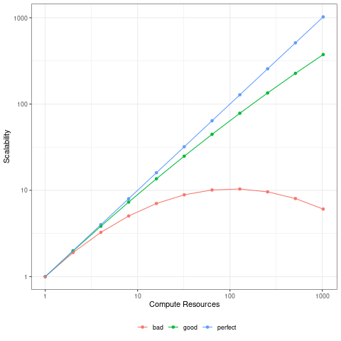
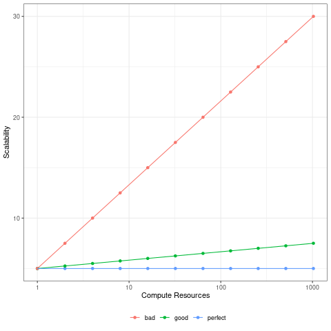

```{r setup, include=FALSE}
options(htmltools.dir.version = FALSE)
knitr::opts_chunk$set(cache=TRUE)
```

```{python timerclass, include=FALSE}
import time

class Timer(object):
  def start(self):
    self.t0 = time.perf_counter()
  
  def stop(self):
    t1 = time.perf_counter()
    print(t1-self.t0)

1+1
t = Timer()
```

# From Last Time
* Homework 3 posted tonight some time
* Questions?


---
class: clear, inverse, middle, center
# Parallelism Basics

---
# Vocabulary
* *Implicit parallelism* - Parallel details hidden from user
  - Example: Using multi-threaded BLAS
* *Explicit parallelism* - Some assembly required
  - Example: Using the `mclapply()` from the parallel package
* *Embarrassingly Parallel* aka *naturally parallel* aka *loosely coupled*
Obvious how to make parallel; lots of independence in computations
  - Example: Fit two independent models
* *Tightly Coupled* - Opposite of embarrassingly parallel; lots of 
dependence in computations
  - Example: Speed up model fitting for one model

---
# Scalability
.pull-left[
## Strong Scaling

]
.pull-right[
## Weak Scaling

]

---
# Speedup
  * *Wallclock Time* - Time of the clock on the wall from start to 
finish
  * *Speedup* - unitless measure of improvement; more is better.
  $$ S_{n_1, n_2} =  \frac{\text{Time for } n_1 \text{ cores}}{\text{Time 
for } n_2 \text{ cores}} $$
* $n_1$ is often taken to be 1
* In this case, comparing parallel algorithm to serial algorithm

---
# Independence
.pull-left[
* Parallelism requires *independence*
* Ability to do different work at the same time
* Single problem split into many sub-problems
* Algorithm vs Implementation
  - Sometimes the algorithm is the hard part
  - Sometimes the parallel interface is
  - Sometimes it's both
]
.pull-right[]


---
# Independence Thought Experiment
.pull-left[
* I have 10 laborers each with a shovel
* What if I need 10 holes dug?
* 5 holes?
* 20 holes?
* One really big hole?
]
.pull-right[]

---
# Independence in Practice
* R/Python function evals almost always independent
  - I/O may break this
  - Some HPC packages break this in memory (e.g. fmlr)
  - Other languages violate this all the time (e.g. C, Fortran, ...)
* Some examples by area:
  - Bio: split by gene
  - Chemistry/Materials: split by atom
  - Stats: split loglik sum
  - Bayesian: MCMC with multiple chains
  - ML: fit multiple models at once

---
# Overhead
.pull-left[
* ***ALL*** parllel methods have overhead
* Sometimes it is undetectable
* Sometimes it is very noticeable
* Sometimes it is worse than serial!
]
.pull-right[]

---
# Fork
* Kernel-level parallelism mechanism
* Inexpensive process clone mechanism
* Only supported on Linux and MacOS
* Data is copy on modify!

---
# Fork in R and Python
* R: parallel package
* Python: multiprocessing package
* Both packages have other interfaces and backends (e.g. sockets)
* You can use that if you want (Windows), but we won't focus on it

---
# Fork Parallelism in R
`lapply()` becomes `mclapply()`:

```r
mclapply(X, FUN, ..., mc.preschedule = TRUE, mc.set.seed = TRUE, 
    mc.silent = FALSE, mc.cores = getOption("mc.cores", 2L), 
    mc.cleanup = TRUE, mc.allow.recursive = TRUE, affinity.list = NULL)
```

---
# Basic Example in R
```{r}
x = lapply(1:5, sqrt)
unlist(x)

ncores = parallel::detectCores()
x_mc = parallel::mclapply(1:5, sqrt, mc.cores=ncores)
all.equal(x, x_mc)
```

---
# Fork Parallelism in Python
* A Bit more complicated...
* We'll try to keep it simple

---
# Basic Example in Python
```{python}
import math
import multiprocessing as mp

list(map(math.sqrt, range(6)))

ncores = mp.cpu_count()
pool = mp.Pool(ncores)
pool.map(math.sqrt, range(6))
```

---
# "Portability"
.pull-left[
* Not all OS's supported
* No fork on Windows
* Many API's try to hide this
* R and Python take different strategies
  - `mclapply()` errors; instead use `makeCluster()`
  - `Pool()` has a `Spawn()` method for Windows
  - ***DO NOT DESTROY YOUR WORKER POOL UNTIL YOU ARE DONE***
]
.pull-right[]


---
class: clear, inverse, middle, center
# Estimating $\pi$ in Python

---
# Monte Carlo $\pi$ Simulation
$\text{Area} = \pi r^2$

.pull-left[
```{r piplot}
set.seed(1234)
n = 1000
x = runif(n)
y = runif(n)

circ_pts = seq(0, pi/2,length.out=100)
library(ggplot2)
g = ggplot(data.frame(x=x, y=y), aes(x, y)) +
  theme_bw() +
  geom_point() +
  annotate("path",
   x = 0 + 1*cos(circ_pts),
   y = 0 + 1*sin(circ_pts),
   color="red"
  )
```
]
.pull-right[
```{r piplot_render, dependson="piplot", echo=FALSE}
g
```
]

---
# Serial Implementation

```{python}
import random

def mc_pi(n):
  acc = 0
  for i in range(n):
    x = random.random()
    y = random.random()
    if x**2 + y**2 < 1:
      acc += 1
  return 4 * acc / n

random.seed(1234)
mc_pi(1000)
```

---
# Parallel Implementation
.pull-left[
```{python mppinorand, dependson="timerclass"}
import multiprocessing as mp
import numpy as np
import random

def mc_pi_count(n):
  acc = 0
  for i in range(n):
    x = random.random()
    y = random.random()
    if x**2 + y**2 < 1:
      acc += 1
  return acc

def mc_pi_par(n, seed, ncores):
  random.seed(seed)
  pool = mp.Pool(ncores)
  acc = pool.map(mc_pi_count,
    np.repeat(round(n/ncores),
    ncores)
  )
  return sum(acc) * 4 / n
```
]
.pull-right[
```{python, dependson="mppinorand"}
n = 10000000
for nc in [1, 2, 4]:
  t.start()
  pi_est = mc_pi_par(n, 1234, nc)
  t.stop()
```
]

---
# What About Numba?
.pull-left[
```{python mppinumba, dependson="mppinorand"}
from numba import jit

@jit(nopython = True)
def mc_pi_count(n):
  acc = 0
  for i in range(int(n)):
    x = random.random()
    y = random.random()
    if x**2 + y**2 < 1:
      acc += 1
  return acc
```
]
.pull-right[
```{python, dependson="mppinumba"}
warmup = mc_pi_count(10)
n = 10000000
for nc in [1, 2, 4]:
  t.start()
  pi_est = mc_pi_par(n, 1234, nc)
  t.stop()
```
]

---
# "Random" Numbers
.pull-left[
* ~~RNG~~ PRNG
* Streams can overlap
* Be careful!
* Like all things:
  - Easy in R
  - Painful in Python
]
.pull-right[]

---
# RNG in Parallel
* *Random Number Generation* by Pierre L'Ecuyer https://www.iro.umontreal.ca/~lecuyer/myftp/papers/handstat.pdf
* R
  - It just works
  - Read `?parallel::mcparallel` if you want
* Python
  - Depends *a lot* on the generator
  - Hard to do correctly
  - Better than nothing strategy: pass additional process-unique seed arg and use `starmap`
  - You're on your own


---
class: clear, inverse, middle, center
# Simulating Monty Hall in R

---
# The Monty Hall Problem
.pull-left[
* You are shown 3 doors
* Behind 1 is a prize
* The other 2 have nothing/junk
* You choose a door
* One of the remaining 2 doors is shown to be junk
* You can switch to the remaining door if you choose
* What is the probability of winning if you switch?
]
.pull-right[]

---
# Simulating One Game
.pull-left[
```{r mh}
monty_hall = function(.)
{
  doors = 1:3
  prize_door = sample(doors, size=1)
  choice_door = sample(doors, size=1)
  # Always switch
  if (choice_door == prize_door)
    0 # lose
  else
    1 # win
}
```
]
.pull-right[
```{r, dependson="mh"}
set.seed(1234)
monty_hall()
monty_hall()
monty_hall()
monty_hall()
```
]

---
# Simulating Many Games
```{r mmh_serial, dependson="mh"}
many_monty_hall = function(nruns)
{
  runtime = system.time({
    runs = lapply(1:nruns, monty_hall)
  })[3]
  
  c(mean(unlist(runs)), runtime)
}

set.seed(1234)
nruns = 1e6
many_monty_hall(nruns)
```

---
# Going Parallel
.pull-left[
```{r mmh, dependson="mh"}
library(parallel)
many_monty_hall = function(nruns, ncores)
{
  runtime = system.time({
    runs = mclapply(1:nruns, monty_hall, mc.cores=ncores)
  })[3]
  
  c(mean(unlist(runs)), runtime)
}

set.seed(1234)
ncores = 1:12
nruns = 1e6
mmh = lapply(ncores, many_monty_hall, nruns=nruns)
df = cbind(ncores, do.call(rbind, mmh)) |> 
  as.data.frame()
```
]
.pull-right[
```{r, dependson="mmh", echo=FALSE, message=FALSE, warning=FALSE}
library(ggplot2)
ggplot(df, aes(ncores, elapsed)) + 
  theme_bw() +
  geom_point() + 
  geom_line() + 
  xlab("Number of Cores") + 
  ylab("Runtime in Seconds (lower is better)") + 
  scale_x_discrete(limits=ncores)
```
]

---
# Parallel Speedup
.center[
```{r, dependson="mmh", echo=FALSE, message=FALSE, warning=FALSE}
df$elapsed = 1 / (df$elapsed / df$elapsed[1])
library(ggplot2)
ggplot(df, aes(ncores, elapsed)) + 
  theme_bw() +
  geom_point() + 
  geom_line() + 
  xlab("Number of Cores") + 
  ylab("Runtime in Seconds (lower is better)") + 
  scale_x_discrete(limits=ncores) +
  geom_abline(slope = 1, intercept = 0) +
  ylim(c(1, 12))
```
]

---
# Going Parallel Again
.pull-left[
```{r mmh_small, dependson=c("mh", "mmh")}
set.seed(1234)
ncores = 1:12
nruns = 1e3
mmh = lapply(ncores, many_monty_hall, nruns=nruns)
df = cbind(ncores, do.call(rbind, mmh)) |> 
  as.data.frame()
```
]
.pull-right[
```{r, dependson="mmh_small", echo=FALSE, message=FALSE, warning=FALSE}
library(ggplot2)
ggplot(df, aes(ncores, elapsed)) + 
  theme_bw() +
  geom_point() + 
  geom_line() + 
  xlab("Number of Cores") + 
  ylab("Runtime in Seconds (lower is better)") + 
  scale_x_discrete(limits=ncores)
```
]

---
# Parallel Speedup Again
.center[
```{r, dependson="mmh_small", echo=FALSE, message=FALSE, warning=FALSE}
df$elapsed = 1 / (df$elapsed / df$elapsed[1])
library(ggplot2)
ggplot(df, aes(ncores, elapsed)) + 
  theme_bw() +
  geom_point() + 
  geom_line() + 
  xlab("Number of Cores") + 
  ylab("Runtime in Seconds (lower is better)") + 
  scale_x_discrete(limits=ncores) +
  geom_abline(slope = 1, intercept = 0) + 
  ylim(c(0, 12))
```
]


---
class: clear, inverse, middle, center
# Improving k-Means Clustering Outcomes in Parallel

---
# Parallelism in k-Means Clustering
* Parallelize the algorithm itself
  - Good for very large datasets
  - Tricky...
* Parallelize on the number of random starts
  - Easy to do!
  - May not be that valuable
* Parallelize on the number of clusters
  - Also easy to do!
  - Turn your brain off! Machine your learnings!!!

---
# Measuring Cluster Performance
* Would like an analogue of classification accuracy
* How do we compare two sets of cluster labels?
* Rand Measure / Rand Index https://en.wikipedia.org/wiki/Rand_index
  - Given a set of $n$ elements $S$ and two partitions of $S$ into $r$-length subsets $X = \{X_1, \dots, X_r\}$ and $Y = \{Y_1, \dots, Y_r\}$
  $$ R = \frac{a + b}{\binom{n}{2}} $$
  Where
      - $a$ is the \# of pairs of elements of $S$ that agree across $X$ and $Y$ 
      - $b$ is the \# of pairs of elements of $S$ that disagree across $X$ and $Y$

---
# Rand Measure

```{r rand}
rand_measure = function(l1, l2){
  n = length(l1)
  a = b = 0L

  for (i in 1:n){
    for (j in (i+1L):n){
      if (j > n) # R indexing is stupid
        break
      
      same1 = (l1[i] == l1[j])
      same2 = (l2[i] == l2[j])
      
      if (same1 && same2)
        a = a + 1L
      else if (!same1 && !same2)
        b = b + 1L
    }
  }
  
  (a + b) / choose(n, 2)
}
```

---
# Using the Iris Dataset
.pull-left[
* Fisher's famous iris dataset
* Required by law in clustering lectures
]
.pull-right[
```{r, echo=FALSE}
library(ggplot2)
ggplot(data=iris, aes(Sepal.Length, Petal.Length, color=Species)) +
  theme_bw() +
  geom_point() +
  theme(legend.position="bottom") + 
  xlab("Sepal Length") + 
  ylab("Petal Length")
```
]

---
# Finding the k in k-Means
.pull-left[
```{r kmeans, dependson="rand"}
library(parallel)
labels = as.numeric(iris[, 5])
x = iris[, -5]

options(mc.cores=8)
nclusters = 2:100
clusters = mclapply(
  nclusters,
  function(i) kmeans(x, i, nstart=10)$cluster
)
rand = mclapply(
  clusters,
  rand_measure,
  l2 = labels
) |> unlist()
```
]
.pull-right[
```{r, dependson="kmeans", echo=FALSE, message=FALSE, warning=FALSE}
df = data.frame(nclusters, rand)
library(ggplot2)
ggplot(data=df, aes(nclusters, rand)) +
  theme_bw() +
  geom_point() +
  geom_line()
```
]


---
class: clear, inverse, middle, center
# Wrapup

---
# Scalability?
.pull-left[
* "scale up"
* "scale out"
* What do these mysterious phrases mean?
]
.pull-right[]

---
# Vertical (up) vs Horizontal (out) Scaling
* Industry jargon
* (Opinion) Not really that well-defined
* More about *hardware* than *applications*
* Example
  - *Scale up* - Get a better processor
  - *Scale out* - Get multiple nodes
* Have we seen either so far?

---
# Wrapup
* Be careful with RNG's in parallel!
* Where to look for (task) parallelism
  - Independent simulations
  - Multiple model fitting
  - *Many* ETL operations
* "Workflow parallelism" is *ubiquitous* in data/analysis pipelines
* Next time: data parallelism

---
class: clear, inverse, middle, center
# Questions?
