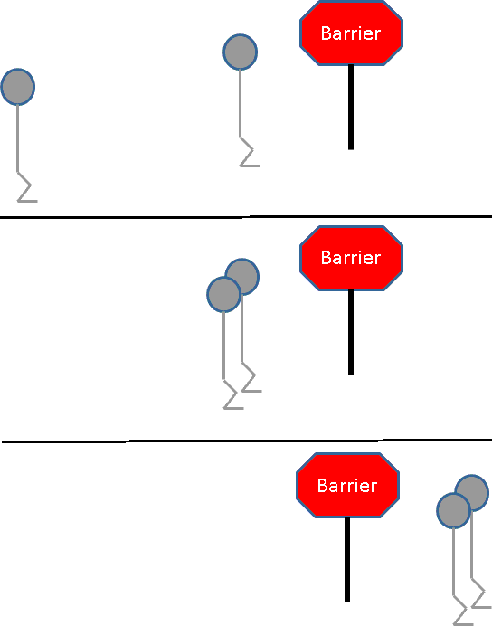

```{r setup, include=FALSE}
options(htmltools.dir.version = FALSE)
```

# From Last Time
* New homework is out
* Due April 9
* Questions?

---
class: clear, middle, center


---
# Parallel Programming Models
* So far we've seen
  - implicit
  - manager/worker
* One process is in charge; tells workers what to do
* Natural extension of interactive programming
* Pros:
  - supports interactivity
  - ubiquitous
* Cons:
  - *not scalable*
  - not the most natural!

---
# Non-Scalability of Manager/Worker
* Imagine an organization with 10, 100, 1000, 10,000 workers
  - Imagine *every* time *anyone* does *anything* it has to go through the CEO
  - Which organizations will get *anything* done?
* Parallel programs with 10, 100, 1000, 10,000 processes
  - If *all* tasks have to go through a manager process...

---
# SPMD
* Single Program Multiple Data
* How *all* big programs are run in HPC
* Designed for batch computing
* No process is in charge

---
# Other Parallel Programming Techniques
* Implicit
* Manager/worker
* MapReduce

---
# SPMD: How It Works
* One program is written
* All processes execute the single program
* Operates on *collectives*
* Some blocks may break this
  - I/O
  - Some point-to-points
  - In-situ/sub-communicators
  - ...


---
class: clear, inverse, middle, center
# Message Passing Interface

---
# MPI
.pull-left[
* Message Passing Interface
* Distributed programming standard
* Implementations
  - OpenMPI
  - MPICH
  - MPT
  - Spectrum
]
.pull-right[]

---
# Interfaces
* Bindings exist for almost every language
* The C interface (libmpi)
* Python: mpi4py
* R: pbdMPI (also Rmpi)

---
# Installing
* Need a system installation of MPI
  - Linux: e.g. `apt install openmpi-bin libopenmpi-dev`
  - Mac: Build it from source; best of luck!
  - Windows: Download and install MSMPI
* *You don't need to do this* because you have ISAAC

---
# Launching MPI Programs
* MPI programs *run in batch*
* Launched with a special launcher
* Many systems: `mpirun -np 2 my_mpi_program`
* ISAAC: `srun my_mpi_program`
* Launchers accept *many* arguments

---
# Recall: MPI Hello World

https://github.com/wrathematics/mpi-hello

* Step 1: Download on ISAAC (`git clone`, `wget`, whatever)
* Step 2: Extract the archive as necessary
* Step 3: Compile it (do `less README.md` for instructions)
* Step 4: Do a quick test with `./mpi-hello`

---
# My Workstation Example
.pull-left[
```bash
mpirun -np 4 ./mpi-hello
```
]
.pull-right[
```
Hello from rank 0/4 global 0/4 local
Hello from rank 1/4 global 1/4 local
Hello from rank 2/4 global 2/4 local
Hello from rank 3/4 global 3/4 local
```
]

---
# ISAAC Example
.pull-left[
```bash
#!/bin/bash
#SBATCH --account=ACF-UTK0188
#SBATCH --job-name=MPI_hello_world
#SBATCH --nodes=2
#SBATCH --ntasks=4
#SBATCH --ntasks-per-node=2
#SBATCH --time=00:00:30
#SBATCH --partition=condo-dse512
#SBATCH --qos=condo

cd ~/mpi-hello
srun ./mpi-hello
```
]
.pull-right[
```
Hello from rank 0/4 global 0/2 local
Hello from rank 1/4 global 1/2 local
Hello from rank 2/4 global 0/2 local
Hello from rank 3/4 global 1/2 local
```
]


---
class: clear, inverse, middle, center
# MPI Basics

---
# Communicator
* Comms managed by a *communicator*
  - special/magical object
  - it's a little complicated...
* Enables parallelism
  - lets different processes "talk" to each other
  - can send/receive essentially any kind of data
  - how it actually works is complicated...
* Primary motivation: distributed computing

---
# Hardware
.center[]

---
# Basic Communicator Jargon
* init - initialize
* finalize - shut down
* rank - "who am I?"
* size - "how many of us are there?"

---
# Communicators
* "world"
  - default communicator
  - contains *all* processes
* sub-communicators

---
# Reasons for Sub-Communicators
* It's a bit complicated...
* Why would you even want to?
* In-situ analysis
  - One set of processes simulating/generating data
  - Another analyzing generated data
* Running one task per node
  - Usually a job for the scheduler
  - Use case: getting local rank in "hello world"

---
# Basic Communicator Example
.pull-left[
## R
```r
suppressMessages(library(pbdMPI))

rank = comm.rank()
print(rank)

finalize()
```

```bash
mpirun -np 2 Rscript example.r
```

```
[1] 0
[1] 1
```
]
.pull-right[
## Python
```python
from mpi4py import MPI
comm = MPI.COMM_WORLD

rank = comm.rank
print(rank)

MPI.Finalize()
```

```bash
mpirun -np 2 python example.py
```

```
0
1
```
]

---
# Some Language Comments
* R (pbdR)
  - main interface is very simplified compared to MPI standard
  - offers *many* high-level helpers
      - `comm.print()`
      - `get.jid()`
      - `pbdLapply()`
* Python (mpi4py)
  - offers a very MPI-like interface
  - its "high-level" functions look more like R's interface
  - *Be very careful* with non-numpy data
* Often need (or receive!) a "placeholder" value
  - `NULL` in R
  - `None` in Python


---
class: clear, inverse, middle, center
# MPI Operations

---
# MPI Operations
* Many operations supported by MPI
* We will focus on a few *collectives*
  - all processes "contribute"
  - each calls the operation
  - generally one or all receive the result
  - if you need something else, use a sub-communicator
* Point-to-point also possible
  - send/receive
  - who calls what is very problem-dependent

---
# Blocking vs Non-Blocking
* We will only focus on blocking ops
* Blocking: do not return until communication completes
* Explanation:
  - Consider `ret = my_expensive_operation()`
  - Blocking: does not proceed until `ret` is set
  - Non-blocking: continues whether it's done or not!
  - No serial analogue! *All* computation is blocking in serial
  - Non-blocking can work with forks
* Non-blocking analogues exist (prefaced by `i`)
  - `send` becomes `isend`
  - `recv` becomes `irecv`

---
# Marjor Collective Operations
* Barrier
* Reduce
* Gather
* Broadcast

---
# Barrier
.pull-left[
* Computation wall
* All processes in the communicator "synchronize"
* No process can proceed until *all* can proceed
* Can destroy performance!
]
.pull-right[

]


---
# Barrier Example

.pull-left[
## R
```r
suppressMessages(library(pbdMPI))

Sys.sleep(comm.rank())
barrier()

finalize()
```

```bash
mpirun -np 2 Rscript example.r
```

```
real	0m1.874s
user	0m2.044s
sys	0m0.264s
```
]
.pull-right[
## Python
```python
import time
from mpi4py import MPI
comm = MPI.COMM_WORLD

time.sleep(comm.rank)
comm.Barrier()

MPI.Finalize()
```

```bash
time mpirun -np 2 python example.py
```

```
real	0m1.400s
user	0m1.120s
sys	0m0.079s
```
]


---
# Reduce
.pull-left[
* One of the main MPI workhorses
* *Shockingly* useful
* What it does:
  - each processor has a number
  - add all of them up, find the largest/smallest, ...
* `reduce` - reduce to one
* `allreduce` - reduce to all
]
.pull-right[]

---
# Reduce Example
.pull-left[
## R
```r
suppressMessages(library(pbdMPI))

x_local = 1:5 * 10^comm.rank()
x = reduce(x_local)
if (comm.rank() == 0)
  print(x)

finalize()
```

```bash
mpirun -np 2 Rscript example.r
```

```
[1] 11 22 33 44 55
```
]
.pull-right[
## Python
```python
from mpi4py import MPI
import numpy as np
comm = MPI.COMM_WORLD

x_local = np.linspace(1, 5, 5) * 10**comm.rank
x = comm.reduce(x_local, op = MPI.SUM)
if comm.rank == 0:
  print(x)

MPI.Finalize()
```

```bash
mpirun -np 2 python example.py
```

```
[11. 22. 33. 44. 55.]
```
]

---
# Broadcast
.pull-left[
* 
* What it does:
  - one process has a number
  - give it to ever other process
* `bcast` - broadcast from one to all
]
.pull-right[]

---
# Broadcast Example
.pull-left[
## R
```r
suppressMessages(library(pbdMPI))

if (comm.rank() == 0){
  x_local = matrix(1:4, nrow=2)
} else {
  x_local = NULL
}

x = bcast(x_local)
comm.print(x, rank.print=1)

finalize()
```

```
COMM.RANK = 1
     [,1] [,2]
[1,]    1    3
[2,]    2    4
```
]
.pull-right[
## Python
```python
from mpi4py import MPI
import numpy as np
comm = MPI.COMM_WORLD

if (comm.rank == 0):
  x_local = np.array([[1, 2], [3, 4]])
else:
  x_local = None

x = comm.bcast(x_local)
if comm.rank == 1:
  print(x)

MPI.Finalize()
```

```
[[1 2]
 [3 4]]
```
]

---
# Gather
.pull-left[
* 
* What it does:
  - each process has a number
  - all processes should also have that number
* Reverse `bcast`
* `gather` - gather to one
* `allgather` - gather to all
]
.pull-right[]

---
# Gather Example
.pull-left[
## R
```r
suppressMessages(library(pbdMPI))

x_local = comm.rank()
x = gather(x_local)
comm.print(x)

finalize()
```

```
COMM.RANK = 0
[[1]]
[1] 0

[[2]]
[1] 1
```
]
.pull-right[
## Python
```python
from mpi4py import MPI
comm = MPI.COMM_WORLD

x_local = comm.rank
x = comm.gather(x_local)
if comm.rank == 1:
  print(x)

MPI.Finalize()
```

```
[0, 1]
```
]


---
class: clear, inverse, middle, center
# More MPI Examples

---
# RNG
.pull-left[
## R
```r
suppressMessages(library(pbdMPI))
comm.set.seed(1234, diff=TRUE)

x_local = sample(1:10, size=1)
comm.print(x_local, all.rank=TRUE)

finalize()
```

```
COMM.RANK = 0
[1] 4
COMM.RANK = 1
[1] 6
```
]
.pull-right[
## Python
```python
from mpi4py import MPI
import random
comm = MPI.COMM_WORLD

random.seed(1234 + comm.rank)
x_local = random.randint(1, 10)
print(x_local)

MPI.Finalize()
```

```
7
8
```
]

---
# Hello World: mpi4py
```python
from mpi4py import MPI

comm = MPI.COMM_WORLD
rank = comm.Get_rank()
size = comm.Get_size()

comm_localrank = MPI.Comm.Split_type(comm, MPI.COMM_TYPE_SHARED, 0)
rank_local = comm_localrank.Get_rank()
size_local = comm_localrank.Get_size()

for p in range(0, size):
    if p == rank:
        print("Hello from rank ", end="")
        print(str(rank) + "/" + str(size) + " global ", end="")
        print(str(rank_local) + "/" + str(size_local) + " local")
    
    comm.Barrier()

MPI.Finalize()
```

---
# Hello World: mpi4py
```bash
mpirun -np 2 python p.py 
```

```
Hello from rank 0/2 global 0/2 local
Hello from rank 1/2 global 1/2 local
```


---
# Hello World: pbdR
```r
suppressMessages(library(pbdMPI))

rank = comm.rank()
size = comm.size()
rank_local = comm.localrank()

hostname = system("uname -n", intern=TRUE)
hostnames = allgather(hostname) |> unlist() |> table()
size_local = hostnames[hostname] |> unname()

msg = paste0("Hello from rank ", rank, "/", size, " global ", rank_local, " local\n")
comm.cat(msg, all.rank=TRUE, quiet=TRUE)

finalize()
```

---
# Hello World: pbdR
```bash
$ mpirun -np 2 Rscript x.r
```

```
Hello from rank 0/2 global 0 local
Hello from rank 1/2 global 1 local
```


---
class: clear, inverse, middle, center
# Wrapup

---
# Wrapup
* Be careful with RNG's in parallel!
* MPI collectives are very powerful.
* We'll see how to use them next time...
* Next time: task parallelism with MPI


---
class: clear, inverse, middle, center
# Questions?
