```{r setup, include=FALSE}
options(htmltools.dir.version = FALSE)
```

# From Last Time
* Homework 3
  - Originally due Saturday April 9
  - Now due Wednesday April 13
  - THERE WILL BE NO ADDITIONAL EXTENSIONS
* Did I forget something?
* Questions?

---
# Today
* Data parallelism with MPI
  - SVD
  - GLM's
  - Some other approaches


---
class: clear, inverse, middle, center
# Parallel SVD

---
# Recall: Connection to Eigendecomposition
$$
\begin{aligned}
A^TA &= \left( U \Sigma V^T \right)^T \left( U \Sigma V^T \right) \\\\
  &= V \Sigma U^T U \Sigma V^T \\\\
  &= V \Sigma^2 V^T
\end{aligned}
$$

---
# Recall: Computing the "Normal Equations" Matrix
Choose $b>0$ and split $A$ into $b$ blocks of rows:

$$
A = \begin{bmatrix} A_1 \\\\ A_2 \\\\ \vdots \\\\ A_b \\\\ \end{bmatrix}
$$

Then

$$
A^TA = \sum_{i=1}^{b} A_i^TA_i
$$

---
# Recall: Crossproduct-Based SVD Algorithms
.pull-left[
## Out-of-core
* Inputs
  - $A_{m\times n}$
  - Number of blocks $b$
* Procedure
  - Initialize $B_{n\times n} = 0$
  - For each $1\leq i \leq b$
      - Read block of rows $A_i$
      - Compute $B = B + A_i^T A_i$
  - Factor $B = \Lambda \Delta \Lambda$
]
.pull-right[
## Parallel
* Inputs
  - $A_{m\times n}$
  - Number of cores $c$
* Procedure
  - Distribute matrix $A$ among $c$ workers into submatrices $A_i$
  - Compute $B_i = A_i^T A_i$
  - Compute $B = \sum_{i=1}^c B_c$
  - Factor $B = \Lambda \Delta \Lambda$
]

---
# Parallel SVD
```{r parsvd, cache=TRUE}
parsvd = function(A_local){
  B_local = crossprod(A_local)
  B = allreduce(B_local)
  e = eigen(B)
  
  sigma = sqrt(e$values)
  v = e$vectors
  
  u_local = sweep(v, STATS=1/sigma, MARGIN=2, FUN="*")
  u_local = A_local %*% u_local
  list(sigma=sigma,
    u_local = u_local,
    v = v
  )
}
```

---
# Cute Trick
.pull-left[
```{r, dependson="parsvd"}
allreduce = identity
set.seed(1234)
A = matrix(rnorm(3*2), 3, 2)
parsvd(A)
```
]
.pull-right[
```{r, dependson="parsvd"}
svd(A)
```
]

---
# Comparing SVD Implementations
.center[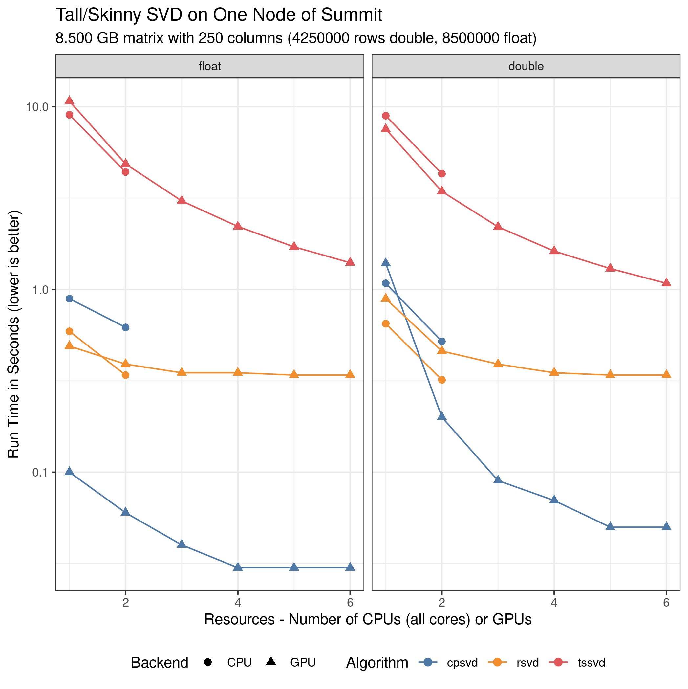]

---
# Comparing SVD Implementations
.center[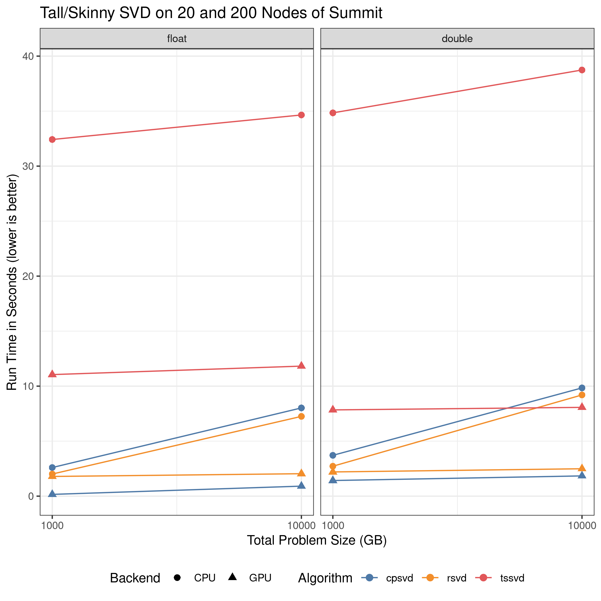]

---
# More Information
See: Schmidt, D., 2020, November. A Survey of Singular Value Decomposition Methods for Distributed Tall/Skinny Data. In 2020 IEEE/ACM 11th Workshop on Latest Advances in Scalable Algorithms for Large-Scale Systems (ScalA) (pp. 27-34). IEEE.


---
class: clear, inverse, middle, center
# Parallel Regression

---
# Recall: Regression 
* Normal equations
* QR
* SVD
* Solving the optimization problem

---
# Recall: Solving the Regression Optimization Problem
$$\min_{\beta \in \mathbb{R}^n} \frac{1}{2m} \sum_{i=1}^m \left((X \beta)_i - y_i\right)^2$$

```r
cost_gaussian = function(beta, x, y){
  m = nrow(x)
  (1/(2*m))*sum((x%*%beta - y)^2)
}

reg.fit = function(x, y, maxiter=100){
  control = list(maxit=maxiter)
  beta = numeric(ncol(x))
  optim(par=beta, fn=cost_gaussian, x=x, y=y, method="CG", control=control)
}
```

```r
reg.fit(X, y)$par
```

---
# Regression: Serial to Parallel
.pull-left[
```r
cost_gaussian = function(beta, x, y){
  m = nrow(x)
  J = (1/(2*m))*sum((x%*%beta - y)^2)
  J
}
```
]
.pull-right[
```r
cost_gaussian = function(beta, x, y){
  m = nrow(x)
  J_local = (1/(2*m))*sum((x%*%beta - y)^2)
  J = allreduce(J_local)
  J
}
```
]
* Global: `beta`
* Distributed: `x`, `y`

---
# Logistic Regression
$$\min_{\theta \in \mathbb{R}^n} \frac{1}{m} \sum_{i=1}^m -y\log(g^{-1}(X\theta)) - (1-y)\log(1-g^{-1}(X\theta))$$

```r
linkinv_logistic = binomial(logit)$linkinv

cost_logistic = function(theta, x, y)
{
  m = nrow(x)
  eta = x%*%theta
  h = linkinv_logistic(eta)
  (1/m)*sum((-y*log(h)) - ((1-y)*log(1-h)))
}

logistic.fit = function(x, y, maxiter=100)
{
  control = list(maxit=maxiter)
  theta = numeric(ncol(x))
  optim(par=theta, fn=cost_logistic, x=x, y=y, method="CG", control=control)
}
```

---
# Logistic Regression: Serial to Parallel
.pull-left[
```r
cost_logistic = function(theta, x, y)
{
  m = nrow(x)
  eta = x%*%theta
  h = linkinv_logistic(eta)
  J = (1/m)*sum((-y*log(h)) - ((1-y)*log(1-h)))
}
```
]
.pull-right[
```r
cost_logistic = function(theta, x, y)
{
  m = nrow(x)
  eta = x%*%theta
  h = linkinv_logistic(eta)
  J_local = (1/m)*sum((-y*log(h)) - ((1-y)*log(1-h)))
  J = allreduce_dbl(J_local)
  J
}
```
]
* Global: `theta`
* Distributed: `x`, `y`

---
# Linear 2-Class SVM Benchmark
.center[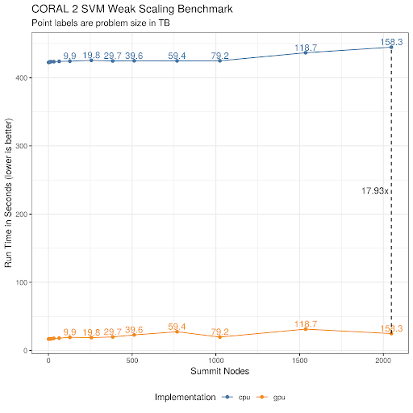]


---
class: clear, inverse, middle, center
# Other Approaches

---
# Distributing a Matrix
.center[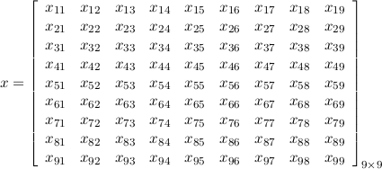]

---
# Distributing a Matrix: Blocking by Rows
.center[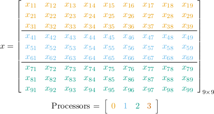]

---
# Distributing a Matrix: Blocking by Columns
.center[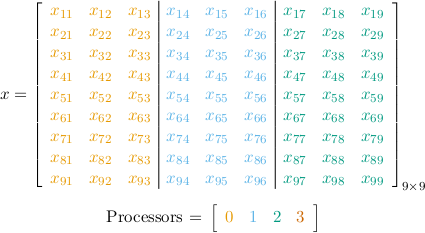]

---
# Distributing a Matrix: Cycling by Rows
.center[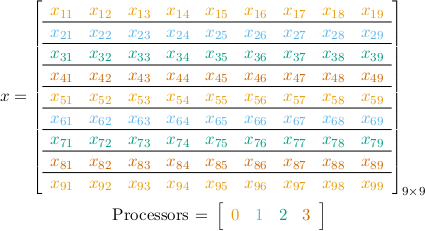]

---
# Distributing a Matrix: Cycling by Columns
.center[]

---
# Distributing a Matrix: Blocking by Rows AND Columns
.center[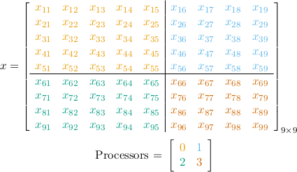]

---
# Distributing a Matrix: Cycling by Rows AND Columns
.center[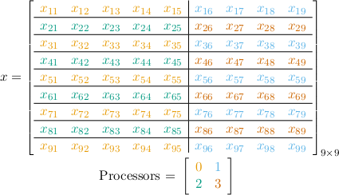]

---
# Distributing a Matrix: The 2-dimensional Block-Cyclic Layout
.center[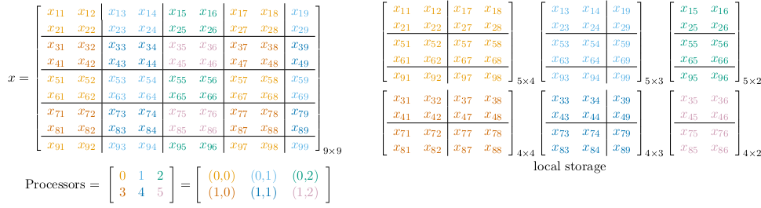]

---
# ScaLAPACK
* The scalable LAPACK
* Uses 2-d block-cyclic layout
* Created in the 90's
* Several attemps to replace it

---
# Bindings
* Julia
  - ScaLAPACK.jl
* Python
  - scalapy
* R
  - pbdDMAT
  - fmlr

---
# SVD with fmlr
.pull-left[
```r
suppressMessages(library(fmlr))

g = grid()
x = mpimat(g, 5, 5, 1, 1)
x$fill_rnorm()
x$info()

s = cpuvec()
linalg_svd(x, s)
if (g$rank0()){
  s
}
```
]
.pull-right[
```bash
mpirun -np 4 Rscript x.r
```

```
# mpimat 5x5 with 1x1 blocking on 2x2 grid type=d
3.1585 2.6992 1.2946 0.9501 0.5486 
```
]

---
# SVD with fmlr
.pull-left[
```r
suppressMessages(library(fmlr))

g = grid()
x = mpimat(g, 5, 5, 1, 1)
x$fill_rnorm()
x$info()

s = cpuvec()
linalg_rsvd(1234, 1, 2, x, s)
if (g$rank0()){
  s
}
```
]
.pull-right[
```bash
mpirun -np 4 Rscript x.r
```

```
# mpimat 5x5 with 1x1 blocking on 2x2 grid type=d
3.1162 
```
]

---
# Comparing SVD Implementations
.center[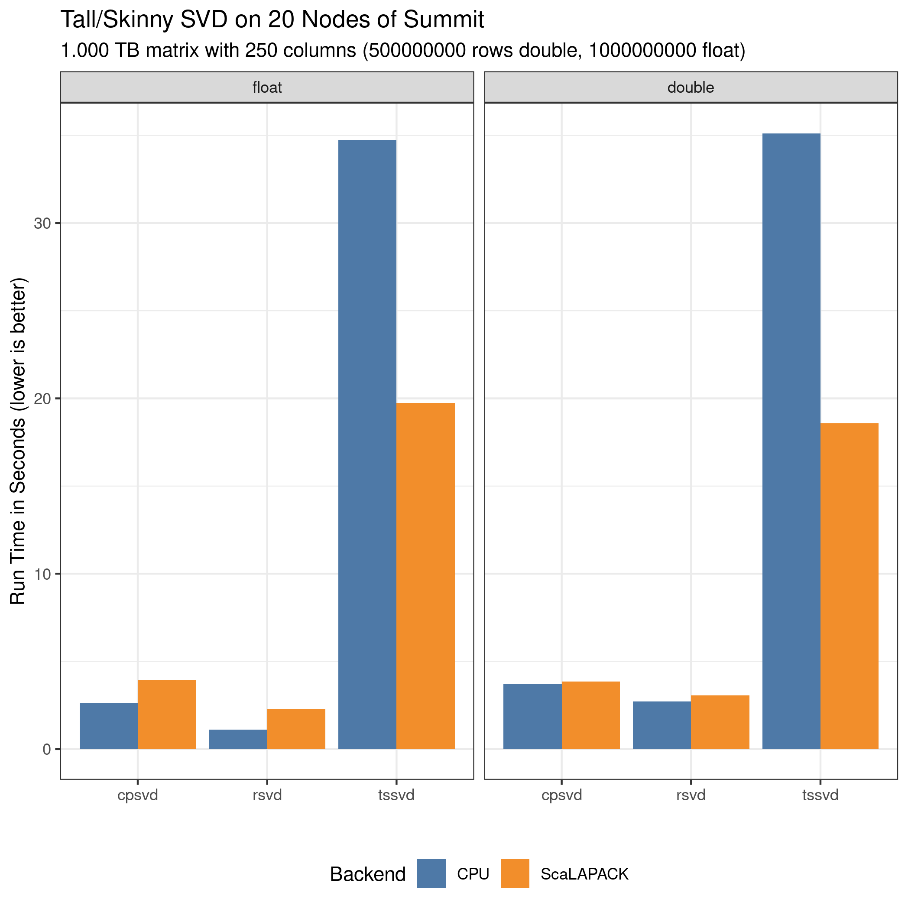]


---
class: clear, inverse, middle, center
# Wrapup

---
# Wrapup
* SPMD makes short work of data parallelism problems.
* The `allreduce()` collective is *very* powerful.
* Distributing by row/col is easy, but not always appropriate.
* Next time: the MapReduce algorithm


---
class: clear, inverse, middle, center
# Questions?
