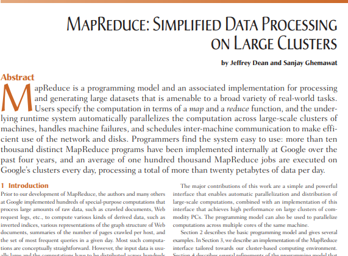
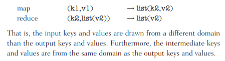
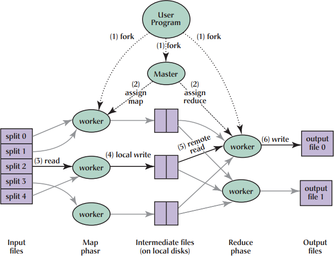
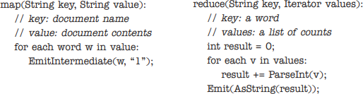
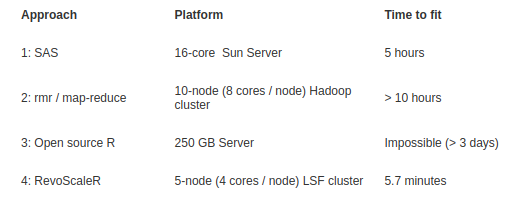
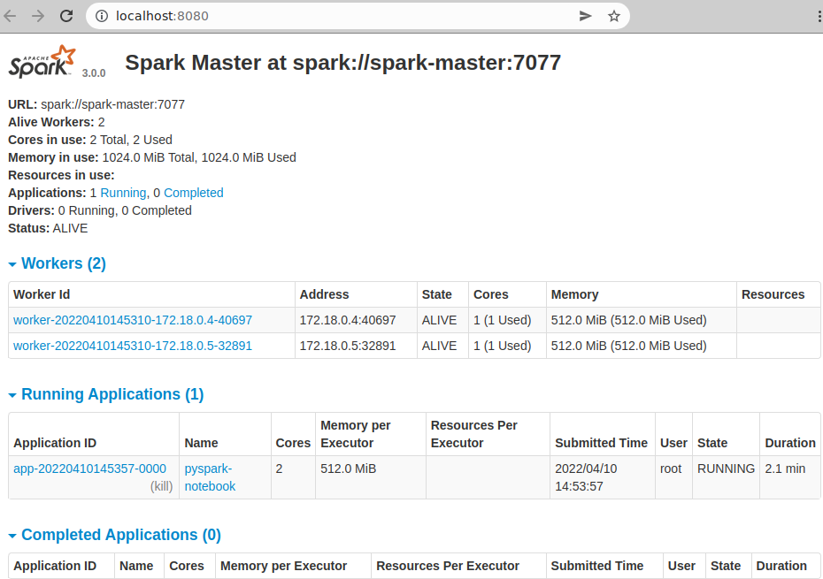
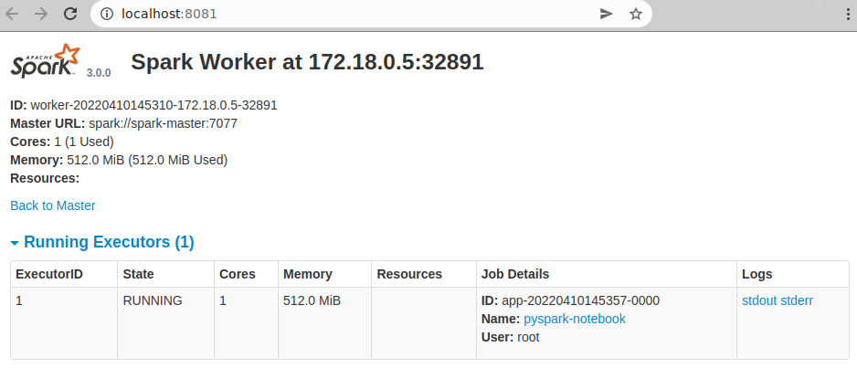

```{r setup, include=FALSE}
options(htmltools.dir.version = FALSE)
```


# From Last Time
* Homework 3
  - Originally due Saturday April 9
  - Now due Wednesday April 13
  - THERE WILL BE NO ADDITIONAL EXTENSIONS
  - New homework (no earlier than) some time next week(?)
* Questions?

---
# Today
* The MapReduce Algorithm


---
class: clear, inverse, middle, center
# Background

---
# MapReduce
.center[]

---
# Algorithm Overview
* Step 1: Read
* Step 2: Map
* Step 3: Shuffle
* Step 4: Reduce
* Step 5: Write

---
# How It Works: User's Perspective
* Everything operates on key/value pairs
* input pair $\xrightarrow{map}$ intermediate pair
* intermediate pairs are automatically grouped
* intermediate key + iterator $\xrightarrow{reduce}$ values
.center[]

---
# How It Works: Computer's Perspective
.center[]

---
# Implementations
* Hadoop
* Spark
* mrmpi

---
# Scalability?
.pull-left[
* "scale up"
* "scale out"
* What do these mysterious phrases mean?
]
.pull-right[]

---
# Vertical (up) vs Horizontal (out) Scaling
* Industry jargon
* (Opinion) Not really that well-defined
* More about *hardware* than *applications*
* Example
  - *Scale up* - Get a better processor, add a GPU, ...
  - *Scale out* - Add more nodes of what you already have
* Which is MapReduce designed for?

---
# The MapReduce 'Hello World'
Count the number of occurrences of a word across many text documents
.center[]

---
# Mapreduce (Spark) Pros and Cons
.pull-left[
## Pros
* No need to worry about parallel details
* Scaling "out" is straightforward: just add nodes
* I/O usually simple (many split text files)
* Can operate in memory or out-of-core
* Modern interfaces have SQL-like ETL
* Fault tolerance built in
]
.pull-right[
## Cons
* Not every problem naturally maps to key/value pairs
* Fault tolerance can't be turned off!
* Very difficult to set up
* Debugging borderline impossible
* Performance is *bad*
]

---
# Hadoop vs RevoScaleR
.center[]

https://blog.revolutionanalytics.com/2012/10/allstate-big-data-glm.html

---
# Spark vs pbdR
.pull-left-minicol[<br><br>]
.pull-right-maxicol[
* A problem that takes several hours on Apache Spark
[was analyzed] in less than a minute using R on OLCF
high-performance hardware.
* "... for situations where one needs interactive
near-real-time analysis, the pbdR approach is much
better."
]

.small[https://www.hpcwire.com/2016/07/06/olcf-researchers-scale-r-tackle-big-science-data-sets/]

---
# So Why Even Bother?
* For analytics, ***phenomenal*** question
* For ETL however...
  - Ask yourself
  - Not rhetorically
  - Actually ask yourself
>How would you implement an SQL join on distributed data with factors?


---
class: clear, inverse, middle, center
# Setting Up a Spark Cluster

---
# Setting Up a Spark Cluster
* ***This is really complicated***
* This is a ***full time job***
* Akin to "setting up ISAAC"
* Another analogy
  - Making SQL queries
  - Creating and maintaining SQL tables
  - Running the postgres database

---
# Setting Up a Spark Cluster
We will be using this guide https://www.kdnuggets.com/2020/07/apache-spark-cluster-docker.html

* Dockerized
* Spark cluster with 1 master 2 workers
* Includes pyspark and Jupyter

```bash
docker-compose up
```
```
Creating spark-master ... done
Creating jupyterlab   ... done
Creating spark-worker-1 ... done
Creating spark-worker-2 ... done
spark-master      | Using Spark's default log4j profile: org/apache/spark/log4j-defaults.properties
spark-master      | 22/04/10 14:53:08 INFO Master: Started daemon with process name: 7@ccf3714443b1
# ...
```

---
# Master
.center[]

---
# Worker 0
.center[]

---
# Worker 1
.center[]


---
class: clear, inverse, middle, center
# Wordcount Example

---
# Wordcount Step 1: Setup
```python
import pyspark

sc = pyspark.SparkContext("local", "word count")
```

---
# Wordcount Step 2: Import Data
```python
import wget

url = "https://raw.githubusercontent.com/bwhite/dv_hadoop_tests/master/python-streaming/word_count/input/4300.txt"
wget.download(url)
```

---
# Wordcount Step 3: Import Data
```python
words = sc.textFile("4300.txt").flatMap(lambda line: line.split(" "))
wordcounts = words.map(lambda word: (word, 1)).reduceByKey(lambda a,b: a + b)
wordcounts
```
```
PythonRDD[6] at RDD at PythonRDD.scala:53
```

---
# Wordcount Step 3.5: Viewing the Data
```python
wordcounts.take(10)
```
```
[('The', 1031),
 ('Project', 78),
 ('Gutenberg', 21),
 ('EBook', 2),
 ('of', 8127),
 ('Ulysses,', 3),
 ('by', 1173),
 ('James', 29),
 ('Joyce', 4),
 ('', 10116)]
```

---
# Wordcount Step 4: Sorting
```python
wordcounts_rbk = wordcounts.reduceByKey(lambda x,y: (x+y)).sortByKey()
wordcounts_rbk = wordcounts_rbk.map(lambda x: (x[1],x[0]))
wordcounts_rbk.sortByKey(False).take(10)
```
```
[(13600, 'the'),
 (10116, ''),
 (8127, 'of'),
 (6542, 'and'),
 (5845, 'a'),
 (4787, 'to'),
 (4606, 'in'),
 (3035, 'his'),
 (2712, 'he'),
 (2432, 'I')]
```

---
# Wordcount Step 5: I/O
```python
wordcounts.saveAsTextFile("counts")
```


---
class: clear, inverse, middle, center
# Basic Dataframe Operations

---
# Dataframes
* We'll be using the SQL operator interface
* There are other (arguably better) ones

---
# Dataframes: Setup
```python
import pyspark

spark = pyspark.sql.SparkSession.\
  builder.\
  appName("dataframe example").\
  master("spark://spark-master:7077").\
  config("spark.executor.memory", "512m").\
  getOrCreate()
```

---
# Dataframes: Import Iris
```python
import wget

url = "https://archive.ics.uci.edu/ml/machine-learning-databases/iris/iris.data"
wget.download(url)

iris = spark.read.csv("iris.data")
iris.show(n=5)
```

```
+---+---+---+---+-----------+
|_c0|_c1|_c2|_c3|        _c4|
+---+---+---+---+-----------+
|5.1|3.5|1.4|0.2|Iris-setosa|
|4.9|3.0|1.4|0.2|Iris-setosa|
|4.7|3.2|1.3|0.2|Iris-setosa|
|4.6|3.1|1.5|0.2|Iris-setosa|
|5.0|3.6|1.4|0.2|Iris-setosa|
+---+---+---+---+-----------+
only showing top 5 rows
```

---
# Dataframes: Distributed?
```python
iris.rdd.getNumPartitions()
```

```
1
```

---
# Dataframes: Distributing
```python
spark.conf.set("spark.sql.files.maxPartitionBytes", 1000)

iris = spark.read.csv("iris.data")
iris.rdd.getNumPartitions()
```

```
5
```

```python
type(iris)
```

```
pyspark.sql.dataframe.DataFrame
```

---
# Dataframes: Printing
```python
iris.show(n=5)
```

```
+---+---+---+---+-----------+
|_c0|_c1|_c2|_c3|        _c4|
+---+---+---+---+-----------+
|5.1|3.5|1.4|0.2|Iris-setosa|
|4.9|3.0|1.4|0.2|Iris-setosa|
|4.7|3.2|1.3|0.2|Iris-setosa|
|4.6|3.1|1.5|0.2|Iris-setosa|
|5.0|3.6|1.4|0.2|Iris-setosa|
+---+---+---+---+-----------+
only showing top 5 rows
```

---
# Dataframes: Renaming Columns
```python
from functools import reduce
cn_old = iris.columns
cn_new = ['Sepal_Length', 'Sepal_Width', 'Petal_Length', 'Petal_Width', 'Species']
iris = reduce(lambda iris,idx: iris.withColumnRenamed(cn_old[idx], cn_new[idx]), range(len(cn_old)), iris)
iris.show(n=5)
```

```
+------------+-----------+------------+-----------+-----------+
|Sepal_Length|Sepal_Width|Petal_Length|Petal_Width|    Species|
+------------+-----------+------------+-----------+-----------+
|         5.1|        3.5|         1.4|        0.2|Iris-setosa|
|         4.9|        3.0|         1.4|        0.2|Iris-setosa|
|         4.7|        3.2|         1.3|        0.2|Iris-setosa|
|         4.6|        3.1|         1.5|        0.2|Iris-setosa|
|         5.0|        3.6|         1.4|        0.2|Iris-setosa|
+------------+-----------+------------+-----------+-----------+
only showing top 5 rows
```

---
# Dataframes: Computing a Mean
```python
from pyspark.sql.functions import *
iris.select('Sepal_Length').\
  agg(mean('Sepal_Length')).\
  show()
```

```
+-----------------+
|avg(Sepal_Length)|
+-----------------+
|5.843333333333333|
+-----------------+
```

```{r}
mean(iris$Sepal.Length)
```

---
# Dataframes: Group Means
```python
iris.select('Sepal_Length', 'Species').\
  groupBy('Species').\
  agg(mean("Sepal_Length")).\
  show()
```

```
+---------------+-----------------+
|        Species|avg(Sepal_Length)|
+---------------+-----------------+
| Iris-virginica|6.587999999999999|
|    Iris-setosa|5.005999999999999|
|Iris-versicolor|5.935999999999999|
+---------------+-----------------+
```

```{r}
aggregate(iris$Sepal.Length, list(iris$Species), FUN=mean)
```


---
class: clear, inverse, middle, center
# Wrapup

---
# Wrapup
* That's it for parallelism!
* What are the advantages/disadvantages of
  - Fork
  - MPI
  - MapReduce
* What are the advantages/disadvantages of
  - Manager/Worker
  - SPMD
* The homework will not involve MapReduce (code)

---
class: clear, inverse, middle, center
# Questions?
