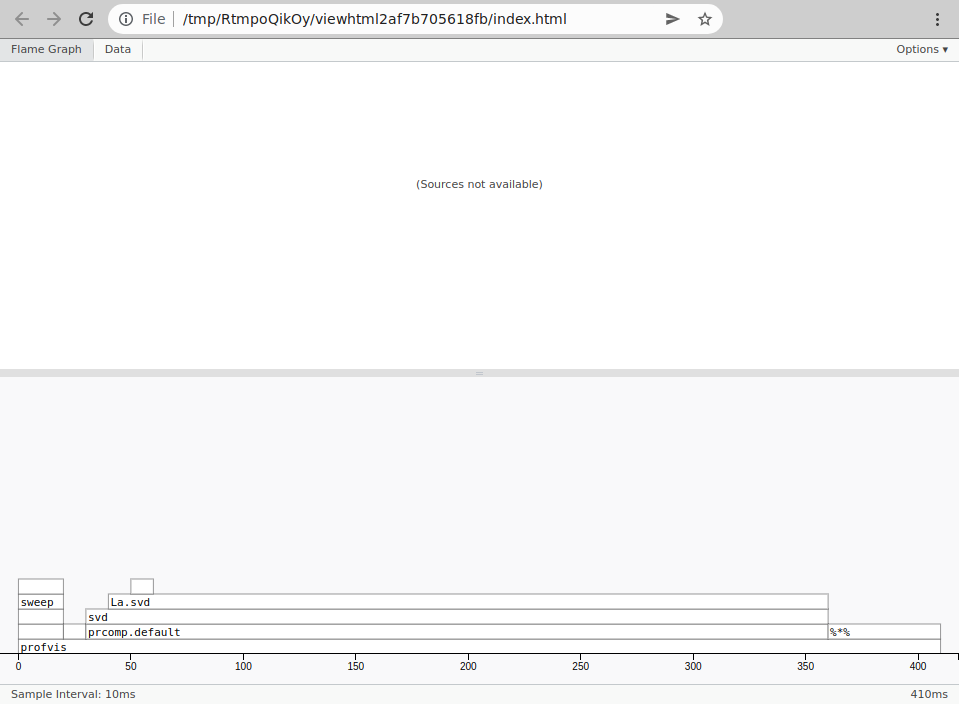
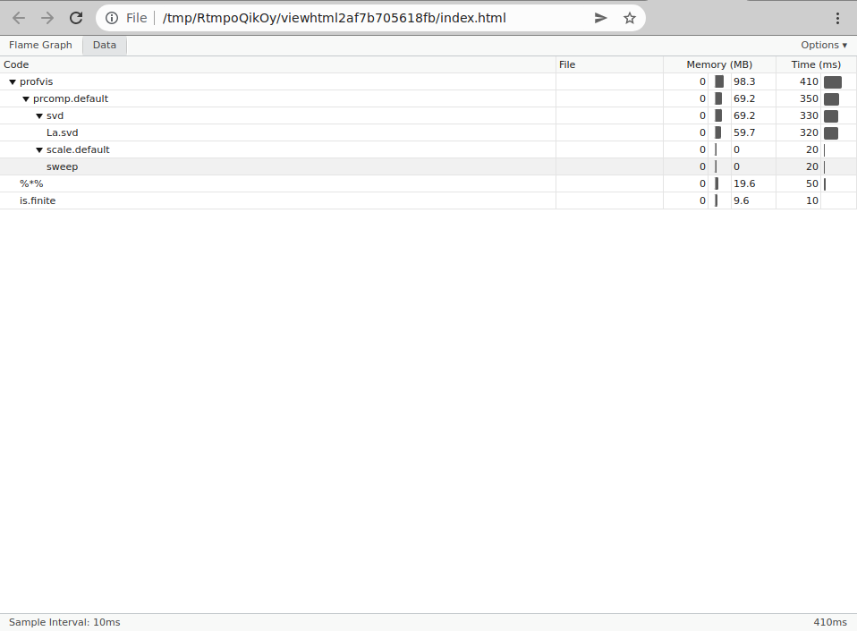

```{r setup, include=FALSE}
options(htmltools.dir.version = FALSE)
```

# From Last Time
* Homework 4
  - Assigned
  - Due April 30
  - Extensions very unlikely
* Homework 5
  - Covers profiling
  - Smaller
  - Assigned next week?
  - Due May 10?
* No Homework 6 (Deep Learning)
* Questions?


---
# Why Profile?
* You're data people, *right*?
  - "It's slow" - how do you know?!
  - Where would you even start?
* Gather information
  - Maybe you wrote it a while ago
  - Maybe you didn't write it!

---
# Profiling
* Information gathering
  - What's the run time?
  - Which functions are doing all the work?
  - How much RAM/disk/network does it use?
* Benchmarking
  - A kind of profiling
  - Comparing resource utilization of different implementations
  - "Implementation A is slower than implementation B"
  - "Implementation A uses more RAM than implementation B"

---
# Statistical vs Deterministic
* Statistical
  - Gets performance data through sampling
  - Can be random or at specific intervals
  - R's `Rprof()` works this way
* Deterministic
  - Instruments the code for exact timings
  - Instrumentation can be explicit or implicit
  - Python's cProfile and profile work this way


---
class: clear, inverse, middle, center
# Profiling in R


---
# Basic Timers
* `system.time()`
  - 
    ```r
    system.time(expensive_function())
    ```
* `Sys.time()`
  - 
    ```r
    tic = Sys.time()
    ret = expensive_function()
    toc = Sys.time()
    toc - tic
    ```

---
# Basic Memory Profiling
```r
library(memuse)
Sys.procmem()
```
```
Size:  69.273 MiB 
Peak:  69.273 MiB
```
```r
x = runif(1e8)
mu(x)
```
```
762.939 MiB
```
```r
rm(x);invisible(gc())
Sys.procmem()
```
```
Size:   69.523 MiB 
Peak:  832.301 MiB 
```

---
# Basic Memory Profiling
.pull-left[
## IEC

| Short | Long | Factor |
|-------|------|--------|
| b | bit | $\frac{1}{8}$ |
| B | byte | 1 |
| KiB| kibibyte | $2^{10}$ |
| MiB| mebibyte | $2^{20}$ |
| GiB| gibibyte | $2^{30}$ |
| TiB| tebibyte | $2^{40}$ |
| PiB| pebibyte | $2^{50}$ |
| EiB| exbibyte | $2^{60}$ |
]
.pull-right[
## SI

| Short | Long | Factor |
|-------|------|--------|
| b | bit | $\frac{1}{8}$ |
| B | byte | 1 |
| kB| kilobyte | $10^{3}$ |
| MB| megabyte | $10^{6}$ |
| GB| gigabyte | $10^{9}$ |
| TB| terabyte | $10^{12}$ |
| PB| petabyte | $10^{15}$ |
| EB| exabyte | $10^{18}$ |
]

---
# Basic Memory Profiling
.center[]
https://cran.r-project.org/web/packages/memuse/vignettes/memuse-guide.pdf


---
# Line Profiling
.pull-left-minicol[
```r
m = 10000
n = 250
x = matrix(rnorm(m*n), nrow=m, ncol=n)

Rprof()
pca = prcomp(x)
Rprof(NULL)

summaryRprof()
```
]
.pull-right-maxicol[
```
$by.self
                self.time self.pct total.time total.pct
"La.svd"             0.68    69.39       0.72     73.47
"%*%"                0.12    12.24       0.12     12.24
"aperm.default"      0.04     4.08       0.04      4.08
"array"              0.04     4.08       0.04      4.08
"matrix"             0.04     4.08       0.04      4.08
"sweep"              0.02     2.04       0.10     10.20
### output truncated by presenter

$by.total
                 total.time total.pct self.time self.pct
"prcomp"               0.98    100.00      0.00     0.00
"prcomp.default"       0.98    100.00      0.00     0.00
"svd"                  0.76     77.55      0.00     0.00
"La.svd"               0.72     73.47      0.68    69.39
### output truncated by presenter

$sample.interval
[1] 0.02

$sampling.time
[1] 0.98
```
]

---
# Line Profiling
.pull-left-minicol[
```r
m = 10000
n = 250
x = matrix(rnorm(m*n), nrow=m, ncol=n)

Rprof(interval=.99)
pca = prcomp(x)
Rprof(NULL)

summaryRprof()
```
]
.pull-right-maxicol[
```
$by.self
[1] self.time  self.pct   total.time total.pct 
<0 rows> (or 0-length row.names)

$by.total
[1] total.time total.pct  self.time  self.pct  
<0 rows> (or 0-length row.names)

$sample.interval
[1] 0.99

$sampling.time
[1] 0
```
]

---
# profvis
* External package, available on cran
* Wrapper around `Rprof()`
* Results summarized in interactive web plots

---
# Using profvis
```r
library(profvis)

m = 10000
n = 250
x = matrix(rnorm(m*n), nrow=m, ncol=n)

profvis({
  pca = prcomp(x)
})
```

---
# Using profvis
.center[]

---
# Using profvis
.center[]

---
# merkhet
* External package, available on HPCRAN
* https://hpcran.org/packages/merkhet/index.html
* Name is a reference to an ancient Egyptian timekeeping device
* Very different approach
* Makes conditional benchmarking possible

---
# Using merkhet
.pull-left[
```r
library(merkhet)
suppressMessages(library(fmlr))

m = n = 250
seed = 1234
type = "float"

header = sprintf("matprod - %dx%d (%s) type=%s", m, n, as.character(howbig(m, n, type=type)), type)
b = bench(header, flops=2*n^3)

tol = ifelse(type=="double", 1e-8, 1e-4)

x = cpumat(n, n, type)
x$fill_rnorm(seed)
xr = x$to_robj()

y = cpumat(n, n, type)
y$fill_rnorm()
yr = y$to_robj()
```
]
.pull-right[
```r
b$time({xr %*% yr}, name="R")

b$time(linalg_matmult(FALSE, FALSE, x=x, y=y), name="fmlr - CPU")

if (fml_gpu())
{
  c = card()
  xg = gpumat(c, type=type)
  cpu2gpu(x, xg)
  yg = gpumat(c, type=type)
  cpu2gpu(y, yg)
  
  b$time({
    linalg_matmult(FALSE, FALSE, x=xg, y=yg)
    c$synch()
  }, name="fmlr - GPU")
}

b$print()
```
]

---
# Using merkhet
```
$ OMP_NUM_THREADS=8 Rscript matprod.r 
## matprod - 250x250 (244.141 KiB) type=float 
           elapsed reps   avg relative gflops
R            0.001    1 0.001        1 31.250
fmlr - CPU   0.002    1 0.002        2 15.625
```


---
class: clear, inverse, middle, center
# Profiling in Python

---
# Basic Timers
* `time.perf_counter()`
  - 
    ```python
    import time
    tic = time.perf_counter()
    ret = expensive_function()
    toc = time.perf_counter()
    toc - tic
    ```

---
# Basic Memory Profiling
```python
import psutil

psutil.virtual_memory()

def process_usage_in_gib():
    return psutil.Process().memory_info().rss / 1024 / 1024 / 1024

process_usage_in_gib()
```
```
0.7800483703613281
```
```python
import numpy as np
x = np.random.rand(int(1e9))
process_usage_in_gib()
```
```
7.4858245849609375
```

---
# The cProfile Package
* Built-in
* Arguably the main line profiler for Python
* Somewhat similar to R's `Rprof()` in output
* Deterministic (unlike `Rprof()`)
* There's also the profile package which is similar
  - cProfile is a C extension
  - profile is pure Python

---
# Using cProfile
```python
import cProfile
cProfile.run("1+1")
```
```
3 function calls in 0.000 seconds

Ordered by: standard name

ncalls  tottime  percall  cumtime  percall filename:lineno(function)
     1    0.000    0.000    0.000    0.000 <string>:1(<module>)
     1    0.000    0.000    0.000    0.000 {built-in method builtins.exec}
     1    0.000    0.000    0.000    0.000 {method 'disable' of '_lsprof.Profiler' objects}
```

---
# cProfile Columns
* ncalls: Number of function calls
* tottime: Total time taken by the function *not* including sub-functions
* percall: $\frac{\text{tottime}}{\text{ncalls}}$
* cumtime: tottime that *does* include sub-functions

---
# Using cProfile
```python
import cProfile
pr = cProfile.Profile()
pr.enable()
1+1
pr.disable()
pr.print_stats(sort='time')
```

---
# Using cProfile
```python
import numpy as np
import cProfile
pr = cProfile.Profile()
pr.enable()
x = np.random.rand(int(1e8))
pr.disable()
pr.print_stats(sort='time')
```
```
9 function calls in 0.894 seconds

Ordered by: internal time

ncalls  tottime  percall  cumtime  percall filename:lineno(function)
     4    0.894    0.224    0.894    0.224 {method 'rand' of 'numpy.random.mtrand.RandomState' objects}
     1    0.000    0.000    0.000    0.000 <stdin>:1(<module>)
     4    0.000    0.000    0.000    0.000 {method 'disable' of '_lsprof.Profiler' objects}
```

---
# Using cProfile Implicitly
```bash
$ cat script.py 
1+1

$ python -m cProfile script.py 
         3 function calls in 0.000 seconds

   Ordered by: standard name

   ncalls  tottime  percall  cumtime  percall filename:lineno(function)
        1    0.000    0.000    0.000    0.000 script.py:1(<module>)
        1    0.000    0.000    0.000    0.000 {built-in method builtins.exec}
        1    0.000    0.000    0.000    0.000 {method 'disable' of '_lsprof.Profiler' objects}
```

---
# Other Notable Packages
- line_prof https://pypi.org/project/line-profiler/
- profile-viewer https://pypi.org/project/profile-viewer/
- memory-profiler https://pypi.org/project/memory-profiler/
- benchmark https://pypi.org/project/benchmark/


---
class: clear, inverse, middle, center
# Wrapup

---
# Wrapup
* Profiling is a kind of fact-finding.
* So far we have looked at *runtime* profiling.
* Profiling helps you understand the performance of the code you are running.
* Especially useful if you didn't write the code.
* Next time: Advanced Profiling

---
class: clear, inverse, middle, center
# Questions?
