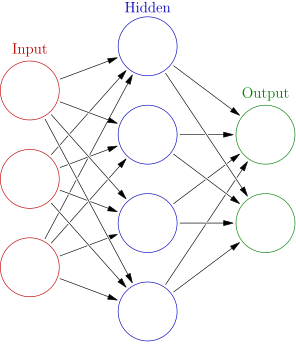
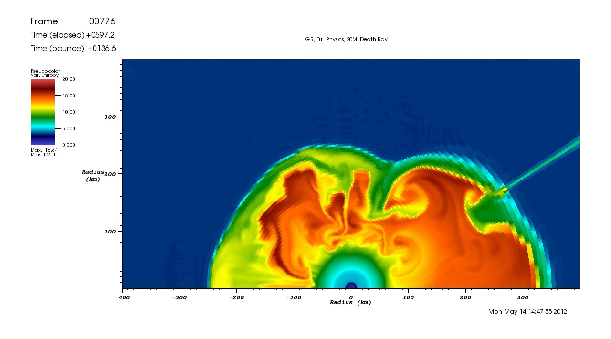
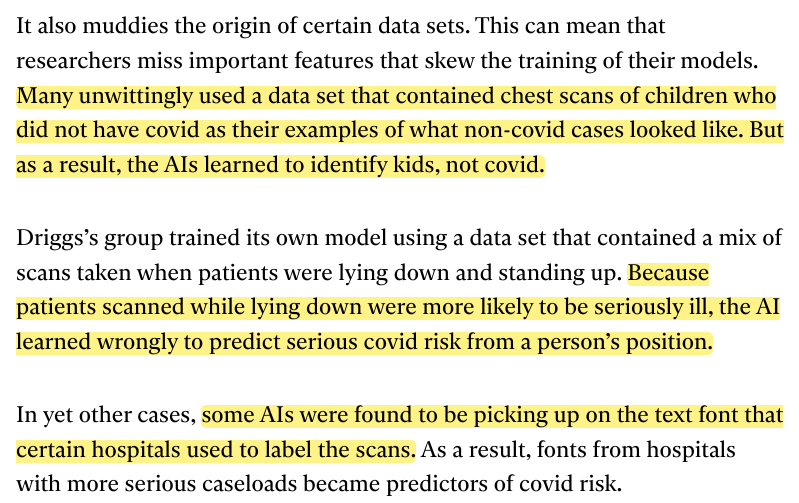
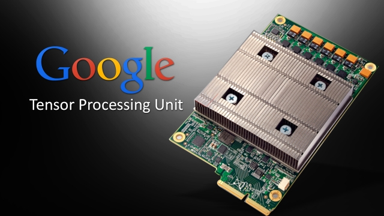

```{r setup, include=FALSE}
options(htmltools.dir.version = FALSE)
```

# From Last Time
* Homework 4
* Homework 5
  - Assigned
  - Due Wed May 11
* Questions?

---
# Getting Started With DL
Where to start...

---
# What Is Deep Learning?
>Deep learning (also known as deep structured learning) is part of a broader family of machine learning methods based on artificial neural networks with representation learning.

https://en.wikipedia.org/wiki/Deep_learning

---
# Neural Network
.pull-left[
* "Artificial" neural networks (ANN, aNN, NN)
* "Inspired" by biological neural networks
* Dates back to the 1960's!
* Resurfaces every decade or so
* In 2010's they finally solved a real problem
].pull-right[]

.tiny[Image from https://en.wikipedia.org/wiki/Artificial_neural_network]

---
# What Is a Neural Network?
* A (complicated) composition of functions
* A universal approximator
  - Others, e.g. polynomials
  - See also Universal Approximation Theorem

---
# Deep Learning
* It's neural networks
* "Learns" a function (potentially even a latent one)
* Why "deep"?
  - First attempt: the perceptron; not a universal approximator
  - Added a hidden layer: becomes universal approximator
  - Add *many* hidden layers (and compute derivatives differently)
  - Seems to work very well for some applications
  - People still trying to develop conceptual frameworks to explain why

---
# Examples of Neural Networks
* Image classification: convolutional neural networks (CNN)
* NLP: LSTM, word2vec, transformer models e.g. GPT-3
* Anomaly detection: autoencoders

---
# Pros and Cons
.pull-left[
## Pros
* The things that work well are best in class
* Basically wrapped up image classification
* Much easier these days!
].pull-right[
## Cons
* Impenetrable terminology
* *Very* computationally expensive
* Often simply doesn't work
* Has huge replication crisis
* No uncertainty quantification
]
.pull-right-maxicol[
## Mixed
* Everything is on arXiv
* Doesn't replace "traditional" stats/AI/ML
]

---
# Anomaly Detection
.center[]
.tiny[Schmidt, D., Messer, B., Young, M.T. and Matheson, M., 2020. Towards the Development of Entropy-Based Anomaly Detection in an Astrophysics Simulation. arXiv preprint arXiv:2009.02430.]

---
# Deep Laughing
.center[]

---
# Core Objects
.pull-left[
## Statistics
Dataframes
].pull-right[
## Deep Learning
Tensors
]

---
# "Tensors"
* Tensors are very convoluted mathematical objects
* In this context: a tensor is a multi-dimensional array
* Yes, a matrix is a tensor
* Terminology used by people who want to sound smarter than they actually are

---
# DL At a Glance
* Training step
  - building the model
  - *VERY* compute intensive
  - often runs on HPC clusters
* Evaluation step
  - make predictions
  - usually not very expensive
  - often runs on phones
  - ***Incorrectly*** called "inference"

---
# DL Training At a Glance
1. Need input data (e.g. images) and response (e.g. labels)
2. A set of weights is initialized (usually randomly)
3. Iterate until done (e.g. max iterations, some loss criterion satisfied, ...)
    1. Pass data through network (forward propagation)
    2. Compute the loss
    3. Compute the gradient (backpropagation)
    4. Take a step (gradient descent)
4. The weights are returned; used for predictions

---
# Some DL Jagron
* Epoch: one pass over the entire dataset
* Size of dataset during iteration:
  - Batch gradient descent: entire dataset
  - Minibatch gradient descent: partial subset
  - Stochastic gradient descent (SGD): minibatch of size 1

---
# Typical Data Splitting
* Training data
  - Data used for building the model
  - Often ~60-80% of total
* Validation data
  - Used *within* an iteration for testing the 
  - Often 5-20% of total
* Test data
  - Used to check a *final* model
  - Often 5-20% of total

---
# Why not use k-fold Crossvalidation?
.center[]

---
# Software Packages
.pull-left[
* Tensorflow
* PyTorch
* Others
  - CNTK
  - Theano
  - Caffe
].pull-right[]

---
# Hardware
.pull-left[
* CPU
* GPU
* TPU
].pull-right[]

---
# Parallelism in DL
* Training
  - "Tuning"
      - many "knobs" to tweak
      - standard task parallelism
  - Data parallelism
      - Different resources see different data
      - Coordination between resources to determine the parameters
  - "Model parallelism"
      - Different resources see *the same* data
      - Coordination between resources to share determined parameters
* "Inference"
  - standard task parallelism

---
class: clear, inverse, middle, center
# Wrapup

---
# Free Resources
* Last year's lectures
* NVIDIA's DL Institute https://www.nvidia.com/en-us/training/resources/
* Andrew Ng's DL lectures https://www.youtube.com/channel/UCcIXc5mJsHVYTZR1maL5l9w

---
# Wrapup
* Using DL is not so bad these days
* DL research is a different PhD track
* Next time
  - DL for Practitioners
  - Emphasis on pre-trained models
  - Examples from image classification

---
class: clear, inverse, middle, center
# Questions?
