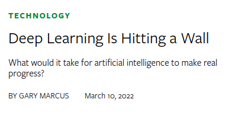
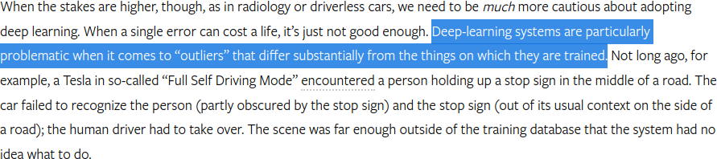
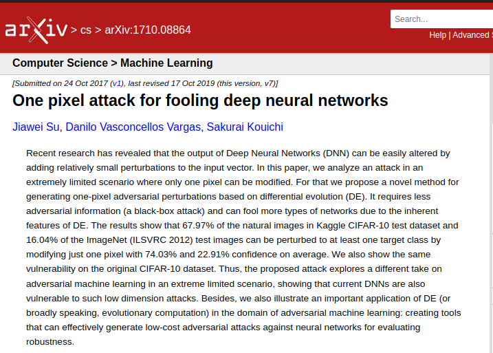
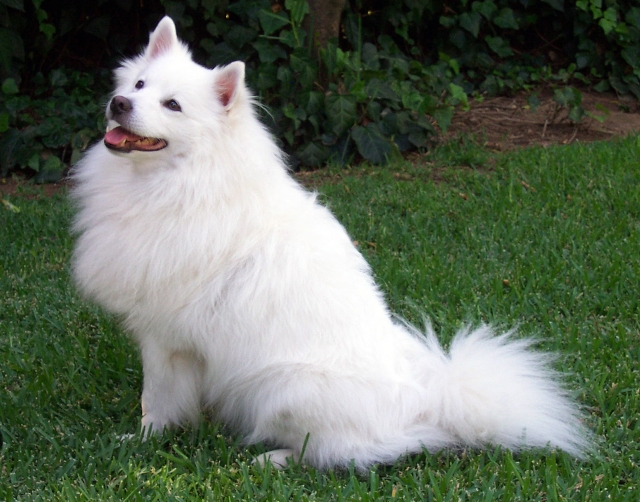

```{r setup, include=FALSE}
options(htmltools.dir.version = FALSE)
```


# From Last Time
* Homework 5 is assigned
* Questions?


---
class: clear, inverse, middle, center
# More DL Background

---
# AI Winter?
.center[]
.center[]
.tiny[https://nautil.us/deep-learning-is-hitting-a-wall-14467/]

---
# DL Model Fragility
.center[]
.tiny[https://arxiv.org/abs/1710.08864]

---
# Some Famous Image Datasets
.pull-left[
* MNIST
  - handwritten digits
* CIFAR
  - 10 and 100 class "common item" dataset
  - 60k hand-labeled images
* Imagenet
  - 1000 class "common item" dataset
  - Nearly 15 million hand-annotated images
].pull-right[]

---
# Some Common CNN's
.pull-left[
* AlexNet (Alex Krizhevsky, Hinton)
* VGG (Oxford)
* ResNet (Microsoft Research)
].pull-right[]

.tiny[Image from https://www.researchgate.net/figure/The-structure-of-ResNet-12_fig1_329954455]

---
# Some History
* AlexNet was the first big splash for DL
* Imagenet competition:
  - Best before 2012: 25% top-5 error rate
  - 2012: (AlexNet) 15.3% top-5 error rate (Winner)
  - 2014: (VGG-16) 7.3% top-5 error rate (Runner up)
  - 2015: (ResNet) 3.57% top-5 error rate (Winner)

---
# ResNet
* Residual Neural Network
* Major insight: utilizes "skip connections"
* Different architectures with differing numbers of hidden layers
* 18, 34, 50, 101, 152, ...


---
class: clear, inverse, middle, center
# PyTorch

---
# Installation
```bash
pip install torch torchvision
```

---
# Resnet Example
Throughout, our example is modified from the pytorch example https://pytorch.org/hub/pytorch_vision_resnet/

```python
import torch
model = torch.hub.load('pytorch/vision:v0.10.0', 'resnet18', pretrained=True)
```
```
Downloading: "https://github.com/pytorch/vision/archive/v0.10.0.zip" to /home/mschmid3/.cache/torch/hub/v0.10.0.zip
Downloading: "https://download.pytorch.org/models/resnet18-f37072fd.pth" to /home/mschmid3/.cache/torch/hub/checkpoints/resnet18-f37072fd.pth
100.0%
```

---
# Is This a Dog?
.center[]

---
# Getting the Image
```python
import urllib
url, filename = ("https://github.com/pytorch/hub/raw/master/images/dog.jpg", "dog.jpg")
urllib.request.urlretrieve(url, filename)

from PIL import Image
input_image = Image.open(filename)
```

---
# Preprocessing
All pre-trained models require the same image normailization
* 3-channel RGB (3 x H x W)
* H and W are at least 224
* values in `[0, 1]`
* normalized to mean `[0.485, 0.456, 0.406]` and sd `[0.229, 0.224, 0.225]`
* minibatches

---
# Preprocessing
```python
from torchvision import transforms
dim = 224
mean = [0.485, 0.456, 0.406]
sd = [0.229, 0.224, 0.225]
preprocess = transforms.Compose([
    transforms.Resize(256),
    transforms.CenterCrop(dim),
    transforms.ToTensor(),
    transforms.Normalize(mean=mean, std=sd),
])
input_tensor = preprocess(input_image)

input_batch = input_tensor.unsqueeze(0)
```

---
# Apply the Model
```python
with torch.no_grad():
    output = model(input_batch)

output.shape
```
```
torch.Size([1, 1000])
```

```python
output[0, range(8)]
```
```
tensor([-1.2817, -1.3418, -0.7523, -0.1647, -0.8529,  1.3985])
```

```python
probabilities = torch.nn.functional.softmax(output[0], dim=0)
probabilities[range(8)]
```
```
tensor([4.4294e-07, 4.1711e-07, 7.5207e-07, 1.3535e-06, 6.8011e-07, 6.4618e-06])
```

---
# Imagenet Labels
```python
import wget
imagenet_labels = 'https://raw.githubusercontent.com/pytorch/hub/master/imagenet_classes.txt'
wget.download(imagenet_labels)

with open("imagenet_classes.txt", "r") as f:
    categories = [s.strip() for s in f.readlines()]

# Show top categories per image
top5_prob, top5_catid = torch.topk(probabilities, 5)
for i in range(top5_prob.size(0)):
    print(categories[top5_catid[i]], top5_prob[i].item())
```
```
bucket 0.008743884973227978
plunger 0.006772770546376705
hook 0.005883164703845978
paper towel 0.005243285093456507
ashcan 0.005110110156238079
```

---
# NO! This is a Bucket
.center[]

---
# Why Did This Happen?
.pull-left[
* We aren't training, we're evaluating
* Need to call `model.eval()`
* For training we use `model.train()`
].pull-right[]

---
# Making a Prediction Function
```python
def predict_with_resnet(input_batch, nlayers):
    model = torch.hub.load('pytorch/vision:v0.10.0', 'resnet' + str(nlayers), pretrained=True)
    model.eval()
    
    with torch.no_grad():
        output = model(input_batch)
    
    probabilities = torch.nn.functional.softmax(output[0], dim=0)
    top5_prob, top5_catid = torch.topk(probabilities, 5)
    for i in range(top5_prob.size(0)):
        print(categories[top5_catid[i]], top5_prob[i].item())
```

---
# Predictions
.pull-left[
```python
predict_with_resnet(input_batch, 18)
```
```
Samoyed 0.8846226930618286
Arctic fox 0.04580523073673248
white wolf 0.044276077300310135
Pomeranian 0.005621373653411865
Great Pyrenees 0.004652000498026609
```
```python
predict_with_resnet(input_batch, 34)
```
```
Samoyed 0.8840289115905762
Pomeranian 0.039363887161016464
Arctic fox 0.025501668453216553
keeshond 0.023505182936787605
white wolf 0.004716045688837767
```
].pull-right[
```python
predict_with_resnet(input_batch, 50)
```
```
Samoyed 0.8732959032058716
Pomeranian 0.030270766466856003
white wolf 0.019671263173222542
keeshond 0.01107351016253233
Eskimo dog 0.009204256348311901
```
```python
predict_with_resnet(input_batch, 101)
```
```
Samoyed 0.951001763343811
Pomeranian 0.019060354679822922
white wolf 0.0076106698252260685
Eskimo dog 0.005612253211438656
keeshond 0.0036319640930742025
```
]

---
# Making a Preprocessing Function
```python
from PIL import Image
from torchvision import transforms
def preprocess(filename):
    input_image = Image.open(filename).convert('RGB')
    dim = 224
    mean = [0.485, 0.456, 0.406]
    sd = [0.229, 0.224, 0.225]
    preprocess = transforms.Compose([
        transforms.Resize(256),
        transforms.CenterCrop(dim),
        transforms.ToTensor(),
        transforms.Normalize(mean=mean, std=sd),
    ])
    input_tensor = preprocess(input_image)
    input_batch = input_tensor.unsqueeze(0)
    return input_batch
```


---
class: clear, inverse, middle, center
# What Is This?

---
# Identifying Known Objects
.pull-left[
What happens when we show it images it has seen?
```python
def string_vec_contains(vec, value):
    for v in vec:
        if value == v:
            return True
    return False
```

```python
string_vec_contains(categories, 'stove')
```
```
True
```
```python
string_vec_contains(categories, 'pot')
```
```
True
```
].pull-right[]


---
# What Is This?
.center[]

---
# Stove Predictions
.pull-left[
```python
input_batch = preprocess('stove.jpg')
predict_with_resnet(input_batch, 34)
```
```
hard disc 0.28327348828315735
dishwasher 0.147591695189476
can opener 0.06293792277574539
water bottle 0.062163639813661575
oil filter 0.056593675166368484
```
```python
input_batch = preprocess('stove.jpg')
predict_with_resnet(input_batch, 50)
```
```
hard disc 0.9527970552444458
oil filter 0.009614785201847553
tape player 0.005083377007395029
barometer 0.00492066191509366
stove 0.0043748836033046246
```
].pull-right[
```python
input_batch = preprocess('stove.jpg')
predict_with_resnet(input_batch, 101)
```
```
hard disc 0.2116469293832779
tape player 0.11292723566293716
china cabinet 0.07321552187204361
barometer 0.053209833800792694
loudspeaker 0.04002181068062782
```
```python
input_batch = preprocess('stove.jpg')
predict_with_resnet(input_batch, 152)
```
```
hard disc 0.3098987936973572
spotlight 0.05348089337348938
tape player 0.04961665719747543
stove 0.038500864058732986
car wheel 0.03589474409818649
```
]


---
# What Is This?
.center[]

---
# Stove Predictions
.pull-left[
```python
input_batch = preprocess('stove_eye_covers.jpg')
predict_with_resnet(input_batch, 34)
```
```
typewriter keyboard 0.2084062248468399
dial telephone 0.18769077956676483
beaker 0.0371890626847744
barrel 0.03656706586480141
ladle 0.033604662865400314
```
```python
input_batch = preprocess('stove_eye_covers.jpg')
predict_with_resnet(input_batch, 50)
```
```
ladle 0.11306107044219971
beaker 0.08212278038263321
tray 0.05218195170164108
barometer 0.04987306147813797
Petri dish 0.04542011767625809
```
].pull-right[
```python
input_batch = preprocess('stove_eye_covers.jpg')
predict_with_resnet(input_batch, 101)
```
```
ladle 0.12029356509447098
rotisserie 0.06697414815425873
radio 0.06427623331546783
beaker 0.06244540214538574
dishwasher 0.052622828632593155
```
```python
input_batch = preprocess('stove_eye_covers.jpg')
predict_with_resnet(input_batch, 152)
```
```
vending machine 0.24071547389030457
rotisserie 0.14042000472545624
espresso maker 0.056181155145168304
radio 0.04111208766698837
typewriter keyboard 0.027740538120269775
```
]


---
# What Is This?
.center[]

---
# Stove Predictions
.pull-left[
```python
input_batch = preprocess('stove_pot.jpg')
predict_with_resnet(input_batch, 34)
```
```
dial telephone 0.12105247378349304
reflex camera 0.12073760479688644
measuring cup 0.08727884292602539
can opener 0.05370359495282173
projector 0.03471950814127922
```
```python
input_batch = preprocess('stove_pot.jpg')
predict_with_resnet(input_batch, 50)
```
```
hard disc 0.18501941859722137
frying pan 0.09731835126876831
tape player 0.08419615030288696
stethoscope 0.07998504489660263
strainer 0.07762958109378815
```
].pull-right[
```python
input_batch = preprocess('stove_pot.jpg')
predict_with_resnet(input_batch, 101)
```
```
ladle 0.2898538410663605
measuring cup 0.15415646135807037
barometer 0.12850868701934814
espresso maker 0.06878988444805145
dishwasher 0.05793755128979683

```
```python
input_batch = preprocess('stove_pot.jpg')
predict_with_resnet(input_batch, 152)
```
```
strainer 0.22474919259548187
espresso maker 0.10625191777944565
stove 0.0950375497341156
frying pan 0.09055980294942856
measuring cup 0.06810993701219559
```
]


---
# What Is This?
.center[]

---
# Stove Predictions
.pull-left[
```python
input_batch = preprocess('pot.jpg')
predict_with_resnet(input_batch, 34)
```
```
measuring cup 0.4072619080543518
gasmask 0.09784889966249466
spotlight 0.05999481678009033
strainer 0.0467490591108799
water jug 0.033165354281663895
```
```python
input_batch = preprocess('pot.jpg')
predict_with_resnet(input_batch, 50)
```
```
measuring cup 0.29147830605506897
strainer 0.14410176873207092
coffeepot 0.05094141140580177
water jug 0.04799923300743103
frying pan 0.04500320926308632
```
].pull-right[
```python
input_batch = preprocess('pot.jpg')
predict_with_resnet(input_batch, 101)
```
```
coffeepot 0.28866541385650635
measuring cup 0.18772068619728088
ladle 0.129950612783432
dishwasher 0.09591767191886902
frying pan 0.08545246720314026

```
```python
input_batch = preprocess('pot.jpg')
predict_with_resnet(input_batch, 152)
```
```
coffeepot 0.2809428572654724
measuring cup 0.19728830456733704
espresso maker 0.16359879076480865
dishwasher 0.05741313472390175
water jug 0.05394719913601875
```
]


---
# Identifying Unknown Objects
.pull-left[
What happens when we show it images it *has not* seen?

```python
string_vec_contains(categories, 'thinking face')
```
```
False
```

```python
string_vec_contains(categories, 'big think')
```
```
False
```
].pull-right[]


---
# What Is This?
.center[]

---
# Thinking Face Predictions
.pull-left[
```python
input_batch = preprocess('big_think.png')
predict_with_resnet(input_batch, 34)
```
```
piggy bank 0.5996401309967041
jack-o'-lantern 0.12286479771137238
mouse 0.05163700133562088
ocarina 0.03909693658351898
mask 0.03525783121585846
```
```python
input_batch = preprocess('big_think.png')
predict_with_resnet(input_batch, 50)
```
```
piggy bank 0.41932418942451477
mouse 0.18913999199867249
ping-pong ball 0.061573710292577744
soap dispenser 0.04287487640976906
jack-o'-lantern 0.029319854453206062
```
].pull-right[
```python
input_batch = preprocess('big_think.png')
predict_with_resnet(input_batch, 101)
```
```
crash helmet 0.40559521317481995
jack-o'-lantern 0.1542121022939682
piggy bank 0.10804979503154755
mouse 0.06449303030967712
football helmet 0.028007907792925835
```
```python
input_batch = preprocess('big_think.png')
predict_with_resnet(input_batch, 152)
```
```
jack-o'-lantern 0.37505489587783813
piggy bank 0.31303077936172485
mask 0.05067762732505798
wall clock 0.04246150702238083
toilet seat 0.041972700506448746
```
]


---
class: clear, inverse, middle, center
# Wrapup

---
# Wrapup
* What exactly have we learned?
* Deep Learning is not infallible; trust it blindly at your peril
* It can often correctly classify things it knows about
* Things the model has not seen at all are unlikely to be identified remotely correctly
* What about rare events?

---
class: clear, inverse, middle, center
# Questions?
