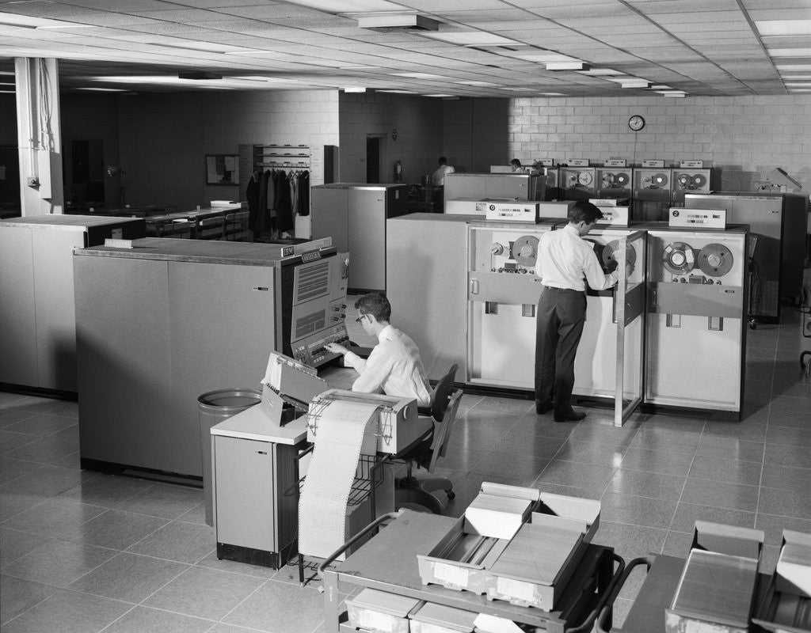
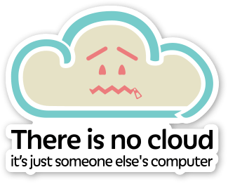
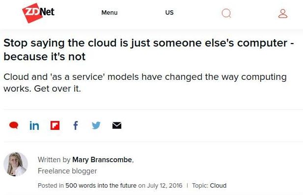
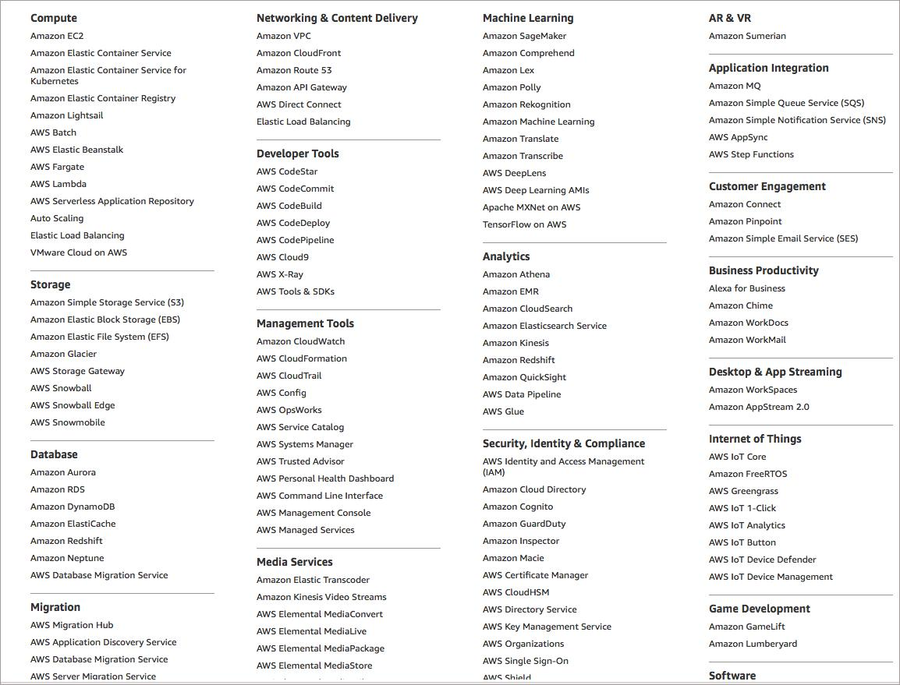

```{r setup, include=FALSE}
options(htmltools.dir.version = FALSE)
```

# From Last Time
* Assignment 1 due tonight

---
class: clear, inverse, middle, center
# HPC

---
# HPC
.pull-left[
* High Performance Computing
* Usually used interchangeably with "supercomputing"
* Summit, ISAAC, ...
* The Cloud?
* Your desktop???
* Your phone?????
]
.pull-right[]

---
# High Performance?
.center[]

---
# Supercomputing
.pull-left[
Characteristics
* Big
* Parallel file system
* Multiple nodes
* High speed interconnect
* Batch programming

Non-characteristics
* Heterogeneous/homogeneous
* Big FLOPS
]
.pull-right[]

---
# Summit
.pull-left[
* 4608 Nodes
  - 2x22-core IBM P9 CPUs
  - 6 NVIDIA V100 GPUs
* 250 PB storage
* Mellanox interconnect
  - 200 Gb/s InfiniBand
  - Non-blocking fat-tree
* 13 MW of power
]
.pull-right[]

---
# Interactive vs Batch
.pull-left[
```
$ python
>>> 1+1

2

>>> exit()

$
```
]
.pull-right[
```
$ bsub myjob.bs

<time passes>

$ cat myjob.out

2

$
```
]

---
# "AI"
.pull-left[]
.pull-right[


]

---
# Some Common Terms
.pull-left[
* **gemm** - matrix-matrix multiply
* **BLAS** - Basic Linear Algebra Subprograms; matrix library
* **FLOPS** - Floating Point Operations Per Second (adds and multiplies)
* **LINPACK** - important benchmark
* **TOP500** - list of computers ranked by LINPACK benchmark
]
.pull-right[]

---
# Some Notable Benchmarks
.pull-left[
* **TOP500** - solve `\\(Ax=b\\)`
* **Green500** - LINPACK, sorted by energy efficiency ("FLOPS per watt")
* **Graph500** - Graph benchmark; BFS and SSSP
* **HPCG** - High Performance Conjugate Gradient; SpMV, dot product, ...
]
.pull-right[]

---
# MPI
.pull-left[
* Message Passing Interface
* Distributed programming standard
* Implementations
  - OpenMPI
  - MPICH
  - MPT
  - Spectrum
* NCCL
* HPC/Data convergence
]
.pull-right[]

---
# Using Video Game Hardware to Multiply Matrices
.pull-left[
* AKA GPGPU
* Not just for video games and mining bitcoin anymore!
* Major players
  - NVIDIA
  - AMD
  - Intel…?!?!
* Pros:
  - Fast
  - When you give up, you can mine bitcoin
Cons:
  - Hard to program
  - Expensive
]
.pull-right[]

---
# DOE Jargon
.pull-left[
* leadership - really big jobs
* capability - big jobs
* capacity - many jobs
* Allocations
  - INCITE - leadership
  - ALCC - things DOE likes
  - DD - small jobs the center likes
]
.pull-right[]

---
# Some Resources
* https://www.hpcwire.com/
* https://insidehpc.com/
* https://twitter.com/HPC_Guru


---
# Linear Algebra
.pull-left[
* LA dominates scientific and data computing
* Some uses in data:
  - PCA - SVD
  - Linear Models - QR
  - Covariance/correlation - gemm/syrk
  - Inverse - Cholesky, LU
* 1970's: LINPACK (not that one)
* 1980's: BLAS, LAPACK
* 1990's: ScaLAPACK
* 2000's: PLASMA, MAGMA
* 2010's: ~~DPLASMA~~ SLATE
]
.pull-right[]

---
# The LINPACK Benchmark
* Solve the system $Ax=b$
  - A- $n\times n$ matrix (you choose $n$)
  - Double precision
  - Must use LU with partial pivoting
      - $A = LU$
      - $b = Ax = LUx$
* $\frac{2}{3} n^3 + 2n^2$ operations
* Solution must satisfy some accuracy conditions.

---
# Top 500 Rankings
.pull-left[]
.pull-right[]

---
# LINPACK on my Desktop
.pull-left[
## CPU
* double
  - Best n=39000 t=200.030
  - Theoretical Peak 217 GFLOPS
  - LINPACK 197.715 GFLOPS
* float
  - Best n=45000 t=156.066
  - Theoretical Peak 434 GFLOPS
  - LINPACK 389.285 GFLOPS
]
.pull-right[
## GPU
* double n=28000 t=58.444 GFLOPS=250.433
* float n=36000 t=4126.614 GFLOPS=4126.614
]

This means Summit is 487,156x more powerful than my desktop!

---
# LINPACK on my Desktop
.center[]

---
# How Do We Rank?
.center[]

---
# How Do We Rank?
.pull-left[]
.pull-right[]


---
class: clear, inverse, middle, center
# The Cloud

---
# History
.pull-left[
* 1960's: Mainframe time sharing
* 1970-80's: Dumb terminals
* 1990's: Virtualization invented
* 2006: AWS launched
* 2015: Docker created
]
.pull-right[]

We will discuss virtualization and Docker in depth in a later lesson.

---
# So What Even Is The Cloud?
.pull-left[
## Someone else's computer?

]
.pull-right[
## Something else?

]

---
# SERVICES, SERVICES, SERVICES!
.center[]

---
# SERVICES, SERVICES, SERVICES!
* Think of a sequence of letters and numbers
* It's probably an Amazon product
* (Ungraded) Homework:
  - Find a random AWS service
  - Try to understand what it does
  - (Bonus) No crying

---
# In This Class
We will restrict attention to EC2 ("someone else's computer")


---
class: clear, inverse, middle, center
# HPC vs The Cloud

---
# How Are They Similar?
.pull-left[
* Somebody else's computer
* Lots of jargon
* Entire career paths
* Can be hard to use
* Tech stacks more similar than most realize
]
.pull-right[]

---
# How Are They Different?
* Privileges (user vs root)
* Salaries, job growth/potential, etc
* Academia vs Industry
* "Free" (taxes) vs you pay
* Some non-intersecting tech stacks
    - cloud: HDFS, databases, web, ...
    - HPC: HDF5, binary files, Fortran, ...

---
# Other Compute Models
* Your computer
* "The office quasi-cluster"
* Edge computing

---
# Next Time
* Computing on remote systems
  - ~30 minutes lecture
  - live tutorial component on ISAAC and/or AWS
* Assignment 1 due tonight
* No new assignments

---
class: clear, inverse, middle, center
# Questions?
