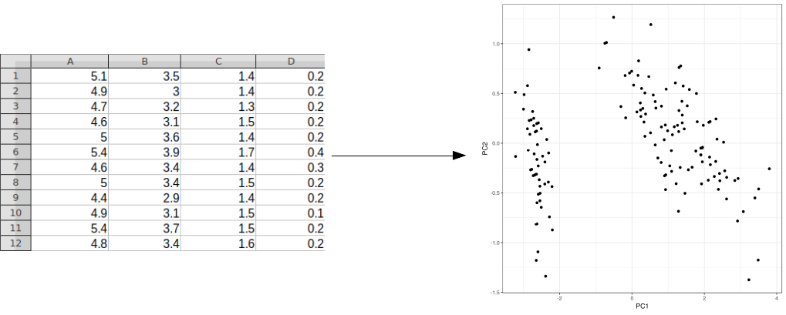
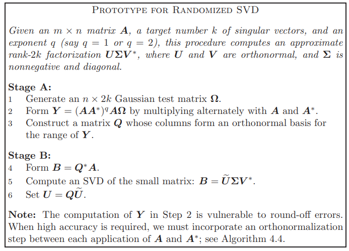
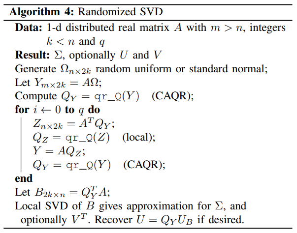

```{r setup, include=FALSE}
options(htmltools.dir.version = FALSE)
```

# From Last Time
* Homework is out --- due Saturday
* Questions?

---
# Two Techniques
* Principal Components Analysis (PCA)
* Linear Regression

---
# Setup
* $X$ is an $m\times n$ (model) matrix with $m>n$
* $y$ is an $m$-length (response) vector
* Example code in R
* We will ignore some efficiency tricks for the moment
  - `crossprod(X)` instead of `t(X) %*% X`
  - `backsolve()` over inversion
  - etc.
* One thing at a time...


---
class: clear, inverse, middle, center
# Principal Components Analysis

---
# PCA



---
# PCA: The Black Box
* Via covariance matrix `princomp()`
* Via SVD `prcomp()`

---
# PCA: Covariance Matrix
.pull-left[
* Step 1: compute covariance matrix $\Sigma_X$
* Step 2: compute Eigendecomposition $\Sigma_X = V \Delta V^T$
  - "Standard deviations": $\sqrt{\delta_i}$
  - Loadings: $V$
  - Scores: $XV$

```r
# compare to princomp()
X_cen = scale(X, center=TRUE, scale=FALSE)
eig = eigen(crossprod(X_cen))

sdev = sqrt(eig$values)
loadings = eig$vectors
scores = X_cen %*% eig$vectors
```
]
.pull-right[
* Pros
  - Very easy to implement
  - Can be very fast
  - Useful in distributed contexts
  - Memory-efficient if $n$ is small
* Cons
  - What happens to the condition number?
  - What happens if $n$ is very large?
]

---
# PCA: SVD
.pull-left[
* Step 1: mean-center $X$
* Step 2: compute $X = U \Sigma V^T$
  - "Standard deviations": $\frac{\sigma_i}{n}$
  - Loadings: $V$
  - Scores: $XV$

```r
# compare to prcomp()
X_cen = scale(X, center=TRUE, scale=FALSE)
s = svd(X_cen)

sdev = s$d / n
loadings = s$v
scores = X_cen %*% s$v
```
]
.pull-right[
* Pros
  - Numerically accurate
* Cons
  - Harder to parallelize in distributed contexts
]

---
# An Observation
* Computing PCA is tantamount to computing SVD
* Many SVD algorithms
* We will revisit this when we get to parallelism

Schmidt, D., 2020, November. A Survey of Singular Value Decomposition Methods for Distributed Tall/Skinny Data. In 2020 IEEE/ACM 11th Workshop on Latest Advances in Scalable Algorithms for Large-Scale Systems (ScalA) (pp. 27-34). IEEE.

---
# Question
.pull-left[What if we just want the first few components?]
.pull-right[]

---
# PCA


---
# Truncated SVD
```r
svd
```
```
function (x, nu = min(n, p), nv = min(n, p)) 
{
    # ...
    n <- nrow(x)
    p <- ncol(x)
    # ...
    res <- if (is.complex(x)) 
        .Internal(La_svd_cmplx(jobu, x, double(min(n, p)), u, 
            vt))
    else .Internal(La_svd(jobu, x, double(min(n, p)), u, vt))
    res <- res[c("d", if (nu) "u", if (nv) "vt")]
    if (nu && nu < nu0) 
        res$u <- res$u[, seq_len(min(n, nu)), drop = FALSE]
    if (nv && nv < nv0) 
        res$vt <- res$vt[seq_len(min(p, nv)), , drop = FALSE]
    res
}
```

---
# Randomized SVD
.pull-left[]
.pull-right[
Halko, N., Martinsson, P.G. and Tropp, J.A., 2009. Finding structure with randomness: Stochastic algorithms for constructing approximate matrix decompositions.
]

---
# Randomized SVD
.center[]

---
# Randomized SVD
```{r}
rsvd = function(x, k=1, q=3){
  ### Stage A
  n = ncol(x)
  Omega = matrix(runif(n*2L*k), nrow=n, ncol=2L*k)
  
  Y = x %*% Omega
  Q = qr.Q(qr(Y))
  for (i in 1:q){
    Y = crossprod(x, Q)
    Q = qr.Q(qr(Y))
    Y = x %*% Q
    Q = qr.Q(qr(Y))
  }
  
  ### Stage B
  B = crossprod(Q, x)
  svd_B = La.svd(x=B, nu=0, nv=0)
  d = svd_B$d[1:k]
  d
}
```

---
# Randomized SVD
```r
m = 1e6
n = 250
X = matrix(runif(m*n), nrow=m, ncol=n)

system.time(svd(X, nu=0, nv=0))
```
```
##    user  system elapsed 
##  96.357  13.982  18.405
```
```r
system.time(rsvd(X, k=2))
```
```
##    user  system elapsed 
##  11.949   7.171   2.994
```

---
class: clear, inverse, middle, center
# Linear Regression

---
# Regression: The Black Box
* Uses a rank-revealing QR
* Modified LINPACK (!) code
* Pivoting destroys statistical information...

```r
lm.fit(X, y)$coef
```

---
# Regression: The Normal Equations
$$
\begin{aligned}
y = X\beta &\iff X^T y = X^T X \beta \\
 &\iff \left(X^TX\right)^{-1} X^T y = \beta
\end{aligned}
$$

```r
solve(t(X) %*% X) %*% t(X) %*% y
```

---
# Regression: QR Factorization
$$
\begin{aligned}
y = X\beta &\iff y = QR\beta \\
 &\iff R^{-1} Q^T y = \beta
\end{aligned}
$$

```r
qr.solve(qr(X), y)
```

---
# Regression: SVD
$$y = X\beta \iff \beta = V \Sigma^{-1} U^T y$$

```r
s = La.svd(X)
t(s$vt) %*% diag(1/s$d) %*% t(s$u) %*% y
```

---
# An Optimization Problem
$$\min_{\beta \in \mathbb{R}^n} \frac{1}{2m} \sum_{i=1}^m \left((X \beta)_i - y_i\right)^2$$

```r
cost_gaussian = function(beta, x, y){
  m = nrow(x)
  (1/(2*m))*sum((x%*%beta - y)^2)
}

reg.fit = function(x, y, maxiter=100){
  control = list(maxit=maxiter)
  beta = numeric(ncol(x))
  optim(par=beta, fn=cost_gaussian, x=x, y=y, method="CG", control=control)
}
```

```r
reg.fit(X, y)$par
```

---
# Ungraded Homework
* Do some basic benchmarking of these methods. How do they compare to the stock R methods?
* Can we improve the performance of these (yes)?
* Implement your own conjugate gradient https://en.wikipedia.org/wiki/Conjugate_gradient_method#Example_code_in_MATLAB_/_GNU_Octave
* Implement these in Python using NumPy
* What relationship will (un-)optimized BLAS have to what we have seen today?
* Let $X$ be the $7\times 7$ Hilbert Matrix (see https://en.wikipedia.org/wiki/Hilbert_matrix). You can generate this in R via `Matrix::Hilbert(7)`. Test your linear model fitters on this data (response can be random uniform). Does anything interesting happen?

---
# Wrapup
* Next time:
  - GPGPU: The Easy Parts
  - Return to ISAAC
* Resources
  - McCullagh, P. and Nelder, J.A., 1989. Generalized Linear Models, no. 37 in Monograph on Statistics and Applied Probability.
  - Duda, R.O., Hart, P.E. and Stork, D.G., 1973. Pattern classification (pp. 526-528). Wiley, New York.


---
class: clear, inverse, middle, center
# Questions?
