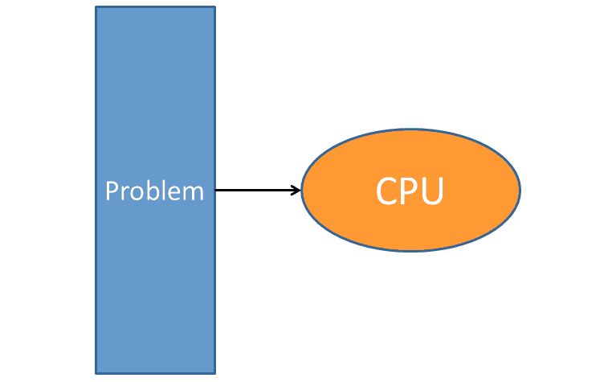
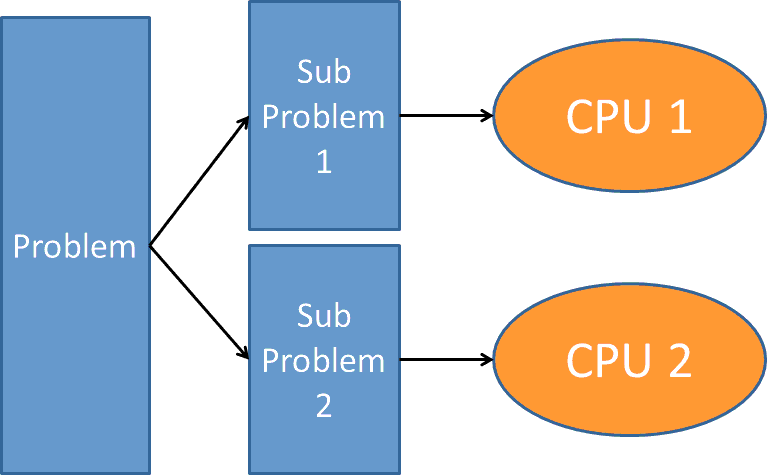
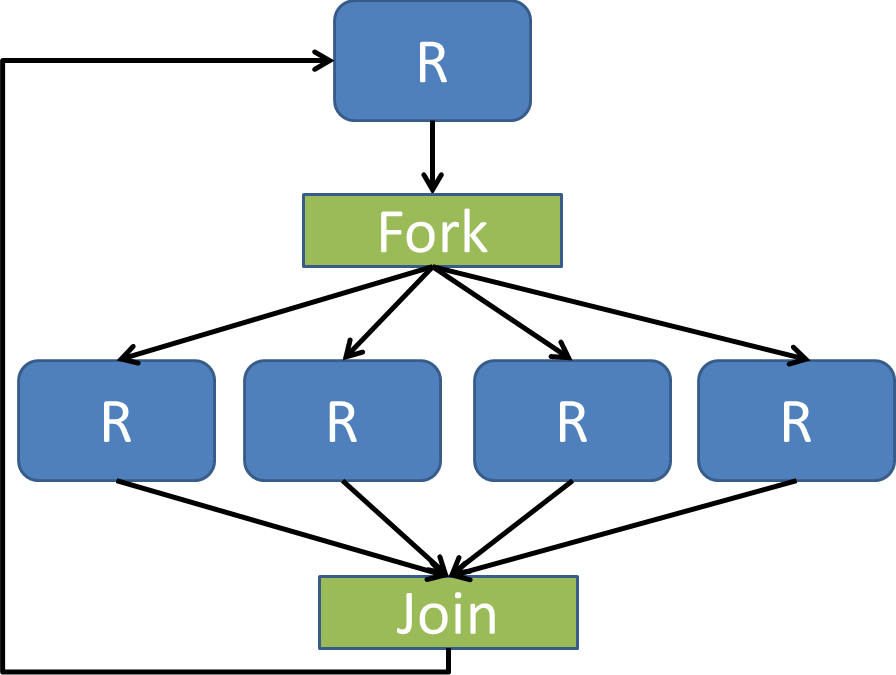
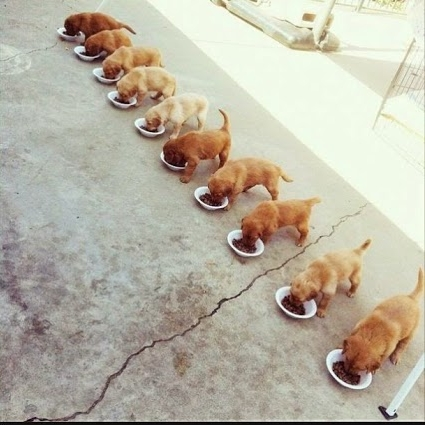
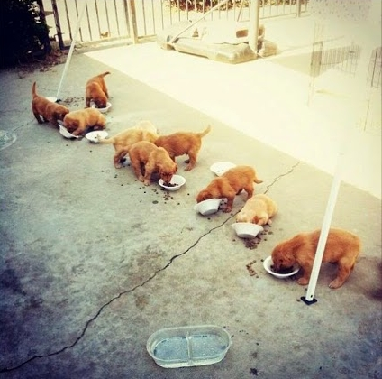

```{r setup, include=FALSE}
options(htmltools.dir.version = FALSE)
```

# From Last Time
* New homework "soon"
* Questions?


---
class: clear, inverse, middle, center
# Reviewing Fork Parallelism

---
# Serial Programming
.center[]

---
# Parallel Programming
.center[]

---
# Fork/Join Parallelism
.center[]

---
# Parallelism in Theory
.center[]

---
# Parallelism in Practice
.center[]


---
class: clear, inverse, middle, center
# Improving k-Means Clustering Outcomes in Parallel

---
# Parallelism in k-Means Clustering
* Parallelize the algorithm itself
  - Good for very large datasets
  - Tricky...
* Parallelize on the number of random starts
  - Easy to do!
  - May not be that valuable
* Parallelize on the number of clusters
  - Also easy to do!
  - Turn your brain off! Machine your learnings!!!

---
# Measuring Cluster Performance
* Would like an analogue of classification accuracy
* How do we compare two sets of cluster labels?
* Rand Measure / Rand Index https://en.wikipedia.org/wiki/Rand_index
  - Given a set of $n$ elements $S$ and two partitions of $S$ into $r$-length subsets $X = \{X_1, \dots, X_r\}$ and $Y = \{Y_1, \dots, Y_r\}$
  $$ R = \frac{a + b}{\binom{n}{2}} $$
  Where
      - $a$ is the \# of pairs of elements of $S$ that agree across $X$ and $Y$ 
      - $b$ is the \# of pairs of elements of $S$ that disagree across $X$ and $Y$

---
# Rand Measure

```{r rand, cache=TRUE}
rand_measure = function(l1, l2){
  n = length(l1)
  a = b = 0L

  for (i in 1:n){
    for (j in (i+1L):n){
      if (j > n) # R indexing is stupid
        break
      
      same1 = (l1[i] == l1[j])
      same2 = (l2[i] == l2[j])
      
      if (same1 && same2)
        a = a + 1L
      else if (!same1 && !same2)
        b = b + 1L
    }
  }
  
  (a + b) / choose(n, 2)
}
```

---
# Using the Iris Dataset
.pull-left[
* Fisher's famous iris dataset
* Required by law in clustering lectures
]
.pull-right[
```{r, echo=FALSE, cache=TRUE}
library(ggplot2)
ggplot(data=iris, aes(Sepal.Length, Petal.Length, color=Species)) +
  theme_bw() +
  geom_point() +
  theme(legend.position="bottom") + 
  xlab("Sepal Length") + 
  ylab("Petal Length")
```
]

---
# Finding the k in k-Means
.pull-left[
```{r kmeans, dependson="rand", cache=TRUE}
library(parallel)
labels = as.numeric(iris[, 5])
x = iris[, -5]

options(mc.cores=8)
nclusters = 2:100
clusters = mclapply(
  nclusters,
  function(i) kmeans(x, i, nstart=10)$cluster
)
rand = mclapply(
  clusters,
  rand_measure,
  l2 = labels
) |> unlist()
```
]
.pull-right[
```{r, dependson="kmeans", echo=FALSE, message=FALSE, warning=FALSE}
df = data.frame(nclusters, rand)
library(ggplot2)
ggplot(data=df, aes(nclusters, rand)) +
  theme_bw() +
  geom_point() +
  geom_line()
```
]


---
class: clear, inverse, middle, center
# Leave-One-Out Cross Validation

---
# Our Model
.pull-left[
* Motor Trend Car Road Tests (mtcars) dataset
* Predict
  - Miles per gallon
* Predictors:
  - Weight (1000's of pounds)
  - Number of cylinders
  - Gross horsepower
]
.pull-right[]

---
# Estimating Model MSE
* Determine the leave-one-out (LOO) cross-validation (CV) MSE
  - Compute each LOO model MSE
  - Overall MSE is the mean of the model MSE's
* Why
  - less biased estimator
  - *expensive* to calculate
  - good teaching example

---
# Quick note
* *Many* packages for R and Python do CV well
* Some of those offer implicit parallelism!
* We're doing it by hand to learn
* Some software engineering principles have been compromised for educational purposes

---
# Estimating MSE with LOOCV
```{r loocv, cache=TRUE}
model_mse = function(mdl){
  mean(mdl$residuals^2)
}

mse_loo = function(i){
  data = mtcars[-i, ]
  mdl = lm(mpg ~ wt + cyl + hp, data=data)
  model_mse(mdl)
}

mse = function(ncores){
  parallel::mclapply(1:nrow(mtcars), mse_loo, mc.cores = ncores) |>
    unlist() |>
    mean()
}
```

---
# Values and Performance
.pull-left[
```{r, dependson="loocv", cache=TRUE}
lm(mpg ~ wt + cyl + hp, data=mtcars) |>
  model_mse()

mse(1)
```
]
.pull-right[
```{r, dependson="loocv", echo=FALSE, cache=TRUE}
cores = 1:8
times = lapply(cores, function(nc) system.time(mse(nc))[3]) |> unlist()
df = data.frame(cores=cores, times=times)
library(ggplot2)
ggplot(df, aes(cores, times)) + 
  theme_bw() +
  geom_point() +
  geom_line() + 
  xlab("Number of Cores") +
  ylab("Runtime in Seconds (lower is better)")
```
]


---
class: clear, inverse, middle, center
# Parallel SVD

---
# Data Parallelism Challenges
* Rarely done with fork
* Generally better suited to *persistent* workers
* Why?

---
# Connection to Eigendecomposition
$$
\begin{aligned}
A^TA &= \left( U \Sigma V^T \right)^T \left( U \Sigma V^T \right) \\\\
  &= V \Sigma U^T U \Sigma V^T \\\\
  &= V \Sigma^2 V^T
\end{aligned}
$$

---
# Computing the "Normal Equations" Matrix
Choose $b>0$ and split $A$ into $b$ blocks of rows:

$$
A = \begin{bmatrix} A_1 \\\\ A_2 \\\\ \vdots \\\\ A_b \\\\ \end{bmatrix}
$$

Then

$$
A^TA = \sum_{i=1}^{b} A_i^TA_i
$$

---
# Recall: SVD with SQL
.pull-left[
```r
svd(big_tbl[, -1])$v
```
```
##           [,1]       [,2]
## [1,] 0.0495752  0.9987704
## [2,] 0.9987704 -0.0495752
```
]
.pull-right[
```r
B = matrix(0, 2, 2)
rpb = 7
num_blocks = get_num_blocks(n, rpb)
for (blockid in 1:num_blocks){
  ids = blockid_to_indices(blockid, n, rpb)
  query = paste(
    "SELECT * FROM big_tbl WHERE ind >=",
    ids$ind_low,
    "AND ind <=",
    ids$ind_high
  )
  A_i = dbGetQuery(db, query)
  B = B + crossprod(as.matrix(A_i[, -1]))
}
svd(B)$vt
```
```
##           [,1]       [,2]
## [1,] 0.0495752  0.9987704
## [2,] 0.9987704 -0.0495752
```
]

---
# Crossproduct-Based SVD Algorithms
.pull-left[
## Out-of-core
* Inputs
  - $A_{m\times n}$
  - Number of blocks $b$
* Procedure
  - Initialize $B_{n\times n} = 0$
  - For each $1\leq i \leq b$
      - Read block of rows $A_i$
      - Compute $B = B + A_i^T A_i$
  - Factor $B = \Lambda \Delta \Lambda$
]
.pull-right[
## Parallel
* Inputs
  - $A_{m\times n}$
  - Number of cores $c$
* Procedure
  - For each $1\leq i \leq c$ in parallel
      - Read block of rows $A_i$
      - Return $B_c = A_i^T A_i$
  - Sum $B = \sum_{i=1}^c B_c$
  - Factor $B = \Lambda \Delta \Lambda$
]

---
# Distributing Work
* Need to be able to distribute "work" (say tasks) among workers
* Similar concept/different implementation to out-of-core work distribution
* Function that takes:
  - total number of tasks
  - total number of workers
  - worker index/rank
* Sounds a lot like task parallelism...

---
# But I thought we were doing data parallelism?
.center[]

---
# Distributing Work: R Implementation
```{r tasker, cache=TRUE}
get_my_tasks = function(num_tasks, num_workers, my_id){
  if (num_tasks == num_workers)
    my_id + 1
  else if (num_tasks > num_workers){
    local = as.integer(num_tasks / num_workers)
    rem = num_tasks %% num_workers
    if (rem == 0 || (my_id < (num_workers - rem))){
      start = my_id * local
      start:(start + local - 1) + 1
    } else {
      start = my_id*(local + 1) - (num_workers - rem)
      start:(start + local) + 1
    }
  } else {
    if (num_tasks > my_id)
      my_id + 1
    else
      integer(0)
  }
}
```

---
# Distributing Work: Python Implementation
```python
def get_my_tasks(num_tasks, num_workers, my_id):
    if num_tasks == num_workers:
        return range(my_id, my_id+1)
    elif num_tasks > num_workers:
        local = int(num_tasks / num_workers)
        rem = num_tasks % num_workers
        
        if rem == 0 or (my_id < (num_workers - rem)):
            start = my_id*local
            return range(start, start + local)
        else:
            start = my_id*(local + 1) - (num_workers - rem)
            return range(start, start + local + 1)
    else:
        if num_tasks > my_id:
            return [my_id]
        else:
            return range(0)
```

---
# Distributing Work: Implementation Details
* chops up `num_tasks` tasks roughly evenly across `num_workers` workers
* `num_tasks` - number of tasks to distribute among workers
* `num_workers` total number of worker processes
* `my_id` 0-based worker index
* Return
  - R: 1-based index
  - Python: 0-based index

---
# Parallel SVD at a High Level
* Chop up the input matrix
  - We can split by rows; other data layouts possible, but complicated
  - Each worker gets a chunk of the matrix
  - The chunks are non-overlapping
* Each worker computes its local crossproduct (normal equations matrix)
* The manager (calling process) sums the local worker matrices
* The manager computes the SVD on the (now global) crossproduct matrix

---
# Parallel SVD
```{r parsvd, dependson="tasker", cache=TRUE}
crossprod_local = function(x, i, ncores)
{
  my_rows = get_my_tasks(nrow(x), ncores, i)
  x_i = x[my_rows, ]
  crossprod_local = crossprod(x_i)
  crossprod_local
}

crossprod_parallel = function(x, ncores)
{
  ret = parallel::mclapply(
    (1:ncores) - 1,
    crossprod_local,
    x=x,
    ncores=ncores
  )
  
  Reduce('+', ret)
}
```

---
# Comparison
```{r, dependson="parsvd", cache=TRUE}
set.seed(1234)
m = 1000
n = 3
x = matrix(rnorm(m*n), m, n)

crossprod_parallel(x, ncores=4)
crossprod(x)
```

---
# Benchmark
```{r, dependson="parsvd", cache=TRUE}
set.seed(1234)
m = 100000
n = 250
x = matrix(rnorm(m*n), m, n)

openblasctl::openblas_set_num_threads(1)
system.time(crossprod_parallel(x, ncores=8))[3]

openblasctl::openblas_set_num_threads(8)
system.time(crossprod(x))[3]
```


---
class: clear, inverse, middle, center
# Wrapup

---
# Wrapup
* Parallelism
  - Exploits independence
  - Can save time; can *waste* time
* Fork
  - (relatively) cheap mechanism for parallelism 
  - great for task parallelism
  - less useful for data parallelism 
* Be careful with RNG's in parallel!
* Next time: intro to MPI

---
class: clear, inverse, middle, center
# Questions?
