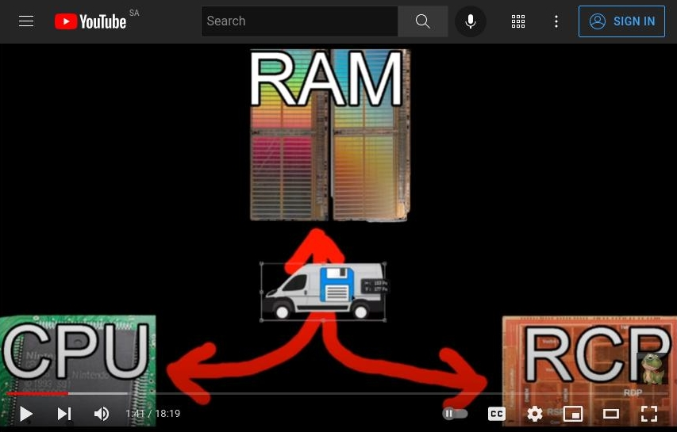
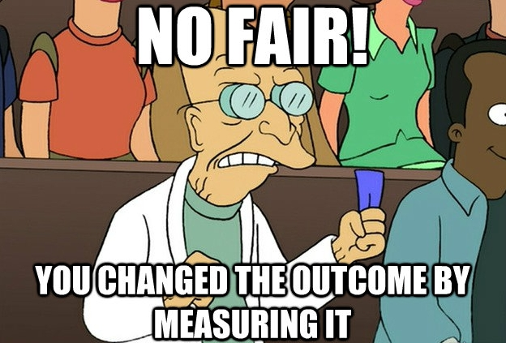
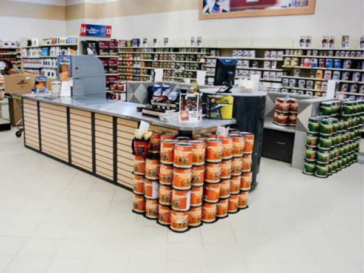
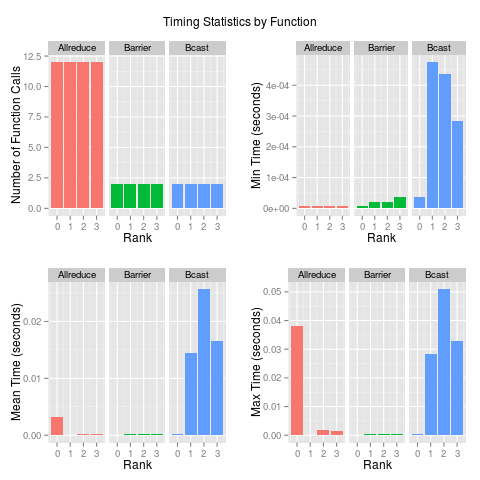

```{r setup, include=FALSE}
options(htmltools.dir.version = FALSE)
```

# From Last Time
* Homework 3
  - Graded
  - Let's talk about it
* Homework 4
  - Assigned
  - Let's talk about it

---
# Where We've Been
## Module 1: Basic Cloud and HPC
* Lecture 1 - Introduction
* Lecture 2 - Overview of HPC and the Cloud
* Lecture 3 - Introduction to Remote Computing
* Lecture 4 - Introduction to Containers
* Lecture 5 - Introduction to ISAAC
* Lecture 6 - MPI and Singularity

---
# Where We've Been
## Module 2: Performance Optimization
* Lecture 7 - Introduction to Performance Optimization
* Lecture 8 - High Level Language Optimizations
* Lecture 9 - Computational Linear Algebra Part 1
* Lecture 10 - Computational Linear Algebra Part 1
* Lecture 11 - GPGPU (The Easy Parts) Part 1
* Lecture 12 - GPGPU (The Easy Parts) Part 2
* Lecture 13 - Utilizing Compiled Code
* Lecture 14 - I/O

---
# Where We've Been
## Module 3: Parallelism
* Lecture 15 - Introduction to Parallelism
* Lecture 16 - Forks and Threads Part 1
* Lecture 17 - Forks and Threads Part 2
* Lecture 18 - MPI Part 1
* Lecture 19 - MPI Part 2
* Lecture 20 - MPI Part 3
* Lecture 21 - MapReduce

---
# Where We're Headed
## Module 4: Profiling
* Lecture 22 - Profiling Basics
* Lecture 23 - HLL Profiling
* Lecture 24 - Advanced Profiling (Hardware and MPI)

## Module 5: Deep Learning
* Lecture 25 - Basic Intro
* Lecture 26 - DL for Practitioners
* Lecture 27 - Distributed Training


---
class: clear, inverse, middle, center
# Profiling Basics

---
# Profiling
.pull-left[
* Gathering information
* Can do "profiling" on lots of different things
  - Customer profiling
  - Profiling in policing
  - ...
* We are interested in *performance profiling*
]
.pull-right[]

---
# How Does Profiling Work?
.center[]

---
# Performance Profiling Examples
.pull-left[
* Software profiling
  - a simple timer
  - line profiling
* API profiling
  - MPI operations
  - Tensorflow profiler
* Hardware profiling
  - Memory profiler
  - Hardware counters
  - CUDA
]
.pull-right[]

---
# What Can Profiling Do?
## FIXING the ENTIRE SM64 Source Code (INSANE N64 performance)
.center[

https://www.youtube.com/watch?v=t_rzYnXEQlE
]

---
# Language Timers
* R
  - `system.time()`
  - `Sys.time()`
* Python's many `time` utilities
  - `time.perf_counter()`
  - ...

---
# time
```{bash}
time Rscript -e "1+1"
```
```{bash}
time Rscript -e "x = runif(1e8)"
```

---
# proginfo
Project home https://github.com/wrathematics/proginfo
.pull-left[
* Uses sampling
* Reports basic CPU and GPU info
* `MIN/MEAN/MAX (SD) / TOTAL`
]
.pull-right[
```bash
./proginfo Rscript -e '1+1'
```
```
[1] 2

## Program Info (from 27 polls)
* CPU
  - Wall time: 0.280
  - Utilization: 3.184%
  - RAM: 19.109/19.142/19.167 (62.791) / 62.810 GiB
* GPU (CUDA=11.4 Driver=470.103.01)
  - Utilization
      + (Device 0) 6/8.96/11 (2.50) / 100%
  - RAM:
      + (Device 0) 0.579/0.579/0.579 (0.000) / 7.926 GiB
```
]

---
# proginfo
## Memory example
```bash
./proginfo Rscript -e 'x=runif\(1e9\)'
```
```
## Program Info (from 1890 polls)
* CPU
  - Wall time: 19.454
  - Utilization: 2.327%
  - RAM: 19.147/22.921/26.671 (60.604) / 62.810 GiB
* GPU (CUDA=11.4 Driver=470.103.01)
  - Utilization
      + (Device 0) 0/0.50/1 (0.50) / 100%
  - RAM:
      + (Device 0) 0.554/0.554/0.554 (0.000) / 7.926 GiB
```

---
# proginfo
## GPU example
```bash
./proginfo Rscript -e 'suppressMessages(library(fmlr)); c = card(); x = gpumat(c, 25000, 25000, type="float"); x$fill_zero(); x$info()'
```
```
# gpumat 25000x25000 type=f 

## Program Info (from 381 polls)
* CPU
  - Wall time: 3.949
  - Utilization: 2.606%
  - RAM: 19.122/19.359/19.509 (62.692) / 62.810 GiB
* GPU (CUDA=11.4 Driver=470.103.01)
  - Utilization
      + (Device 0) 0/1.94/27 (4.76) / 100%
  - RAM:
      + (Device 0) 0.554/0.673/3.105 (0.189) / 7.926 GiB
```

---
# Basic Memory Profiling
.pull-left[
* Can be quite sophisticated
  - valgrind
  - gdb
* Or also very simple
]
.pull-right[
```{r, cache=FALSE}
library(memuse)
Sys.procmem()
x = runif(1e8)
mu(x)
rm(x);invisible(gc())
Sys.procmem()
```
]

---
# Line Profiling
.pull-left-minicol[
```r
m = 10000
n = 250
x = matrix(rnorm(m*n), nrow=m, ncol=n)

Rprof()
pca = prcomp(x)
Rprof(NULL)

summaryRprof()
```
]
.pull-right-maxicol[
```
$by.self
                self.time self.pct total.time total.pct
"La.svd"             0.68    69.39       0.72     73.47
"%*%"                0.12    12.24       0.12     12.24
"aperm.default"      0.04     4.08       0.04      4.08
"array"              0.04     4.08       0.04      4.08
"matrix"             0.04     4.08       0.04      4.08
"sweep"              0.02     2.04       0.10     10.20
### output truncated by presenter

$by.total
                 total.time total.pct self.time self.pct
"prcomp"               0.98    100.00      0.00     0.00
"prcomp.default"       0.98    100.00      0.00     0.00
"svd"                  0.76     77.55      0.00     0.00
"La.svd"               0.72     73.47      0.68    69.39
### output truncated by presenter

$sample.interval
[1] 0.02

$sampling.time
[1] 0.98
```
]

---
# Line Profiling
.pull-left-minicol[
```r
m = 10000
n = 250
x = matrix(rnorm(m*n), nrow=m, ncol=n)

Rprof(interval=.99)
pca = prcomp(x)
Rprof(NULL)

summaryRprof()
```
]
.pull-right-maxicol[
```
$by.self
[1] self.time  self.pct   total.time total.pct 
<0 rows> (or 0-length row.names)

$by.total
[1] total.time total.pct  self.time  self.pct  
<0 rows> (or 0-length row.names)

$sample.interval
[1] 0.99

$sampling.time
[1] 0
```
]


---
# Profiling Overhead
.center[]

---
# Hardware counters
.pull-left[
* Cache misses
  - Data cache
  - Instruction cache
* Flops
* Others
]
.pull-right[]

---
# MPI Profiling
.center[]

---
# MPI Profiling
.center[]


---
class: clear, inverse, middle, center
# Questions?
