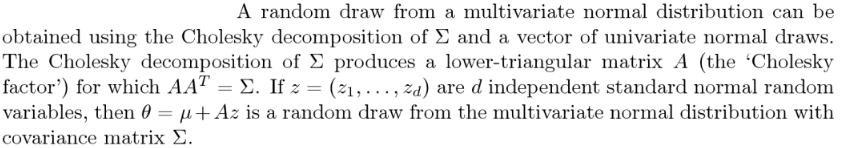

```{r setup, include=FALSE}
options(htmltools.dir.version = FALSE)
```


# From Last Time
* Homework 4
  - Assigned
  - Due April 30
  - Extensions very unlikely


---
# Story Time
.center[]

---
# Cholesky
$$A_{n\times n} = L_{n\times n}L_{n\times n}^T = U_{n\times n}^TU_{n\times n}$$

---
# Revisiting Cholesky
.center[]

Gelman, A., Carlin, J.B., Stern, H.S. and Rubin, D.B., 1995. Bayesian data analysis. Chapman and Hall/CRC.

---
# Building a Matrix
$$ \displaystyle a_{ij} = \exp\left( -\frac{i+j}{ij} \right) $$

---
# An Interesting Puzzle
.pull-left[
* Goal
  - build the covariance matrix
  - compute its Cholesky factor
* Works fine
  - on my laptop
  - on my EC2 box
  - on several other EC2 boxes
  - in a container
  - outside the container
* Where it doesn't work
  - Exactly one runtime environment
]
.pull-right[]

---
# What Actually Goes Wrong
```
Error in chol.default(x) : 
  the leading minor of order 19 is not positive definite
```

Problem: can't access the data!

---
# An Idea
From https://nhigham.com/2021/02/16/diagonally-perturbing-a-symmetric-matrix-to-make-it-positive-definite/

```r
jitter = abs(min(eigen(cov_mat, only.values=TRUE)$values))
diag(cov_mat) = diag(cov_mat) + jitter
```

Problem:
* My machine: `jitter = 5.23178e-14`
* The problem machine: `jitter = 47.50922`

---
# Comparing Draws
.pull-left[
## My Machine
```
Min.   :-2.48445  
1st Qu.:-1.02584  
Median :-0.66874  
Mean   :-0.49502  
3rd Qu.:-0.03763  
Max.   : 1.34634  
```
]
.pull-right[
## Problem Machine
```
Min.   :-23.5999
1st Qu.: -5.1117
Median : -0.5249
Mean   : -0.5053
3rd Qu.: 3.9693
Max.   : 21.8226
```
]

---
# Solution
* Give up
* Get the data
* **Discover the data is the same!**

---
# Another Idea
Check the CPU
```r
readLines("/proc/cpuinfo")
```

---
# Hardware Has AVX-512
.center[]

Solution:
```
update-alternatives --set libblas.so-x86_64-linux-gnu /usr/lib/x86_64-linux-gnu/blas/libblas.so
```


---
class: clear, inverse, middle, center
# That's it for today!
