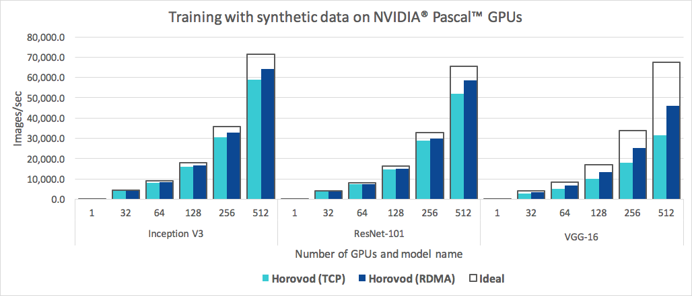

```{r setup, include=FALSE}
options(htmltools.dir.version = FALSE)
```


# From Last Time
* Homework 5 is assigned: due tomorrow
* Last day today!
* Questions?


---
class: clear, inverse, middle, center
# Training with PyTorch

---
# Example
We will be using modifications of a horovod example

.tiny[https://github.com/horovod/horovod/blob/master/examples/pytorch/pytorch_mnist.py]


---
# MNIST Data
.pull-left[
* handwritten digits
* 60,000 examples
].pull-right[]


---
# Getting the Data
```python
from torchvision import datasets

data_dir = '/tmp/mnist'
datasets.MNIST(data_dir, train=False, download=True)
```

---
# Loading the Data
```python
train_dataset = datasets.MNIST(data_dir, train=True, download=False,
    transform=transforms.Compose([
       transforms.ToTensor(),
       transforms.Normalize((0.1307,), (0.3081,))
    ]))

test_dataset = datasets.MNIST(data_dir, train=False,
    transform=transforms.Compose([
        transforms.ToTensor(),
        transforms.Normalize((0.1307,), (0.3081,))
    ]))
```

---
# Defining the Network
```python
import torch.nn as nn
import torch.nn.functional as F

class Net(nn.Module):
    def __init__(self):
        super(Net, self).__init__()
        self.conv1 = nn.Conv2d(1, 10, kernel_size=5)
        self.conv2 = nn.Conv2d(10, 20, kernel_size=5)
        self.conv2_drop = nn.Dropout2d()
        self.fc1 = nn.Linear(320, 50)
        self.fc2 = nn.Linear(50, 10)

    def forward(self, x):
        x = F.relu(F.max_pool2d(self.conv1(x), 2))
        x = F.relu(F.max_pool2d(self.conv2_drop(self.conv2(x)), 2))
        x = x.view(-1, 320)
        x = F.relu(self.fc1(x))
        x = F.dropout(x, training=self.training)
        x = self.fc2(x)
        return F.log_softmax(x, dim=-1)
```

---
# The Outline
```python
torch.manual_seed(1234)
torch.set_num_threads(8)

model = Net()
optimizer = optim.SGD(model.parameters(), lr=learning_rate, momentum=momentum)

for epoch in range(1, epochs + 1):
    train(epoch)
    test()
```

---
# Defining the Training/Test Loops
.pull-left[
## Training
* Iterate over the data
  - Apply model (forward propagation)
  - Compute loss
  - Backpropagation
  - Update optimizer
].pull-right[
## Test
* Iterate over the data
  - Apply model (forward propagation)
  - Compute loss
  - Make prediction
  - Compute accuracy
]

---
# Using a GPU
* Relatively easy these days
* Operations mostly fp32 (fp16 acceleration if supported)
* Gamer cards can be used!

---
# Using a GPU
.pull-left[
```python
torch.cuda.is_available()
```
```
True
```
```python
device = torch.device(0)
print(device)
```
```
device(type='cuda', index=0)
```
].pull-right[
```python
torch.cuda.current_device()
```
```
0
```
```python
torch.cuda.device_count()
```
```
1
```
```python
torch.cuda.get_device_name(0)
```
```
'NVIDIA GeForce GTX 1070 Ti'
```
]

---
# GPU Tensor Computing
```python
x = torch.FloatTensor([1, 2])
x_gpu = x.cuda()
x_gpu
```
```
tensor([1., 2.], device='cuda:0')
```


---
class: clear, inverse, middle, center
# Distributed Training with Horovod

---
# What Is Horovod?
.pull-left[
* Enables distributed training
* Named after a Russian dance
* Uses MPI!
* Powered by `allreduce()`
].pull-right[]

---
# Horovod Scaling
.center[]

.tiny[Source: https://horovod.readthedocs.io/en/stable/summary_include.html]

---
# Why Use Horovod
* Runs on a laptop (need MPI installed)
* Runs on a cluser
* Easily integrates with GPUs
* Faster than 

For any serious project, you should be using Horovod *from the start*.

---
# Using Horovod: Major Changes
```python
import horovod
import horovod.torch as hvd

# Tensor averaging
def metric_average(val, name):
    tensor = torch.tensor([val])
    avg_tensor = hvd.allreduce(tensor, name=name)
    return avg_tensor.item()

# Wrap the optimizer
optimizer = hvd.DistributedOptimizer(optimizer,
    named_parameters = model.named_parameters(),
    compression = hvd.Compression.none,
    op = hvd.Average,
    gradient_predivide_factor = 1.0
)
```

---
# Distributed Training (Data Parallelism)
```python
train_dataset = datasets.MNIST(data_dir, train=True, download=False,
    transform=transforms.Compose([
       transforms.ToTensor(),
       transforms.Normalize((0.1307,), (0.3081,))
    ]))

train_sampler = torch.utils.data.distributed.DistributedSampler(
    train_dataset, num_replicas=hvd.size(), rank=hvd.rank())
train_loader = torch.utils.data.DataLoader(
    train_dataset, batch_size=batch_size, sampler=train_sampler)
```

---
# Distributed Training (Data Parallelism)
```python
test_dataset = \
    datasets.MNIST(data_dir, train=False, transform=transforms.Compose([
        transforms.ToTensor(),
        transforms.Normalize((0.1307,), (0.3081,))
    ]))
# Horovod: use DistributedSampler to partition the test data.
test_sampler = torch.utils.data.distributed.DistributedSampler(
    test_dataset, num_replicas=hvd.size(), rank=hvd.rank())
test_loader = torch.utils.data.DataLoader(test_dataset, batch_size=test_batch_size,
                                          sampler=test_sampler)
```

---
# The Training Loop
```python
def train(epoch):
    model.train()
    train_sampler.set_epoch(epoch)
    for batch_idx, (data, target) in enumerate(train_loader):
        optimizer.zero_grad()
        output = model(data)
        loss = F.nll_loss(output, target)
        loss.backward()
        optimizer.step()
```

---
# The Test Loop
```python
def test():
    model.eval()
    test_loss = 0.
    test_accuracy = 0.
    for data, target in test_loader:
        output = model(data)
        test_loss += F.nll_loss(output, target, size_average=False).item()
        pred = output.data.max(1, keepdim=True)[1]
        test_accuracy += pred.eq(target.data.view_as(pred)).cpu().float().sum()
    
    test_loss /= len(test_sampler)
    test_accuracy /= len(test_sampler)
    
    test_loss = metric_average(test_loss, 'avg_loss')
    test_accuracy = metric_average(test_accuracy, 'avg_accuracy')
    
    if hvd.rank() == 0:
        print('Test set: Average loss: {:.4f}, Accuracy: {:.2f}%\n'.format(
            test_loss, 100. * test_accuracy))
```

---
# Launching
```python
def main():
    # setup omitted
    for epoch in range(1, epochs + 1):
        train(epoch)
        test()

num_proc = 8
horovod.run(main, np=num_proc, use_mpi=True)
```

---
# Distributed Training
.pull-left[
## Training Without Horovod
```output
Test: Avg loss: 0.2169, Acc: 93.45%
Test: Avg loss: 0.1334, Acc: 96.02%
Test: Avg loss: 0.1006, Acc: 96.99%
Test: Avg loss: 0.0833, Acc: 97.29%
Test: Avg loss: 0.0738, Acc: 97.68%
Test: Avg loss: 0.0682, Acc: 97.89%
Test: Avg loss: 0.0634, Acc: 97.99%
Test: Avg loss: 0.0588, Acc: 98.18%
Test: Avg loss: 0.0525, Acc: 98.35%
Test: Avg loss: 0.0512, Acc: 98.36%

real  3m9.633s
user  13m1.501s
sys   0m2.505s

```
].pull-right[
## Training With Horovod
```output
Running training through horovod.run
[1,0]<stdout>:Test: Avg loss: 0.2353, Acc: 92.53%
[1,0]<stdout>:Test: Avg loss: 0.1405, Acc: 95.40%
[1,0]<stdout>:Test: Avg loss: 0.1088, Acc: 96.56%
[1,0]<stdout>:Test: Avg loss: 0.0822, Acc: 97.40%
[1,0]<stdout>:Test: Avg loss: 0.0766, Acc: 97.59%
[1,0]<stdout>:Test: Avg loss: 0.0652, Acc: 98.09%
[1,0]<stdout>:Test: Avg loss: 0.0650, Acc: 97.95%
[1,0]<stdout>:Test: Avg loss: 0.0560, Acc: 98.33%
[1,0]<stdout>:Test: Avg loss: 0.0618, Acc: 98.05%
[1,0]<stdout>:Test: Avg loss: 0.0505, Acc: 98.34%

real  1m16.417s
user  17m25.743s
sys   0m49.709s

```
]


---
# What About GPUs?
* As before: set your tensors to use GPU
* Recommendation: one GPU $\longleftrightarrow$ one MPI rank
* Not just true for DL!
* Horovod makes this easy

```python
torch.cuda.set_device(hvd.local_rank())
```


---
class: clear, inverse, middle, center
# Wrapup

---
# Wrapup
* Use Horovod for distributed training
* Can also be used for multi-core parallelism on a laptop
* GPU acceleration is fairly straight-forward
* A lot of these pieces can be abstracted and repurposed
  - Data loader class
  - Train/test

---
# Where We've Been
## Module 1: Basic Cloud and HPC
* Lecture 1 - Introduction
* Lecture 2 - Overview of HPC and the Cloud
* Lecture 3 - Introduction to Remote Computing
* Lecture 4 - Introduction to Containers
* Lecture 5 - Introduction to ISAAC
* Lecture 6 - MPI and Singularity

---
# Where We've Been
## Module 2: Performance Optimization
* Lecture 7 - Introduction to Performance Optimization
* Lecture 8 - High Level Language Optimizations
* Lecture 9 - Computational Linear Algebra Part 1
* Lecture 10 - Computational Linear Algebra Part 1
* Lecture 11 - GPGPU (The Easy Parts) Part 1
* Lecture 12 - GPGPU (The Easy Parts) Part 2
* Lecture 13 - Utilizing Compiled Code
* Lecture 14 - I/O

---
# Where We've Been
## Module 3: Parallelism
* Lecture 15 - Introduction to Parallelism
* Lecture 16 - Forks and Threads Part 1
* Lecture 17 - Forks and Threads Part 2
* Lecture 18 - MPI Part 1
* Lecture 19 - MPI Part 2
* Lecture 20 - MPI Part 3
* Lecture 21 - MapReduce

---
# Where We've Been
## Module 4: Profiling
* Lecture 22 - Profiling Basics
* Lecture 23 - Debugging Story 
* Lecture 24 - HLL Profiling
* Lecture 25 - Advanced Profiling (Hardware and MPI)

## Module 5: Deep Learning
* Lecture 26 - Basic Intro
* Lecture 27 - DL for Practitioners
* Lecture 28 - GPU and Distributed Training

---
class: clear, inverse, middle, center
# Questions?
